Bike Sharing System Analysis in South Korea
================
Tan Kar Min
2023-11-26

Import Essential Libraries

``` r
library(rvest)
```

    ## Warning: package 'rvest' was built under R version 4.2.3

``` r
library(httr)
library(tidyverse)
```

    ## ── Attaching packages ─────────────────────────────────────── tidyverse 1.3.2 ──
    ## ✔ ggplot2 3.4.4     ✔ purrr   1.0.2
    ## ✔ tibble  3.2.1     ✔ dplyr   1.1.3
    ## ✔ tidyr   1.3.0     ✔ stringr 1.5.0
    ## ✔ readr   2.1.2     ✔ forcats 0.5.1

    ## Warning: package 'ggplot2' was built under R version 4.2.3

    ## Warning: package 'tibble' was built under R version 4.2.3

    ## Warning: package 'tidyr' was built under R version 4.2.3

    ## Warning: package 'purrr' was built under R version 4.2.3

    ## Warning: package 'dplyr' was built under R version 4.2.3

    ## Warning: package 'stringr' was built under R version 4.2.3

    ## ── Conflicts ────────────────────────────────────────── tidyverse_conflicts() ──
    ## ✖ dplyr::filter()         masks stats::filter()
    ## ✖ readr::guess_encoding() masks rvest::guess_encoding()
    ## ✖ dplyr::lag()            masks stats::lag()

``` r
library(ggplot2)
library(ggpubr)
library(chron)
```

    ## Warning: package 'chron' was built under R version 4.2.3

``` r
library(fastDummies)
```

    ## Warning: package 'fastDummies' was built under R version 4.2.3

``` r
library(BBmisc)
```

    ## Warning: package 'BBmisc' was built under R version 4.2.3

    ## 
    ## Attaching package: 'BBmisc'
    ## 
    ## The following objects are masked from 'package:dplyr':
    ## 
    ##     coalesce, collapse, symdiff
    ## 
    ## The following object is masked from 'package:base':
    ## 
    ##     isFALSE

``` r
library(car)
```

    ## Loading required package: carData
    ## 
    ## Attaching package: 'car'
    ## 
    ## The following object is masked from 'package:dplyr':
    ## 
    ##     recode
    ## 
    ## The following object is masked from 'package:purrr':
    ## 
    ##     some

``` r
library(openmeteo)
```

    ## Warning: package 'openmeteo' was built under R version 4.2.3

``` r
library(lubridate)
```

    ## 
    ## Attaching package: 'lubridate'
    ## 
    ## The following objects are masked from 'package:chron':
    ## 
    ##     days, hours, minutes, seconds, years
    ## 
    ## The following objects are masked from 'package:base':
    ## 
    ##     date, intersect, setdiff, union

``` r
library(knitr)
opts_chunk$set(dev='png')
```

## Data Collection

Retrieve the population information for South Korean cities from an HTML
table and transform it into a data frame.

``` r
url <- "https://worldpopulationreview.com/countries/cities/south-korea"
root_node <- read_html(url)
table_nodes2 <- html_nodes(root_node, "table")
kr_cities <- html_table(table_nodes2[[1]], fill=TRUE)
head(kr_cities)
```

    ## # A tibble: 6 × 2
    ##   City    `2024 Population`
    ##   <chr>   <chr>            
    ## 1 Seoul   10,349,312       
    ## 2 Busan   3,678,555        
    ## 3 Incheon 2,628,000        
    ## 4 Daegu   2,566,540        
    ## 5 Daejeon 1,475,221        
    ## 6 Gwangju 1,416,938

Extract South Korea bike sharing systems HTML table from a Wiki page and
convert it into a data frame.

``` r
url <- "https://en.wikipedia.org/wiki/Public_bicycle_rental_service_in_South_Korea"
root_node <- read_html(url)
table_nodes <- html_nodes(root_node, "table")
bike_sharing_systems<-html_table(table_nodes[[3]], fill=TRUE)
bike_sharing_systems<-select(bike_sharing_systems, -`Nat.`)
head(bike_sharing_systems)
```

    ## # A tibble: 6 × 2
    ##   Region   Name                   
    ##   <chr>    <chr>                  
    ## 1 Ansan    Pedalro System (페달로)
    ## 2 Seoul    Ddareungi (따릉이)     
    ## 3 Goyang   Fifteen (피프틴)       
    ## 4 Yeosu    U - Bike (유 바이크)   
    ## 5 Changwon Nubija (누비자)        
    ## 6 Daejeon  Tashu System (타슈)

Download a specific hourly Seoul bike sharing demand dataset which will
be used to train our model.

``` r
seoul_bike_sharing<-read.csv("https://cf-courses-data.s3.us.cloud-object-storage.appdomain.cloud/IBMDeveloperSkillsNetwork-RP0321EN-SkillsNetwork/labs/datasets/raw_seoul_bike_sharing.csv")
head(seoul_bike_sharing)
```

    ##         Date RENTED_BIKE_COUNT Hour TEMPERATURE HUMIDITY WIND_SPEED Visibility
    ## 1 01/12/2017               254    0        -5.2       37        2.2       2000
    ## 2 01/12/2017               204    1        -5.5       38        0.8       2000
    ## 3 01/12/2017               173    2        -6.0       39        1.0       2000
    ## 4 01/12/2017               107    3        -6.2       40        0.9       2000
    ## 5 01/12/2017                78    4        -6.0       36        2.3       2000
    ## 6 01/12/2017               100    5        -6.4       37        1.5       2000
    ##   DEW_POINT_TEMPERATURE SOLAR_RADIATION RAINFALL Snowfall SEASONS    HOLIDAY
    ## 1                 -17.6               0        0        0  Winter No Holiday
    ## 2                 -17.6               0        0        0  Winter No Holiday
    ## 3                 -17.7               0        0        0  Winter No Holiday
    ## 4                 -17.6               0        0        0  Winter No Holiday
    ## 5                 -18.6               0        0        0  Winter No Holiday
    ## 6                 -18.7               0        0        0  Winter No Holiday
    ##   FUNCTIONING_DAY
    ## 1             Yes
    ## 2             Yes
    ## 3             Yes
    ## 4             Yes
    ## 5             Yes
    ## 6             Yes

The data set consist of the following features: - `TEMPERATURE` -
Temperature in Celsius - `HUMIDITY` - Unit is `%` - `WIND_SPEED` - Unit
is `m/s` - `VISIBILITY` - Multiplied by 10m - `DEW_POINT_TEMPERATURE` -
The temperature to which the air would have to cool down in order to
reach saturation, unit is Celsius - `SOLAR_RADIATION` - MJ/m2 -
`RAINFALL` - mm - `SNOWFALL` - cm - `DATE` - Year-month-day - `HOUR`-
Hour of he day - `FUNCTIONAL DAY` - NoFunc(Non Functional Hours),
Fun(Functional hours) - `HOLIDAY` - Holiday/No holiday - `SEASONS` -
Winter, Spring, Summer, Autumn </br>

## Date Cleaning

Standardize all column names

``` r
 names(kr_cities)<-str_replace_all(toupper(names(kr_cities)), " ", "_")
 names(bike_sharing_systems)<-str_replace_all(toupper(names(bike_sharing_systems)), " ", "_")
 names(seoul_bike_sharing)<-str_replace_all(toupper(names(seoul_bike_sharing)), " ", "_")
```

Clean kr_cities dataset to match the cities name of bike_sharing_systems
table.

``` r
kr_cities$CITY <- sub("-[a-z]+", "", kr_cities$CITY)
kr_cities$`2024_POPULATION`<-as.numeric(gsub(",", "", kr_cities$`2024_POPULATION`))
head(kr_cities)
```

    ## # A tibble: 6 × 2
    ##   CITY    `2024_POPULATION`
    ##   <chr>               <dbl>
    ## 1 Seoul            10349312
    ## 2 Busan             3678555
    ## 3 Incheon           2628000
    ## 4 Daegu             2566540
    ## 5 Daejeon           1475221
    ## 6 Gwangju           1416938

Clean Seoul bike sharing dataset

``` r
summary(seoul_bike_sharing)
```

    ##      DATE           RENTED_BIKE_COUNT      HOUR        TEMPERATURE    
    ##  Length:8760        Min.   :   2.0    Min.   : 0.00   Min.   :-17.80  
    ##  Class :character   1st Qu.: 214.0    1st Qu.: 5.75   1st Qu.:  3.40  
    ##  Mode  :character   Median : 542.0    Median :11.50   Median : 13.70  
    ##                     Mean   : 729.2    Mean   :11.50   Mean   : 12.87  
    ##                     3rd Qu.:1084.0    3rd Qu.:17.25   3rd Qu.: 22.50  
    ##                     Max.   :3556.0    Max.   :23.00   Max.   : 39.40  
    ##                     NA's   :295                       NA's   :11      
    ##     HUMIDITY       WIND_SPEED      VISIBILITY   DEW_POINT_TEMPERATURE
    ##  Min.   : 0.00   Min.   :0.000   Min.   :  27   Min.   :-30.600      
    ##  1st Qu.:42.00   1st Qu.:0.900   1st Qu.: 940   1st Qu.: -4.700      
    ##  Median :57.00   Median :1.500   Median :1698   Median :  5.100      
    ##  Mean   :58.23   Mean   :1.725   Mean   :1437   Mean   :  4.074      
    ##  3rd Qu.:74.00   3rd Qu.:2.300   3rd Qu.:2000   3rd Qu.: 14.800      
    ##  Max.   :98.00   Max.   :7.400   Max.   :2000   Max.   : 27.200      
    ##                                                                      
    ##  SOLAR_RADIATION     RAINFALL          SNOWFALL         SEASONS         
    ##  Min.   :0.0000   Min.   : 0.0000   Min.   :0.00000   Length:8760       
    ##  1st Qu.:0.0000   1st Qu.: 0.0000   1st Qu.:0.00000   Class :character  
    ##  Median :0.0100   Median : 0.0000   Median :0.00000   Mode  :character  
    ##  Mean   :0.5691   Mean   : 0.1487   Mean   :0.07507                     
    ##  3rd Qu.:0.9300   3rd Qu.: 0.0000   3rd Qu.:0.00000                     
    ##  Max.   :3.5200   Max.   :35.0000   Max.   :8.80000                     
    ##                                                                         
    ##    HOLIDAY          FUNCTIONING_DAY   
    ##  Length:8760        Length:8760       
    ##  Class :character   Class :character  
    ##  Mode  :character   Mode  :character  
    ##                                       
    ##                                       
    ##                                       
    ## 

``` r
dim(seoul_bike_sharing)
```

    ## [1] 8760   14

The data set have 14 features and 8760 records. “RENTED_BIKE_COUNT” and
“TEMPERATURE” have missing values.

</br>

Handling missing values in RENTED_BIKE_COUNT by dropping them

``` r
seoul_bike_sharing <-seoul_bike_sharing[!is.na(seoul_bike_sharing$RENTED_BIKE_COUNT),]
dim(seoul_bike_sharing)
```

    ## [1] 8465   14

Handling missing values in TEMPERATURE by replacing them with average
temperature

``` r
seoul_bike_sharing %>% 
  filter(is.na(TEMPERATURE)) 
```

    ##          DATE RENTED_BIKE_COUNT HOUR TEMPERATURE HUMIDITY WIND_SPEED VISIBILITY
    ## 1  07/06/2018              3221   18          NA       57        2.7       1217
    ## 2  12/06/2018              1246   14          NA       45        2.2       1961
    ## 3  13/06/2018              2664   17          NA       57        3.3        919
    ## 4  17/06/2018              2330   17          NA       58        3.3        865
    ## 5  20/06/2018              2741   19          NA       61        2.7       1236
    ## 6  30/06/2018              1144   13          NA       87        1.7        390
    ## 7  05/07/2018               827   10          NA       75        1.1       1028
    ## 8  11/07/2018               634    9          NA       96        0.6        450
    ## 9  12/07/2018               593    6          NA       93        1.1        852
    ## 10 21/07/2018               347    4          NA       77        1.2       1203
    ## 11 21/08/2018              1277   23          NA       75        0.1       1892
    ##    DEW_POINT_TEMPERATURE SOLAR_RADIATION RAINFALL SNOWFALL SEASONS    HOLIDAY
    ## 1                   16.4            0.96      0.0        0  Summer No Holiday
    ## 2                   12.7            1.39      0.0        0  Summer No Holiday
    ## 3                   16.4            0.87      0.0        0  Summer No Holiday
    ## 4                   16.7            0.66      0.0        0  Summer No Holiday
    ## 5                   17.5            0.60      0.0        0  Summer No Holiday
    ## 6                   23.2            0.71      3.5        0  Summer No Holiday
    ## 7                   20.8            1.22      0.0        0  Summer No Holiday
    ## 8                   24.9            0.41      0.0        0  Summer No Holiday
    ## 9                   24.3            0.01      0.0        0  Summer No Holiday
    ## 10                  21.2            0.00      0.0        0  Summer No Holiday
    ## 11                  20.8            0.00      0.0        0  Summer No Holiday
    ##    FUNCTIONING_DAY
    ## 1              Yes
    ## 2              Yes
    ## 3              Yes
    ## 4              Yes
    ## 5              Yes
    ## 6              Yes
    ## 7              Yes
    ## 8              Yes
    ## 9              Yes
    ## 10             Yes
    ## 11             Yes

All missing temperature are found to be in Summer.

</br>

Replace NA values with average temperature of summer

``` r
Avg_temp<-aggregate(TEMPERATURE~SEASONS, seoul_bike_sharing, mean, na.action=na.omit)
round(Avg_temp[Avg_temp$SEASONS=="Summer", "TEMPERATURE"], 1)
```

    ## [1] 26.6

``` r
seoul_bike_sharing <- seoul_bike_sharing %>%
  mutate(TEMPERATURE = ifelse(is.na(TEMPERATURE), 26.6, TEMPERATURE))

summary(seoul_bike_sharing)
```

    ##      DATE           RENTED_BIKE_COUNT      HOUR        TEMPERATURE    
    ##  Length:8465        Min.   :   2.0    Min.   : 0.00   Min.   :-17.80  
    ##  Class :character   1st Qu.: 214.0    1st Qu.: 6.00   1st Qu.:  3.00  
    ##  Mode  :character   Median : 542.0    Median :12.00   Median : 13.50  
    ##                     Mean   : 729.2    Mean   :11.51   Mean   : 12.77  
    ##                     3rd Qu.:1084.0    3rd Qu.:18.00   3rd Qu.: 22.70  
    ##                     Max.   :3556.0    Max.   :23.00   Max.   : 39.40  
    ##     HUMIDITY       WIND_SPEED      VISIBILITY   DEW_POINT_TEMPERATURE
    ##  Min.   : 0.00   Min.   :0.000   Min.   :  27   Min.   :-30.600      
    ##  1st Qu.:42.00   1st Qu.:0.900   1st Qu.: 935   1st Qu.: -5.100      
    ##  Median :57.00   Median :1.500   Median :1690   Median :  4.700      
    ##  Mean   :58.15   Mean   :1.726   Mean   :1434   Mean   :  3.945      
    ##  3rd Qu.:74.00   3rd Qu.:2.300   3rd Qu.:2000   3rd Qu.: 15.200      
    ##  Max.   :98.00   Max.   :7.400   Max.   :2000   Max.   : 27.200      
    ##  SOLAR_RADIATION     RAINFALL          SNOWFALL         SEASONS         
    ##  Min.   :0.0000   Min.   : 0.0000   Min.   :0.00000   Length:8465       
    ##  1st Qu.:0.0000   1st Qu.: 0.0000   1st Qu.:0.00000   Class :character  
    ##  Median :0.0100   Median : 0.0000   Median :0.00000   Mode  :character  
    ##  Mean   :0.5679   Mean   : 0.1491   Mean   :0.07769                     
    ##  3rd Qu.:0.9300   3rd Qu.: 0.0000   3rd Qu.:0.00000                     
    ##  Max.   :3.5200   Max.   :35.0000   Max.   :8.80000                     
    ##    HOLIDAY          FUNCTIONING_DAY   
    ##  Length:8465        Length:8465       
    ##  Class :character   Class :character  
    ##  Mode  :character   Mode  :character  
    ##                                       
    ##                                       
    ## 

Check datatypes

``` r
str(seoul_bike_sharing)
```

    ## 'data.frame':    8465 obs. of  14 variables:
    ##  $ DATE                 : chr  "01/12/2017" "01/12/2017" "01/12/2017" "01/12/2017" ...
    ##  $ RENTED_BIKE_COUNT    : int  254 204 173 107 78 100 181 460 930 490 ...
    ##  $ HOUR                 : int  0 1 2 3 4 5 6 7 8 9 ...
    ##  $ TEMPERATURE          : num  -5.2 -5.5 -6 -6.2 -6 -6.4 -6.6 -7.4 -7.6 -6.5 ...
    ##  $ HUMIDITY             : int  37 38 39 40 36 37 35 38 37 27 ...
    ##  $ WIND_SPEED           : num  2.2 0.8 1 0.9 2.3 1.5 1.3 0.9 1.1 0.5 ...
    ##  $ VISIBILITY           : int  2000 2000 2000 2000 2000 2000 2000 2000 2000 1928 ...
    ##  $ DEW_POINT_TEMPERATURE: num  -17.6 -17.6 -17.7 -17.6 -18.6 -18.7 -19.5 -19.3 -19.8 -22.4 ...
    ##  $ SOLAR_RADIATION      : num  0 0 0 0 0 0 0 0 0.01 0.23 ...
    ##  $ RAINFALL             : num  0 0 0 0 0 0 0 0 0 0 ...
    ##  $ SNOWFALL             : num  0 0 0 0 0 0 0 0 0 0 ...
    ##  $ SEASONS              : chr  "Winter" "Winter" "Winter" "Winter" ...
    ##  $ HOLIDAY              : chr  "No Holiday" "No Holiday" "No Holiday" "No Holiday" ...
    ##  $ FUNCTIONING_DAY      : chr  "Yes" "Yes" "Yes" "Yes" ...

Several datatypes needs to be coerce. Change “DATE” and “HOUR” to date
and ordinal datatype respectively.

``` r
seoul_bike_sharing$DATE<-as.Date(seoul_bike_sharing$DATE, format = "%d/%m/%Y")
class(seoul_bike_sharing$DATE)
```

    ## [1] "Date"

``` r
seoul_bike_sharing$HOUR<-as.factor(seoul_bike_sharing$HOUR)
class(seoul_bike_sharing$HOUR)
```

    ## [1] "factor"

## Explanatory Data Analysis

### Descriptive Analysis

Basic Observations:

``` r
summary(seoul_bike_sharing)
```

    ##       DATE            RENTED_BIKE_COUNT      HOUR       TEMPERATURE    
    ##  Min.   :2017-12-01   Min.   :   2.0    7      : 353   Min.   :-17.80  
    ##  1st Qu.:2018-02-27   1st Qu.: 214.0    8      : 353   1st Qu.:  3.00  
    ##  Median :2018-05-28   Median : 542.0    9      : 353   Median : 13.50  
    ##  Mean   :2018-05-28   Mean   : 729.2    10     : 353   Mean   : 12.77  
    ##  3rd Qu.:2018-08-24   3rd Qu.:1084.0    11     : 353   3rd Qu.: 22.70  
    ##  Max.   :2018-11-30   Max.   :3556.0    12     : 353   Max.   : 39.40  
    ##                                         (Other):6347                   
    ##     HUMIDITY       WIND_SPEED      VISIBILITY   DEW_POINT_TEMPERATURE
    ##  Min.   : 0.00   Min.   :0.000   Min.   :  27   Min.   :-30.600      
    ##  1st Qu.:42.00   1st Qu.:0.900   1st Qu.: 935   1st Qu.: -5.100      
    ##  Median :57.00   Median :1.500   Median :1690   Median :  4.700      
    ##  Mean   :58.15   Mean   :1.726   Mean   :1434   Mean   :  3.945      
    ##  3rd Qu.:74.00   3rd Qu.:2.300   3rd Qu.:2000   3rd Qu.: 15.200      
    ##  Max.   :98.00   Max.   :7.400   Max.   :2000   Max.   : 27.200      
    ##                                                                      
    ##  SOLAR_RADIATION     RAINFALL          SNOWFALL         SEASONS         
    ##  Min.   :0.0000   Min.   : 0.0000   Min.   :0.00000   Length:8465       
    ##  1st Qu.:0.0000   1st Qu.: 0.0000   1st Qu.:0.00000   Class :character  
    ##  Median :0.0100   Median : 0.0000   Median :0.00000   Mode  :character  
    ##  Mean   :0.5679   Mean   : 0.1491   Mean   :0.07769                     
    ##  3rd Qu.:0.9300   3rd Qu.: 0.0000   3rd Qu.:0.00000                     
    ##  Max.   :3.5200   Max.   :35.0000   Max.   :8.80000                     
    ##                                                                         
    ##    HOLIDAY          FUNCTIONING_DAY   
    ##  Length:8465        Length:8465       
    ##  Class :character   Class :character  
    ##  Mode  :character   Mode  :character  
    ##                                       
    ##                                       
    ##                                       
    ## 

``` r
table(seoul_bike_sharing$SEASONS)
```

    ## 
    ## Autumn Spring Summer Winter 
    ##   1937   2160   2208   2160

``` r
table(seoul_bike_sharing$HOLIDAY)
```

    ## 
    ##    Holiday No Holiday 
    ##        408       8057

``` r
table(seoul_bike_sharing$FUNCTIONING_DAY)
```

    ## 
    ##  Yes 
    ## 8465

1)  We can see from `DATE` that we have exactly a full year of data
2)  Temperature has a large range, so we might expect it to explain at
    least some of the variation in bike rentals
3)  Precipitation seems to be quite rare
4)  Wind speed has a small range. The average `WINDSPEED` is very light
    at only 1.7 m/s
5)  Spring and Winter have the same count of records, while autumn has
    the least and Summer has the most
6)  Majorities of the records are not holidays.
7)  All records are functioning day, thus, we can remove this feature
    from our analysis

</br>

Check correlation

``` r
cor_matrix<-cor(seoul_bike_sharing[c(2,4,5,6,7,8,9,10,11)])
cor_matrix
```

    ##                       RENTED_BIKE_COUNT TEMPERATURE   HUMIDITY   WIND_SPEED
    ## RENTED_BIKE_COUNT             1.0000000  0.56281052 -0.2019727  0.125021946
    ## TEMPERATURE                   0.5628105  1.00000000  0.1664719 -0.038466217
    ## HUMIDITY                     -0.2019727  0.16647193  1.0000000 -0.337352380
    ## WIND_SPEED                    0.1250219 -0.03846622 -0.3373524  1.000000000
    ## VISIBILITY                    0.2123228  0.02819900 -0.5485418  0.180427649
    ## DEW_POINT_TEMPERATURE         0.4002628  0.91448482  0.5394024 -0.177170126
    ## SOLAR_RADIATION               0.2738616  0.35480990 -0.4572727  0.326221868
    ## RAINFALL                     -0.1286261  0.05215776  0.2369169 -0.024931327
    ## SNOWFALL                     -0.1516108 -0.21773825  0.1101265 -0.003789344
    ##                       VISIBILITY DEW_POINT_TEMPERATURE SOLAR_RADIATION
    ## RENTED_BIKE_COUNT      0.2123228            0.40026283      0.27386155
    ## TEMPERATURE            0.0281990            0.91448482      0.35480990
    ## HUMIDITY              -0.5485418            0.53940245     -0.45727269
    ## WIND_SPEED             0.1804276           -0.17717013      0.32622187
    ## VISIBILITY             1.0000000           -0.18258645      0.15304614
    ## DEW_POINT_TEMPERATURE -0.1825864            1.00000000      0.09852498
    ## SOLAR_RADIATION        0.1530461            0.09852498      1.00000000
    ## RAINFALL              -0.1703518            0.12681245     -0.07415727
    ## SNOWFALL              -0.1228597           -0.14975979     -0.07337987
    ##                           RAINFALL     SNOWFALL
    ## RENTED_BIKE_COUNT     -0.128626093 -0.151610753
    ## TEMPERATURE            0.052157758 -0.217738246
    ## HUMIDITY               0.236916912  0.110126502
    ## WIND_SPEED            -0.024931327 -0.003789344
    ## VISIBILITY            -0.170351798 -0.122859731
    ## DEW_POINT_TEMPERATURE  0.126812453 -0.149759793
    ## SOLAR_RADIATION       -0.074157271 -0.073379874
    ## RAINFALL               1.000000000  0.008604092
    ## SNOWFALL               0.008604092  1.000000000

A multicollinearity issue has surfaced in the data, marked by a notable
correlation between TEMPERATURE and DEW_POINT_TEMPERATURE. Additionally,
Solar Radiation exhibits a noteworthy correlation with both HUMIDITY and
WIND_SPEED.

Among all the features, the variables ‘TEMPERATURE’ and
‘DEW_POINT_TEMPERATURE’ exhibit the highest correlation with
‘RENTED_BIKE_COUNT’, followed by ‘SOLAR_RADIATION’, ‘VISIBILITY’, and
‘HUMIDITY’. However, it is necessary to validate these correlations
through visual aids for a more comprehensive understanding.

</br>

### Data Visualisation

Distribution of `RENTED_BIKE_COUNT`

``` r
ggplot(seoul_bike_sharing,aes(x=RENTED_BIKE_COUNT))+geom_histogram(fill="lightgray",color="black")
```

    ## `stat_bin()` using `bins = 30`. Pick better value with `binwidth`.

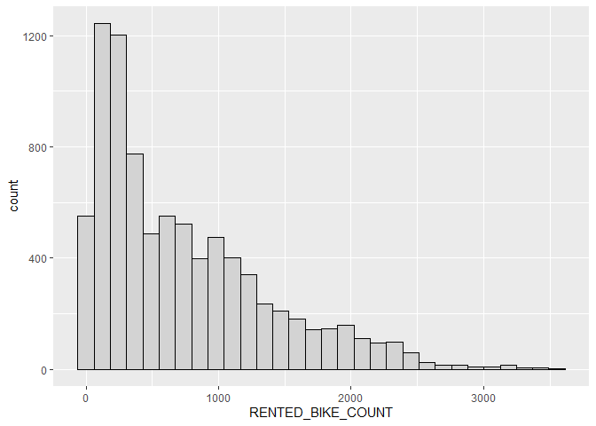<!-- -->
</br>

The mode of bikes rented is about 250. The distribution is right skewed.

</br>

Association between `RENTED_BIKE_COUNT` and `TEMPERATURE`.

``` r
ggplot(seoul_bike_sharing, aes(TEMPERATURE,RENTED_BIKE_COUNT)) + 
  geom_point()+
  geom_smooth(method="lm", formula = y ~ poly(x, 4), se = FALSE)
```

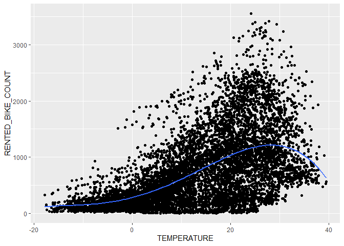<!-- -->

</br>

It seems that there is a non-linear positive relationship, possibly a
fourth-degree polynomial, between the two variables. `RENTED_BIKE_COUNT`
peaks at around 25 degrees Celsius.

</br>

Association between `RENTED_BIKE_COUNT` and `HUMIDITY`

``` r
ggplot(seoul_bike_sharing, aes(HUMIDITY,RENTED_BIKE_COUNT)) + 
  geom_point()+
  geom_smooth(method="lm", formula = y ~ poly(x, 2), se = FALSE)
```

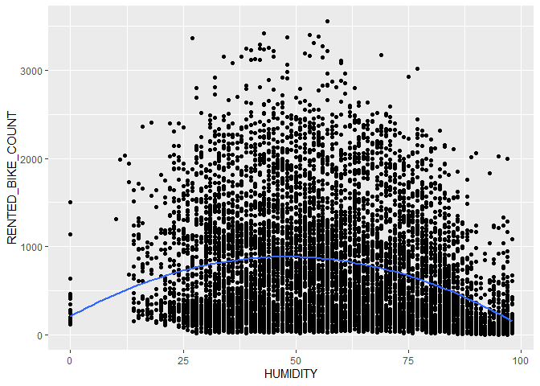<!-- -->

</br>

It appears that there is a weak non-linear relationship between
`HUMIDITY` and `RENTED_BIKE_COUNT`. Moderate humidity levels tend to be
associated with a greater number of rented bikes.

</br>

Association between `RENTED_BIKE_COUNT` and `WIND_SPEED`

``` r
ggplot(seoul_bike_sharing, aes(WIND_SPEED,RENTED_BIKE_COUNT)) + 
  geom_point()
```

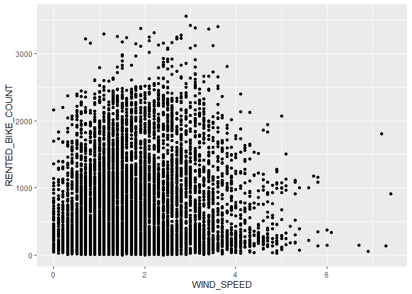<!-- -->

</br>

Not much association can be observed between `WIND_SPEED` and
`RENTED_BIKE_COUNT`.

</br>

Association between `RENTED_BIKE_COUNT` and `VISIBILITY`

``` r
ggplot(seoul_bike_sharing, aes(VISIBILITY,RENTED_BIKE_COUNT)) + 
  geom_point()
```

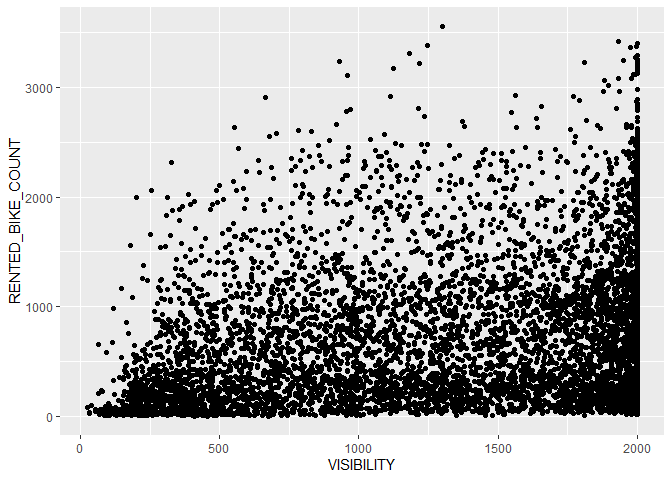<!-- -->

</br>

Not much association can be observed between `VISIBILITY` and
`RENTED_BIKE_COUNT`.

</br>

Association between `RENTED_BIKE_COUNT` and `DEW_POINT_TEMPERATURE`

``` r
ggplot(seoul_bike_sharing, aes(DEW_POINT_TEMPERATURE,RENTED_BIKE_COUNT)) + 
  geom_point()
```

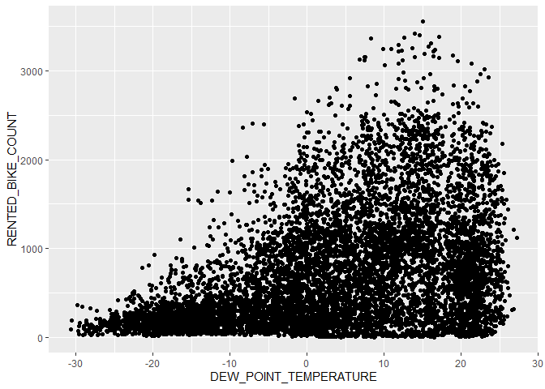<!-- -->

</br>

The relationship between `RENTED_BIKE_COUNT` and `DEW_POINT_TEMPERATURE`
is similar to that between `RENTED_BIKE_COUNT` and `TEMPERATURE`.This is
expected as `TEMPERATURE` and `DEW_POINT_TEMPERATURE` have very high
correlation. Thus, we can exclude one of the features in our model
later.

</br>

Association between `RENTED_BIKE_COUNT` and `SOLAR_RADIATION`

``` r
ggplot(seoul_bike_sharing, aes(SOLAR_RADIATION,RENTED_BIKE_COUNT)) + 
  geom_point()
```

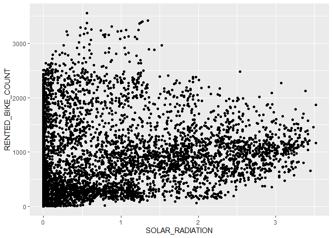<!-- -->

</br>

There is a very weak negative relationship between the two variables.

</br>

Association between `RENTED_BIKE_COUNT` and `RAINFALL`

``` r
ggplot(seoul_bike_sharing, aes(RAINFALL,RENTED_BIKE_COUNT)) + 
  geom_point()
```

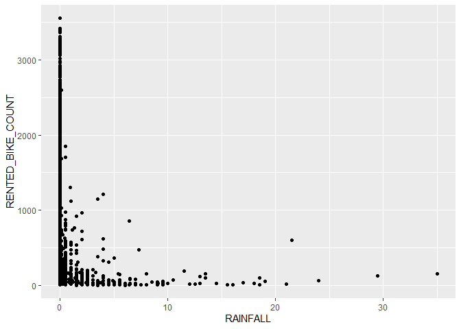<!-- -->

``` r
df_rain<-seoul_bike_sharing%>%
  group_by(RAINFALL)%>%
  summarise(AVG_BIKE=mean(RENTED_BIKE_COUNT))

ggplot(df_rain, aes(RAINFALL, AVG_BIKE))+
  geom_point()+
  labs(title = "Average Rented Bikes by Rainfall")
```

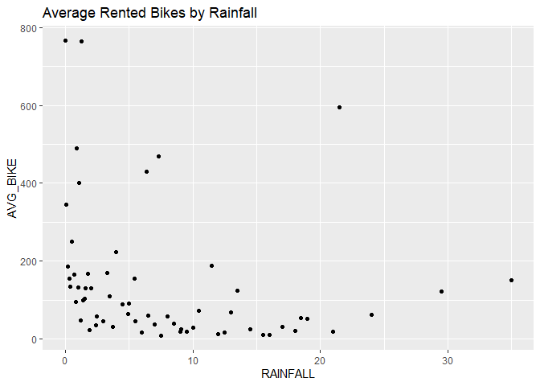<!-- -->

</br>

The average number of rented bikes is significantly larger when there
are no rainfall or very minimal rainfall.

</br>

Association between `RENTED_BIKE_COUNT` and `SNOWFALL`

``` r
ggplot(seoul_bike_sharing, aes(SNOWFALL,RENTED_BIKE_COUNT)) + 
  geom_point()
```

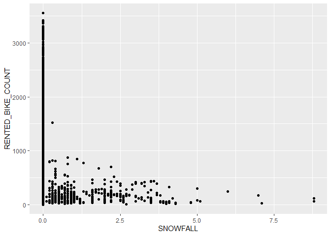<!-- -->

``` r
df_rain<-seoul_bike_sharing%>%
  group_by(SNOWFALL)%>%
  summarise(AVG_BIKE=mean(RENTED_BIKE_COUNT))

ggplot(df_rain, aes(SNOWFALL, AVG_BIKE))+
  geom_point()+
  labs(title = "Average Rented Bikes by Snowfall")
```

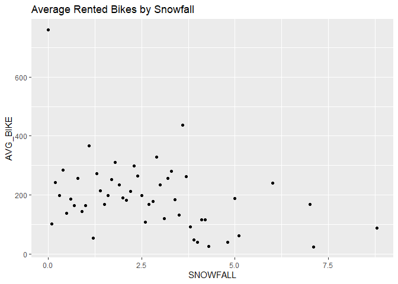<!-- -->

</br>

Similar to `RAINFALL`, the average number of rented bikes significantly
increases in the absence of snowfall. The average number of rented bikes
remains relatively similar(low) during snowfall.

</br>

Association between rented bike count with day and time

``` r
ggplot(seoul_bike_sharing, aes(DATE, RENTED_BIKE_COUNT, color=HOUR))+
  geom_point(alpha=0.8)
```

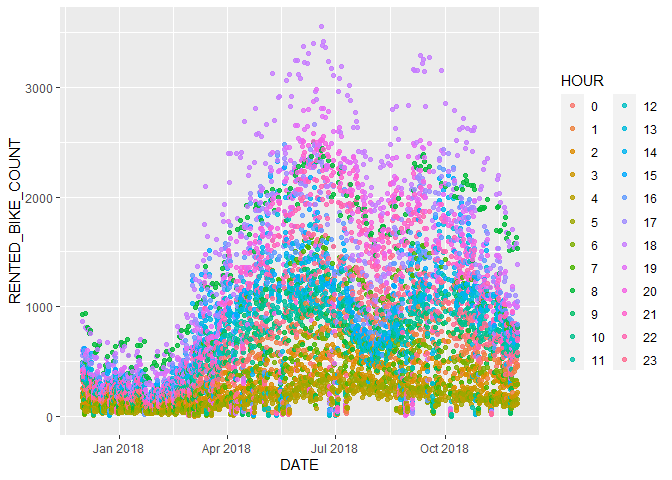<!-- -->
</br>

1)  The number of rented bikes reaches its peak around mid-year and
    October, while it tends to be lower before April. This pattern
    suggests an association with the seasons, where mid-year and October
    align with spring/summer and autumn, respectively, while the period
    before April corresponds to winter.

2)  The number of rented bikes appears to be associated with time. There
    is a notable peak during the evening around 6 pm, followed by
    another peak in the morning around 8 am.

</br>

Let’s delve into a more comprehensive analysis of the relationship
between the number of rented bikes and the factors of seasons and time

``` r
ggplot(seoul_bike_sharing, aes(HOUR, RENTED_BIKE_COUNT))+
  geom_boxplot()+
  facet_wrap(~seoul_bike_sharing$SEASONS)
```

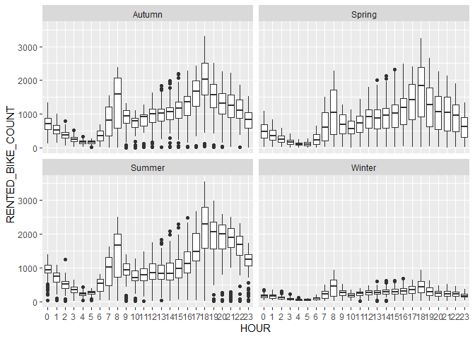<!-- -->
</br>

The overall scale of bike rental counts does indeed vary with the
seasons. Summer tends to have slightly higher average number of rented
bike than spring and autumn, which exhibit a very similar scale. In
contrast, winter has a substantially lower scale compared to the other
three seasons. Despite these differences in scale, key patterns remain
remarkably consistent. For instance, peak demand times persist at 8 am
and 6 pm across all seasons

</br>

Let’s explore whether holidays have an impact on the number of rented
bikes.

``` r
t.test(RENTED_BIKE_COUNT ~ HOLIDAY, data = seoul_bike_sharing)
```

    ## 
    ##  Welch Two Sample t-test
    ## 
    ## data:  RENTED_BIKE_COUNT by HOLIDAY
    ## t = -7.1703, df = 460.46, p-value = 3.002e-12
    ## alternative hypothesis: true difference in means between group Holiday and group No Holiday is not equal to 0
    ## 95 percent confidence interval:
    ##  -267.7201 -152.5410
    ## sample estimates:
    ##    mean in group Holiday mean in group No Holiday 
    ##                 529.1544                 739.2850

On average, the number of rented bikes is significantly higher on
non-holidays compared to holidays.

</br>

Additionally, we analyze how weekdays and weekends influence the demand
for bike rentals.

``` r
seoul_bike_sharing$IS_WEEKEND<-ifelse(is.weekend(seoul_bike_sharing$DATE), 1, 0)
t.test(RENTED_BIKE_COUNT ~ IS_WEEKEND, data = seoul_bike_sharing)
```

    ## 
    ##  Welch Two Sample t-test
    ## 
    ## data:  RENTED_BIKE_COUNT by IS_WEEKEND
    ## t = 4.4203, df = 4876.6, p-value = 1.007e-05
    ## alternative hypothesis: true difference in means between group 0 and group 1 is not equal to 0
    ## 95 percent confidence interval:
    ##  36.57985 94.88752
    ## sample estimates:
    ## mean in group 0 mean in group 1 
    ##        748.1122        682.3785

On average, the number of rented bikes is significantly higher on
weekdays compared to weekends. Hence, we will include this additional
feature in our analysis.

</br>

## Baseline Predictive Modelling

We will first remove unused columns. We won’t be using the `DATE`
column, because ‘as is’, it basically acts like an data entry index. We
also do not need the `FUNCTIONAL DAY` column because it only has one
distinct value remaining.

``` r
df_removed <- seoul_bike_sharing %>% 
  select(-DATE, -FUNCTIONING_DAY) 
```

Convert categorical/ordinal attributes to dummy variables.

``` r
df_converted <- dummy_cols(df_removed, 
                           select_columns = c("SEASONS", "HOLIDAY", "HOUR"),
                           remove_first_dummy = TRUE)%>%
                select(-SEASONS, -HOLIDAY,-HOUR)

####Standardized column names again
names(df_converted)<-toupper(names(df_converted))
names(df_converted)<-str_replace_all(names(df_converted), " ", "_")
head(df_converted)
```

    ##   RENTED_BIKE_COUNT TEMPERATURE HUMIDITY WIND_SPEED VISIBILITY
    ## 1               254        -5.2       37        2.2       2000
    ## 2               204        -5.5       38        0.8       2000
    ## 3               173        -6.0       39        1.0       2000
    ## 4               107        -6.2       40        0.9       2000
    ## 5                78        -6.0       36        2.3       2000
    ## 6               100        -6.4       37        1.5       2000
    ##   DEW_POINT_TEMPERATURE SOLAR_RADIATION RAINFALL SNOWFALL IS_WEEKEND
    ## 1                 -17.6               0        0        0          0
    ## 2                 -17.6               0        0        0          0
    ## 3                 -17.7               0        0        0          0
    ## 4                 -17.6               0        0        0          0
    ## 5                 -18.6               0        0        0          0
    ## 6                 -18.7               0        0        0          0
    ##   SEASONS_SPRING SEASONS_SUMMER SEASONS_WINTER HOLIDAY_NO_HOLIDAY HOUR_1 HOUR_2
    ## 1              0              0              1                  1      0      0
    ## 2              0              0              1                  1      1      0
    ## 3              0              0              1                  1      0      1
    ## 4              0              0              1                  1      0      0
    ## 5              0              0              1                  1      0      0
    ## 6              0              0              1                  1      0      0
    ##   HOUR_3 HOUR_4 HOUR_5 HOUR_6 HOUR_7 HOUR_8 HOUR_9 HOUR_10 HOUR_11 HOUR_12
    ## 1      0      0      0      0      0      0      0       0       0       0
    ## 2      0      0      0      0      0      0      0       0       0       0
    ## 3      0      0      0      0      0      0      0       0       0       0
    ## 4      1      0      0      0      0      0      0       0       0       0
    ## 5      0      1      0      0      0      0      0       0       0       0
    ## 6      0      0      1      0      0      0      0       0       0       0
    ##   HOUR_13 HOUR_14 HOUR_15 HOUR_16 HOUR_17 HOUR_18 HOUR_19 HOUR_20 HOUR_21
    ## 1       0       0       0       0       0       0       0       0       0
    ## 2       0       0       0       0       0       0       0       0       0
    ## 3       0       0       0       0       0       0       0       0       0
    ## 4       0       0       0       0       0       0       0       0       0
    ## 5       0       0       0       0       0       0       0       0       0
    ## 6       0       0       0       0       0       0       0       0       0
    ##   HOUR_22 HOUR_23
    ## 1       0       0
    ## 2       0       0
    ## 3       0       0
    ## 4       0       0
    ## 5       0       0
    ## 6       0       0

Scale and Normalize numerical data

``` r
df_final<- df_converted %>% 
 mutate_at(c('TEMPERATURE', 'HUMIDITY', 'WIND_SPEED', 'VISIBILITY', 'DEW_POINT_TEMPERATURE', 'SOLAR_RADIATION', 'RAINFALL', 'SNOWFALL'), ~(normalize(.,method = "range", range = c(0, 1)) %>% as.vector))
summary(df_final)
```

    ##  RENTED_BIKE_COUNT  TEMPERATURE        HUMIDITY        WIND_SPEED    
    ##  Min.   :   2.0    Min.   :0.0000   Min.   :0.0000   Min.   :0.0000  
    ##  1st Qu.: 214.0    1st Qu.:0.3636   1st Qu.:0.4286   1st Qu.:0.1216  
    ##  Median : 542.0    Median :0.5472   Median :0.5816   Median :0.2027  
    ##  Mean   : 729.2    Mean   :0.5345   Mean   :0.5933   Mean   :0.2332  
    ##  3rd Qu.:1084.0    3rd Qu.:0.7080   3rd Qu.:0.7551   3rd Qu.:0.3108  
    ##  Max.   :3556.0    Max.   :1.0000   Max.   :1.0000   Max.   :1.0000  
    ##    VISIBILITY     DEW_POINT_TEMPERATURE SOLAR_RADIATION       RAINFALL       
    ##  Min.   :0.0000   Min.   :0.0000        Min.   :0.000000   Min.   :0.000000  
    ##  1st Qu.:0.4602   1st Qu.:0.4412        1st Qu.:0.000000   1st Qu.:0.000000  
    ##  Median :0.8429   Median :0.6107        Median :0.002841   Median :0.000000  
    ##  Mean   :0.7131   Mean   :0.5977        Mean   :0.161326   Mean   :0.004261  
    ##  3rd Qu.:1.0000   3rd Qu.:0.7924        3rd Qu.:0.264205   3rd Qu.:0.000000  
    ##  Max.   :1.0000   Max.   :1.0000        Max.   :1.000000   Max.   :1.000000  
    ##     SNOWFALL          IS_WEEKEND     SEASONS_SPRING   SEASONS_SUMMER  
    ##  Min.   :0.000000   Min.   :0.0000   Min.   :0.0000   Min.   :0.0000  
    ##  1st Qu.:0.000000   1st Qu.:0.0000   1st Qu.:0.0000   1st Qu.:0.0000  
    ##  Median :0.000000   Median :0.0000   Median :0.0000   Median :0.0000  
    ##  Mean   :0.008828   Mean   :0.2884   Mean   :0.2552   Mean   :0.2608  
    ##  3rd Qu.:0.000000   3rd Qu.:1.0000   3rd Qu.:1.0000   3rd Qu.:1.0000  
    ##  Max.   :1.000000   Max.   :1.0000   Max.   :1.0000   Max.   :1.0000  
    ##  SEASONS_WINTER   HOLIDAY_NO_HOLIDAY     HOUR_1            HOUR_2       
    ##  Min.   :0.0000   Min.   :0.0000     Min.   :0.00000   Min.   :0.00000  
    ##  1st Qu.:0.0000   1st Qu.:1.0000     1st Qu.:0.00000   1st Qu.:0.00000  
    ##  Median :0.0000   Median :1.0000     Median :0.00000   Median :0.00000  
    ##  Mean   :0.2552   Mean   :0.9518     Mean   :0.04158   Mean   :0.04158  
    ##  3rd Qu.:1.0000   3rd Qu.:1.0000     3rd Qu.:0.00000   3rd Qu.:0.00000  
    ##  Max.   :1.0000   Max.   :1.0000     Max.   :1.00000   Max.   :1.00000  
    ##      HOUR_3            HOUR_4            HOUR_5            HOUR_6       
    ##  Min.   :0.00000   Min.   :0.00000   Min.   :0.00000   Min.   :0.00000  
    ##  1st Qu.:0.00000   1st Qu.:0.00000   1st Qu.:0.00000   1st Qu.:0.00000  
    ##  Median :0.00000   Median :0.00000   Median :0.00000   Median :0.00000  
    ##  Mean   :0.04158   Mean   :0.04158   Mean   :0.04158   Mean   :0.04158  
    ##  3rd Qu.:0.00000   3rd Qu.:0.00000   3rd Qu.:0.00000   3rd Qu.:0.00000  
    ##  Max.   :1.00000   Max.   :1.00000   Max.   :1.00000   Max.   :1.00000  
    ##      HOUR_7           HOUR_8           HOUR_9          HOUR_10      
    ##  Min.   :0.0000   Min.   :0.0000   Min.   :0.0000   Min.   :0.0000  
    ##  1st Qu.:0.0000   1st Qu.:0.0000   1st Qu.:0.0000   1st Qu.:0.0000  
    ##  Median :0.0000   Median :0.0000   Median :0.0000   Median :0.0000  
    ##  Mean   :0.0417   Mean   :0.0417   Mean   :0.0417   Mean   :0.0417  
    ##  3rd Qu.:0.0000   3rd Qu.:0.0000   3rd Qu.:0.0000   3rd Qu.:0.0000  
    ##  Max.   :1.0000   Max.   :1.0000   Max.   :1.0000   Max.   :1.0000  
    ##     HOUR_11          HOUR_12          HOUR_13          HOUR_14      
    ##  Min.   :0.0000   Min.   :0.0000   Min.   :0.0000   Min.   :0.0000  
    ##  1st Qu.:0.0000   1st Qu.:0.0000   1st Qu.:0.0000   1st Qu.:0.0000  
    ##  Median :0.0000   Median :0.0000   Median :0.0000   Median :0.0000  
    ##  Mean   :0.0417   Mean   :0.0417   Mean   :0.0417   Mean   :0.0417  
    ##  3rd Qu.:0.0000   3rd Qu.:0.0000   3rd Qu.:0.0000   3rd Qu.:0.0000  
    ##  Max.   :1.0000   Max.   :1.0000   Max.   :1.0000   Max.   :1.0000  
    ##     HOUR_15          HOUR_16          HOUR_17          HOUR_18      
    ##  Min.   :0.0000   Min.   :0.0000   Min.   :0.0000   Min.   :0.0000  
    ##  1st Qu.:0.0000   1st Qu.:0.0000   1st Qu.:0.0000   1st Qu.:0.0000  
    ##  Median :0.0000   Median :0.0000   Median :0.0000   Median :0.0000  
    ##  Mean   :0.0417   Mean   :0.0417   Mean   :0.0417   Mean   :0.0417  
    ##  3rd Qu.:0.0000   3rd Qu.:0.0000   3rd Qu.:0.0000   3rd Qu.:0.0000  
    ##  Max.   :1.0000   Max.   :1.0000   Max.   :1.0000   Max.   :1.0000  
    ##     HOUR_19          HOUR_20          HOUR_21          HOUR_22      
    ##  Min.   :0.0000   Min.   :0.0000   Min.   :0.0000   Min.   :0.0000  
    ##  1st Qu.:0.0000   1st Qu.:0.0000   1st Qu.:0.0000   1st Qu.:0.0000  
    ##  Median :0.0000   Median :0.0000   Median :0.0000   Median :0.0000  
    ##  Mean   :0.0417   Mean   :0.0417   Mean   :0.0417   Mean   :0.0417  
    ##  3rd Qu.:0.0000   3rd Qu.:0.0000   3rd Qu.:0.0000   3rd Qu.:0.0000  
    ##  Max.   :1.0000   Max.   :1.0000   Max.   :1.0000   Max.   :1.0000  
    ##     HOUR_23      
    ##  Min.   :0.0000  
    ##  1st Qu.:0.0000  
    ##  Median :0.0000  
    ##  Mean   :0.0417  
    ##  3rd Qu.:0.0000  
    ##  Max.   :1.0000

Based on EDA and prior knowledge, weather conditions may affect people’s
bike renting. Thus, we will build a model to explain the city’s
bike-sharing demand based on its local weather information.

``` r
df1<-df_final%>%
  select(RENTED_BIKE_COUNT,TEMPERATURE, HUMIDITY, WIND_SPEED, VISIBILITY, DEW_POINT_TEMPERATURE, SOLAR_RADIATION, RAINFALL, SNOWFALL)

lm_model_weather<-lm(RENTED_BIKE_COUNT~.,df1)
summary(lm_model_weather)
```

    ## 
    ## Call:
    ## lm(formula = RENTED_BIKE_COUNT ~ ., data = df1)
    ## 
    ## Residuals:
    ##      Min       1Q   Median       3Q      Max 
    ## -1383.08  -295.36   -57.59   208.03  2331.02 
    ## 
    ## Coefficients:
    ##                        Estimate Std. Error t value Pr(>|t|)    
    ## (Intercept)             208.739     51.228   4.075 4.65e-05 ***
    ## TEMPERATURE            2081.995    232.074   8.971  < 2e-16 ***
    ## HUMIDITY              -1051.702    112.937  -9.312  < 2e-16 ***
    ## WIND_SPEED              396.932     41.219   9.630  < 2e-16 ***
    ## VISIBILITY                4.742     21.329   0.222  0.82407    
    ## DEW_POINT_TEMPERATURE    13.361    247.566   0.054  0.95696    
    ## SOLAR_RADIATION        -416.810     29.976 -13.905  < 2e-16 ***
    ## RAINFALL              -1867.176    170.108 -10.976  < 2e-16 ***
    ## SNOWFALL                328.687    109.057   3.014  0.00259 ** 
    ## ---
    ## Signif. codes:  0 '***' 0.001 '**' 0.01 '*' 0.05 '.' 0.1 ' ' 1
    ## 
    ## Residual standard error: 484.1 on 8456 degrees of freedom
    ## Multiple R-squared:  0.4327, Adjusted R-squared:  0.4321 
    ## F-statistic: 806.1 on 8 and 8456 DF,  p-value: < 2.2e-16

The adjusted R-squared suggests that the weather model explains 43.2% of
the data variability. `VISIBILITY` and `DEW_POINT_TEMPERATURE` are not
significant.

</br>

Based on EDA, it appears that additional features such as seasons or
time could also be influential predictors of bike rental demand.
Consequently, we will construct another model incorporating all features
and compare its performance with the weather-based model.

``` r
df2<-df_final%>%
 select(everything()) 

lm_model_all<-lm(RENTED_BIKE_COUNT ~ ., df2)
summary(lm_model_all)
```

    ## 
    ## Call:
    ## lm(formula = RENTED_BIKE_COUNT ~ ., data = df2)
    ## 
    ## Residuals:
    ##      Min       1Q   Median       3Q      Max 
    ## -1356.02  -222.08   -13.29   201.88  1877.71 
    ## 
    ## Coefficients:
    ##                        Estimate Std. Error t value Pr(>|t|)    
    ## (Intercept)             494.266     55.154   8.962  < 2e-16 ***
    ## TEMPERATURE             679.397    186.568   3.642 0.000273 ***
    ## HUMIDITY               -969.364     88.047 -11.010  < 2e-16 ***
    ## WIND_SPEED              -17.311     34.278  -0.505 0.613552    
    ## VISIBILITY                7.907     17.247   0.458 0.646633    
    ## DEW_POINT_TEMPERATURE   736.143    195.246   3.770 0.000164 ***
    ## SOLAR_RADIATION         280.639     35.306   7.949 2.13e-15 ***
    ## RAINFALL              -2175.458    132.347 -16.438  < 2e-16 ***
    ## SNOWFALL                264.841     85.019   3.115 0.001845 ** 
    ## IS_WEEKEND              -83.141      8.977  -9.262  < 2e-16 ***
    ## SEASONS_SPRING         -163.438     12.257 -13.335  < 2e-16 ***
    ## SEASONS_SUMMER         -167.842     15.162 -11.070  < 2e-16 ***
    ## SEASONS_WINTER         -358.336     17.237 -20.789  < 2e-16 ***
    ## HOLIDAY_NO_HOLIDAY      128.091     19.144   6.691 2.36e-11 ***
    ## HOUR_1                 -105.826     28.085  -3.768 0.000166 ***
    ## HOUR_2                 -217.537     28.106  -7.740 1.11e-14 ***
    ## HOUR_3                 -304.378     28.124 -10.823  < 2e-16 ***
    ## HOUR_4                 -367.065     28.133 -13.047  < 2e-16 ***
    ## HOUR_5                 -354.762     28.175 -12.591  < 2e-16 ***
    ## HOUR_6                 -186.891     28.196  -6.628 3.60e-11 ***
    ## HOUR_7                  126.122     28.196   4.473 7.81e-06 ***
    ## HOUR_8                  497.983     28.371  17.553  < 2e-16 ***
    ## HOUR_9                   23.935     29.009   0.825 0.409340    
    ## HOUR_10                -214.073     30.130  -7.105 1.30e-12 ***
    ## HOUR_11                -224.725     31.328  -7.173 7.94e-13 ***
    ## HOUR_12                -184.469     32.221  -5.725 1.07e-08 ***
    ## HOUR_13                -182.574     32.528  -5.613 2.05e-08 ***
    ## HOUR_14                -177.126     32.078  -5.522 3.46e-08 ***
    ## HOUR_15                 -89.202     31.311  -2.849 0.004397 ** 
    ## HOUR_16                  48.378     30.258   1.599 0.109895    
    ## HOUR_17                 330.613     29.351  11.264  < 2e-16 ***
    ## HOUR_18                 789.189     28.742  27.458  < 2e-16 ***
    ## HOUR_19                 528.135     28.435  18.573  < 2e-16 ***
    ## HOUR_20                 455.040     28.301  16.079  < 2e-16 ***
    ## HOUR_21                 447.533     28.165  15.890  < 2e-16 ***
    ## HOUR_22                 349.276     28.083  12.437  < 2e-16 ***
    ## HOUR_23                 111.008     28.057   3.957 7.67e-05 ***
    ## ---
    ## Signif. codes:  0 '***' 0.001 '**' 0.01 '*' 0.05 '.' 0.1 ' ' 1
    ## 
    ## Residual standard error: 372.4 on 8428 degrees of freedom
    ## Multiple R-squared:  0.6654, Adjusted R-squared:  0.6639 
    ## F-statistic: 465.5 on 36 and 8428 DF,  p-value: < 2.2e-16

The current model outperforms the previous one based on the adjusted
R-squared, suggesting that both weather conditions and time are
significant predictors. As anticipated, `WIND_SPEED` and `VISIBILITY`
are not deemed significant, as their association with
`RENTED_BIKE_COUNT` lacks statistical significance, as observed in the
exploratory data analysis (EDA).

</br>

## Refine the Regression Model

To enhance the lm_model_all model, which exhibits a higher adjusted
R-squared, we will address the issue of multicollinearity observed in
the Exploratory Data Analysis (EDA). We will exclude one of the highly
correlated variables.

``` r
#we exclude DEW_POINT_TEMPERATURE that is highly correlated with TEMPERATURE and SOLAR_RADIATION that exhibits a noteworthy correlation with both HUMIDITY and WIND_SPEED. 
vif(lm_model_all)
```

    ##           TEMPERATURE              HUMIDITY            WIND_SPEED 
    ##             95.165503             20.675225              1.401023 
    ##            VISIBILITY DEW_POINT_TEMPERATURE       SOLAR_RADIATION 
    ##              1.730103            122.137304              4.629253 
    ##              RAINFALL              SNOWFALL            IS_WEEKEND 
    ##              1.105663              1.123492              1.009500 
    ##        SEASONS_SPRING        SEASONS_SUMMER        SEASONS_WINTER 
    ##              1.742935              2.705646              3.447277 
    ##    HOLIDAY_NO_HOLIDAY                HOUR_1                HOUR_2 
    ##              1.026404              1.919064              1.921952 
    ##                HOUR_3                HOUR_4                HOUR_5 
    ##              1.924388              1.925602              1.931297 
    ##                HOUR_6                HOUR_7                HOUR_8 
    ##              1.934182              1.939498              1.963607 
    ##                HOUR_9               HOUR_10               HOUR_11 
    ##              2.052944              2.214597              2.394223 
    ##               HOUR_12               HOUR_13               HOUR_14 
    ##              2.532780              2.581229              2.510240 
    ##               HOUR_15               HOUR_16               HOUR_17 
    ##              2.391603              2.233568              2.101609 
    ##               HOUR_18               HOUR_19               HOUR_20 
    ##              2.015265              1.972544              1.953944 
    ##               HOUR_21               HOUR_22               HOUR_23 
    ##              1.935147              1.923926              1.920404

``` r
vif(lm(RENTED_BIKE_COUNT ~ .-DEW_POINT_TEMPERATURE-SOLAR_RADIATION, df2))
```

    ##        TEMPERATURE           HUMIDITY         WIND_SPEED         VISIBILITY 
    ##           5.030664           2.340458           1.367162           1.716584 
    ##           RAINFALL           SNOWFALL         IS_WEEKEND     SEASONS_SPRING 
    ##           1.087038           1.114642           1.005168           1.721337 
    ##     SEASONS_SUMMER     SEASONS_WINTER HOLIDAY_NO_HOLIDAY             HOUR_1 
    ##           2.693515           3.447252           1.026309           1.918788 
    ##             HOUR_2             HOUR_3             HOUR_4             HOUR_5 
    ##           1.921102           1.922884           1.923627           1.928253 
    ##             HOUR_6             HOUR_7             HOUR_8             HOUR_9 
    ##           1.930074           1.929445           1.924063           1.931966 
    ##            HOUR_10            HOUR_11            HOUR_12            HOUR_13 
    ##           1.954664           1.994179           2.033026           2.074119 
    ##            HOUR_14            HOUR_15            HOUR_16            HOUR_17 
    ##           2.094136           2.110191           2.095791           2.061346 
    ##            HOUR_18            HOUR_19            HOUR_20            HOUR_21 
    ##           2.011843           1.968855           1.948157           1.932238 
    ##            HOUR_22            HOUR_23 
    ##           1.922827           1.920131

Upon removing correlated variables, the VIF values have substantially
decreased, and the remaining variables now exhibit acceptable VIF
values, all equal to or below 5.

</br>

In the lm_model_all, it is evident that several HOUR dummy variables are
insignificant. Consequently, we merge some of them based on their
coefficient sizes. We also remove correlated and insignificant
variables.

``` r
df3 <- df_final %>%
  mutate(HOUR_9_16 = HOUR_9 + HOUR_16,
         HOUR_15_1_12_13_14 =  HOUR_15 + HOUR_1 + HOUR_12+ HOUR_13 + HOUR_14) %>%
  select(-HOUR_1, -HOUR_15, -HOUR_9, -HOUR_16, -HOUR_12, -HOUR_13 , -HOUR_14, -WIND_SPEED, -VISIBILITY, -DEW_POINT_TEMPERATURE, -SOLAR_RADIATION)
```

We will utilize the ‘glm’ function, which provides the AIC measurement
for more robust comparisons. The chosen distribution is Gaussian, and
the identity link is employed, equivalent to linear regression.

``` r
lm_model_all_refined1<-glm(RENTED_BIKE_COUNT ~ ., family=gaussian(link = "identity"),df3)
summary(lm_model_all_refined1)
```

    ## 
    ## Call:
    ## glm(formula = RENTED_BIKE_COUNT ~ ., family = gaussian(link = "identity"), 
    ##     data = df3)
    ## 
    ## Deviance Residuals: 
    ##      Min        1Q    Median        3Q       Max  
    ## -1348.70   -225.79    -13.77    200.11   1856.22  
    ## 
    ## Coefficients:
    ##                     Estimate Std. Error t value Pr(>|t|)    
    ## (Intercept)          402.685     39.260  10.257  < 2e-16 ***
    ## TEMPERATURE         1481.631     41.589  35.625  < 2e-16 ***
    ## HUMIDITY            -771.692     23.264 -33.171  < 2e-16 ***
    ## RAINFALL           -2270.037    131.277 -17.292  < 2e-16 ***
    ## SNOWFALL             279.422     84.843   3.293 0.000994 ***
    ## IS_WEEKEND           -84.863      8.984  -9.446  < 2e-16 ***
    ## SEASONS_SPRING      -154.330     11.741 -13.145  < 2e-16 ***
    ## SEASONS_SUMMER      -166.597     14.965 -11.132  < 2e-16 ***
    ## SEASONS_WINTER      -353.704     16.869 -20.967  < 2e-16 ***
    ## HOLIDAY_NO_HOLIDAY   127.220     19.210   6.622 3.75e-11 ***
    ## HOUR_2              -213.503     28.198  -7.571 4.08e-14 ***
    ## HOUR_3              -298.185     28.207 -10.571  < 2e-16 ***
    ## HOUR_4              -359.663     28.216 -12.747  < 2e-16 ***
    ## HOUR_5              -345.472     28.231 -12.237  < 2e-16 ***
    ## HOUR_6              -176.627     28.241  -6.254 4.19e-10 ***
    ## HOUR_7               142.831     28.211   5.063 4.22e-07 ***
    ## HOUR_8               529.697     28.183  18.795  < 2e-16 ***
    ## HOUR_10             -134.476     28.313  -4.750 2.07e-06 ***
    ## HOUR_11             -127.564     28.494  -4.477 7.68e-06 ***
    ## HOUR_17              352.296     28.712  12.270  < 2e-16 ***
    ## HOUR_18              789.575     28.552  27.654  < 2e-16 ***
    ## HOUR_19              517.017     28.364  18.228  < 2e-16 ***
    ## HOUR_20              442.519     28.283  15.646  < 2e-16 ***
    ## HOUR_21              439.035     28.226  15.554  < 2e-16 ***
    ## HOUR_22              344.348     28.186  12.217  < 2e-16 ***
    ## HOUR_23              108.834     28.173   3.863 0.000113 ***
    ## HOUR_9_16             86.993     24.686   3.524 0.000427 ***
    ## HOUR_15_1_12_13_14   -72.682     22.363  -3.250 0.001158 ** 
    ## ---
    ## Signif. codes:  0 '***' 0.001 '**' 0.01 '*' 0.05 '.' 0.1 ' ' 1
    ## 
    ## (Dispersion parameter for gaussian family taken to be 139852)
    ## 
    ##     Null deviance: 3492373534  on 8464  degrees of freedom
    ## Residual deviance: 1179931204  on 8437  degrees of freedom
    ## AIC: 124349
    ## 
    ## Number of Fisher Scoring iterations: 2

``` r
AIC(lm_model_all_refined1)
```

    ## [1] 124348.8

``` r
BIC(lm_model_all_refined1)
```

    ## [1] 124553

``` r
phi=summary(lm_model_all_refined1)$dispersion
qqnorm(residuals(lm_model_all_refined1, type="deviance")/sqrt(phi))
qqline(residuals(lm_model_all_refined1, type="deviance")/sqrt(phi))
```

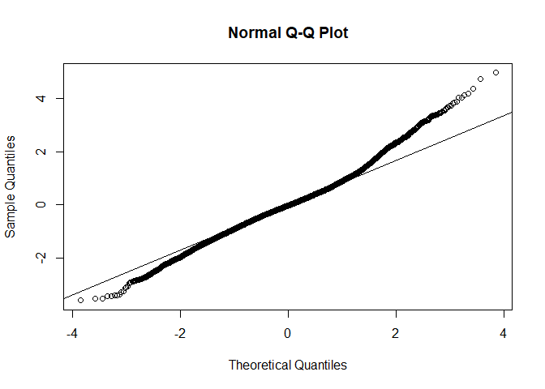<!-- -->

``` r
plot(fitted(lm_model_all_refined1), residuals(lm_model_all_refined1, type="deviance")/sqrt(phi),
xlab="fitted values",
ylab="standardised residuals")
```

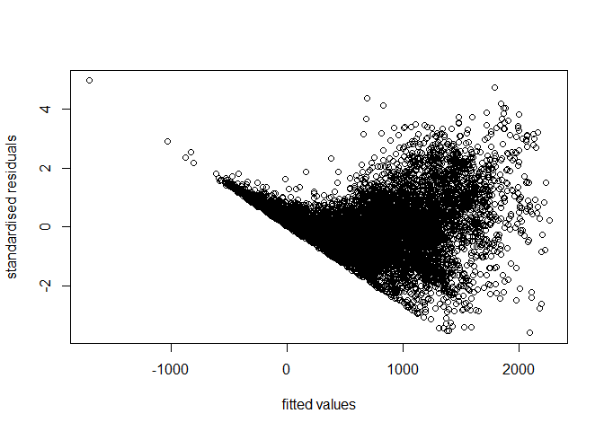<!-- -->

</br>

All variables are statistically significant. However, the Q-Q plot
reveals slight deviations at both ends, and the residual plot displays
noticeable patterns. These observations suggest that modifications to
the model are necessary.

</br>

In the EDA, we observed that the relationships between TEMPERATURE and
RENTED_BIKE_COUNT and between HUMIDITY and RENTED_BIKE_COUNT are not
linear. Thus, we will introduce polynomial forms to assess whether it
improves the model.

``` r
lm_model_all_refined2<-glm(RENTED_BIKE_COUNT ~ poly(TEMPERATURE, 4)+poly(HUMIDITY, 2)+., family=gaussian(link = "identity"), df3)
summary(lm_model_all_refined2)
```

    ## 
    ## Call:
    ## glm(formula = RENTED_BIKE_COUNT ~ poly(TEMPERATURE, 4) + poly(HUMIDITY, 
    ##     2) + ., family = gaussian(link = "identity"), data = df3)
    ## 
    ## Deviance Residuals: 
    ##      Min        1Q    Median        3Q       Max  
    ## -1404.21   -216.65     -1.39    185.53   1548.48  
    ## 
    ## Coefficients: (2 not defined because of singularities)
    ##                         Estimate Std. Error t value Pr(>|t|)    
    ## (Intercept)              698.674     26.330  26.535  < 2e-16 ***
    ## poly(TEMPERATURE, 4)1  29032.724    755.198  38.444  < 2e-16 ***
    ## poly(TEMPERATURE, 4)2  -2608.217    482.717  -5.403 6.72e-08 ***
    ## poly(TEMPERATURE, 4)3  -9913.782    356.618 -27.799  < 2e-16 ***
    ## poly(TEMPERATURE, 4)4  -5883.389    383.042 -15.360  < 2e-16 ***
    ## poly(HUMIDITY, 2)1    -15962.782    429.413 -37.173  < 2e-16 ***
    ## poly(HUMIDITY, 2)2     -7872.960    372.115 -21.157  < 2e-16 ***
    ## TEMPERATURE                   NA         NA      NA       NA    
    ## HUMIDITY                      NA         NA      NA       NA    
    ## RAINFALL               -1747.368    125.713 -13.900  < 2e-16 ***
    ## SNOWFALL                 496.521     78.969   6.287 3.39e-10 ***
    ## IS_WEEKEND               -80.568      8.307  -9.699  < 2e-16 ***
    ## SEASONS_SPRING          -121.731     10.914 -11.154  < 2e-16 ***
    ## SEASONS_SUMMER          -155.061     15.554  -9.969  < 2e-16 ***
    ## SEASONS_WINTER          -318.241     17.573 -18.110  < 2e-16 ***
    ## HOLIDAY_NO_HOLIDAY       111.168     17.778   6.253 4.22e-10 ***
    ## HOUR_2                  -205.711     26.016  -7.907 2.97e-15 ***
    ## HOUR_3                  -283.261     26.030 -10.882  < 2e-16 ***
    ## HOUR_4                  -339.679     26.045 -13.042  < 2e-16 ***
    ## HOUR_5                  -319.649     26.072 -12.260  < 2e-16 ***
    ## HOUR_6                  -151.511     26.080  -5.810 6.49e-09 ***
    ## HOUR_7                   162.303     26.047   6.231 4.85e-10 ***
    ## HOUR_8                   528.382     26.006  20.317  < 2e-16 ***
    ## HOUR_10                 -128.726     26.121  -4.928 8.46e-07 ***
    ## HOUR_11                 -102.575     26.302  -3.900 9.70e-05 ***
    ## HOUR_17                  423.701     26.565  15.949  < 2e-16 ***
    ## HOUR_18                  835.724     26.369  31.694  < 2e-16 ***
    ## HOUR_19                  537.132     26.172  20.523  < 2e-16 ***
    ## HOUR_20                  444.158     26.093  17.022  < 2e-16 ***
    ## HOUR_21                  435.810     26.040  16.736  < 2e-16 ***
    ## HOUR_22                  341.263     26.002  13.124  < 2e-16 ***
    ## HOUR_23                  107.706     25.990   4.144 3.44e-05 ***
    ## HOUR_9_16                129.187     22.809   5.664 1.53e-08 ***
    ## HOUR_15_1_12_13_14       -12.175     20.719  -0.588    0.557    
    ## ---
    ## Signif. codes:  0 '***' 0.001 '**' 0.01 '*' 0.05 '.' 0.1 ' ' 1
    ## 
    ## (Dispersion parameter for gaussian family taken to be 119014.3)
    ## 
    ##     Null deviance: 3492373534  on 8464  degrees of freedom
    ## Residual deviance: 1003647739  on 8433  degrees of freedom
    ## AIC: 122987
    ## 
    ## Number of Fisher Scoring iterations: 2

``` r
AIC(lm_model_all_refined2)
```

    ## [1] 122987

``` r
BIC(lm_model_all_refined2)
```

    ## [1] 123219.5

``` r
phi=summary(lm_model_all_refined2)$dispersion
qqnorm(residuals(lm_model_all_refined2, type="deviance")/sqrt(phi))
qqline(residuals(lm_model_all_refined2, type="deviance")/sqrt(phi))
```

<!-- -->

``` r
plot(fitted(lm_model_all_refined2), residuals(lm_model_all_refined2, type="deviance")/sqrt(phi),
xlab="fitted values",
ylab="standardised residuals")
```

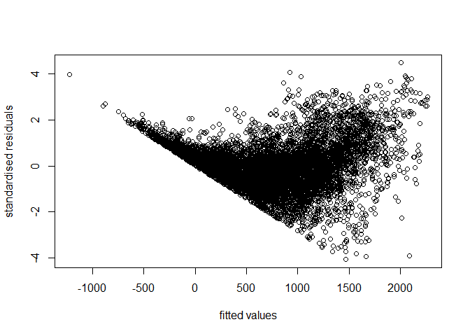<!-- -->

</br>

The introduction of polynomial forms led to an improvement in the AIC
and BIC despite having one variable becoming insignificant. The Q-Q plot
and residual plot show similar patterns, indicating that further
adjustments to the model may be needed.

</br>

Based on EDA, we noted a significant increase in the number of rented
bikes when it is not raining or snowing. Consequently, we have
transformed the two variables into categorical variables, distinguishing
between raining or not raining and snowing or not snowing.

``` r
df4<-df3
df4$NO_RAINING<-ifelse(df3$RAINFALL==0, 1, 0)
df4$NO_SNOWFALL<-ifelse(df3$SNOWFALL==0, 1, 0)
df4 <- df4%>%
  select(-RAINFALL, -SNOWFALL)
```

``` r
lm_model_all_refined3<-glm(RENTED_BIKE_COUNT ~ poly(TEMPERATURE, 4)+poly(HUMIDITY, 2)+., family=gaussian(link = "identity"), df4)
summary(lm_model_all_refined3)
```

    ## 
    ## Call:
    ## glm(formula = RENTED_BIKE_COUNT ~ poly(TEMPERATURE, 4) + poly(HUMIDITY, 
    ##     2) + ., family = gaussian(link = "identity"), data = df4)
    ## 
    ## Deviance Residuals: 
    ##      Min        1Q    Median        3Q       Max  
    ## -1346.90   -214.94     -6.34    183.40   1543.56  
    ## 
    ## Coefficients: (2 not defined because of singularities)
    ##                         Estimate Std. Error t value Pr(>|t|)    
    ## (Intercept)              397.634     36.552  10.878  < 2e-16 ***
    ## poly(TEMPERATURE, 4)1  29214.530    743.410  39.298  < 2e-16 ***
    ## poly(TEMPERATURE, 4)2  -2580.691    479.944  -5.377 7.77e-08 ***
    ## poly(TEMPERATURE, 4)3  -9778.457    351.007 -27.858  < 2e-16 ***
    ## poly(TEMPERATURE, 4)4  -6132.317    376.135 -16.303  < 2e-16 ***
    ## poly(HUMIDITY, 2)1    -13050.398    449.607 -29.026  < 2e-16 ***
    ## poly(HUMIDITY, 2)2     -5679.053    381.339 -14.892  < 2e-16 ***
    ## TEMPERATURE                   NA         NA      NA       NA    
    ## HUMIDITY                      NA         NA      NA       NA    
    ## IS_WEEKEND               -80.067      8.133  -9.845  < 2e-16 ***
    ## SEASONS_SPRING          -113.458     10.684 -10.620  < 2e-16 ***
    ## SEASONS_SUMMER          -155.268     15.215 -10.205  < 2e-16 ***
    ## SEASONS_WINTER          -323.808     17.228 -18.796  < 2e-16 ***
    ## HOLIDAY_NO_HOLIDAY       109.749     17.397   6.308 2.96e-10 ***
    ## HOUR_2                  -214.342     25.474  -8.414  < 2e-16 ***
    ## HOUR_3                  -275.491     25.483 -10.811  < 2e-16 ***
    ## HOUR_4                  -359.419     25.518 -14.085  < 2e-16 ***
    ## HOUR_5                  -335.307     25.540 -13.129  < 2e-16 ***
    ## HOUR_6                  -151.465     25.532  -5.932 3.10e-09 ***
    ## HOUR_7                   142.406     25.523   5.580 2.49e-08 ***
    ## HOUR_8                   517.715     25.463  20.332  < 2e-16 ***
    ## HOUR_10                 -122.701     25.562  -4.800 1.61e-06 ***
    ## HOUR_11                  -99.743     25.734  -3.876 0.000107 ***
    ## HOUR_17                  432.954     26.015  16.643  < 2e-16 ***
    ## HOUR_18                  845.090     25.813  32.740  < 2e-16 ***
    ## HOUR_19                  546.663     25.626  21.332  < 2e-16 ***
    ## HOUR_20                  441.175     25.528  17.282  < 2e-16 ***
    ## HOUR_21                  441.398     25.488  17.318  < 2e-16 ***
    ## HOUR_22                  335.724     25.455  13.189  < 2e-16 ***
    ## HOUR_23                  103.660     25.444   4.074 4.66e-05 ***
    ## HOUR_9_16                136.273     22.327   6.104 1.08e-09 ***
    ## HOUR_15_1_12_13_14        -7.223     20.282  -0.356 0.721750    
    ## NO_RAINING               437.917     18.581  23.569  < 2e-16 ***
    ## NO_SNOWFALL             -118.997     18.755  -6.345 2.34e-10 ***
    ## ---
    ## Signif. codes:  0 '***' 0.001 '**' 0.01 '*' 0.05 '.' 0.1 ' ' 1
    ## 
    ## (Dispersion parameter for gaussian family taken to be 114063.7)
    ## 
    ##     Null deviance: 3492373534  on 8464  degrees of freedom
    ## Residual deviance:  961899212  on 8433  degrees of freedom
    ## AIC: 122627
    ## 
    ## Number of Fisher Scoring iterations: 2

``` r
AIC(lm_model_all_refined3)
```

    ## [1] 122627.4

``` r
BIC(lm_model_all_refined3)
```

    ## [1] 122859.8

``` r
phi=summary(lm_model_all_refined3)$dispersion
qqnorm(residuals(lm_model_all_refined3, type="deviance")/sqrt(phi))
qqline(residuals(lm_model_all_refined3, type="deviance")/sqrt(phi))
```

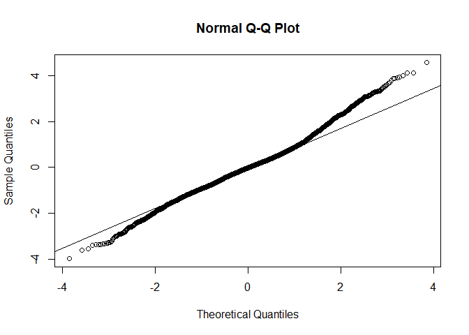<!-- -->

``` r
plot(fitted(lm_model_all_refined3), residuals(lm_model_all_refined3, type="deviance")/sqrt(phi),
xlab="fitted values",
ylab="standardised residuals")
```

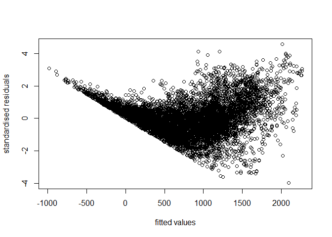<!-- -->
</br>

The model performance is very similar to the previous version with an
improved AIC and BIC.

</br>

Based on EDA, we observed that summer, spring, and autumn exhibit a
similar scale in rented bike counts. To simplify the model, we will
attempt to merge these three categories into one.

``` r
lm_model_all_refined4<-glm(RENTED_BIKE_COUNT ~ poly(TEMPERATURE, 4)+poly(HUMIDITY, 2)+.-SEASONS_SUMMER-SEASONS_SPRING, family=gaussian(link = "identity"), df4)

summary(lm_model_all_refined4)
```

    ## 
    ## Call:
    ## glm(formula = RENTED_BIKE_COUNT ~ poly(TEMPERATURE, 4) + poly(HUMIDITY, 
    ##     2) + . - SEASONS_SUMMER - SEASONS_SPRING, family = gaussian(link = "identity"), 
    ##     data = df4)
    ## 
    ## Deviance Residuals: 
    ##      Min        1Q    Median        3Q       Max  
    ## -1368.39   -223.22     -5.69    190.23   1491.75  
    ## 
    ## Coefficients: (2 not defined because of singularities)
    ##                         Estimate Std. Error t value Pr(>|t|)    
    ## (Intercept)              327.535     36.484   8.977  < 2e-16 ***
    ## poly(TEMPERATURE, 4)1  26621.399    623.662  42.686  < 2e-16 ***
    ## poly(TEMPERATURE, 4)2  -4125.918    424.818  -9.712  < 2e-16 ***
    ## poly(TEMPERATURE, 4)3  -9904.827    354.008 -27.979  < 2e-16 ***
    ## poly(TEMPERATURE, 4)4  -5700.871    370.184 -15.400  < 2e-16 ***
    ## poly(HUMIDITY, 2)1    -13537.700    446.535 -30.317  < 2e-16 ***
    ## poly(HUMIDITY, 2)2     -6115.476    383.186 -15.960  < 2e-16 ***
    ## TEMPERATURE                   NA         NA      NA       NA    
    ## HUMIDITY                      NA         NA      NA       NA    
    ## IS_WEEKEND               -79.453      8.210  -9.677  < 2e-16 ***
    ## SEASONS_WINTER          -268.844     16.387 -16.406  < 2e-16 ***
    ## HOLIDAY_NO_HOLIDAY        97.991     17.531   5.590 2.35e-08 ***
    ## HOUR_2                  -215.026     25.717  -8.361  < 2e-16 ***
    ## HOUR_3                  -276.005     25.725 -10.729  < 2e-16 ***
    ## HOUR_4                  -360.500     25.760 -13.995  < 2e-16 ***
    ## HOUR_5                  -336.522     25.781 -13.053  < 2e-16 ***
    ## HOUR_6                  -152.606     25.772  -5.921 3.32e-09 ***
    ## HOUR_7                   141.243     25.764   5.482 4.32e-08 ***
    ## HOUR_8                   517.172     25.706  20.119  < 2e-16 ***
    ## HOUR_10                 -118.877     25.801  -4.607 4.14e-06 ***
    ## HOUR_11                  -92.964     25.964  -3.580 0.000345 ***
    ## HOUR_17                  446.097     26.208  17.021  < 2e-16 ***
    ## HOUR_18                  855.916     26.019  32.895  < 2e-16 ***
    ## HOUR_19                  553.996     25.850  21.432  < 2e-16 ***
    ## HOUR_20                  445.761     25.763  17.303  < 2e-16 ***
    ## HOUR_21                  444.527     25.728  17.278  < 2e-16 ***
    ## HOUR_22                  337.418     25.697  13.131  < 2e-16 ***
    ## HOUR_23                  104.608     25.686   4.073 4.69e-05 ***
    ## HOUR_9_16                144.285     22.518   6.408 1.56e-10 ***
    ## HOUR_15_1_12_13_14         3.071     20.436   0.150 0.880558    
    ## NO_RAINING               443.798     18.751  23.668  < 2e-16 ***
    ## NO_SNOWFALL             -132.308     18.904  -6.999 2.78e-12 ***
    ## ---
    ## Signif. codes:  0 '***' 0.001 '**' 0.01 '*' 0.05 '.' 0.1 ' ' 1
    ## 
    ## (Dispersion parameter for gaussian family taken to be 116252.4)
    ## 
    ##     Null deviance: 3492373534  on 8464  degrees of freedom
    ## Residual deviance:  980588731  on 8435  degrees of freedom
    ## AIC: 122786
    ## 
    ## Number of Fisher Scoring iterations: 2

``` r
AIC(lm_model_all_refined4)
```

    ## [1] 122786.3

``` r
BIC(lm_model_all_refined4)
```

    ## [1] 123004.6

``` r
phi=summary(lm_model_all_refined4)$dispersion
qqnorm(residuals(lm_model_all_refined4, type="deviance")/sqrt(phi))
qqline(residuals(lm_model_all_refined4, type="deviance")/sqrt(phi))
```

<!-- -->

``` r
plot(fitted(lm_model_all_refined4), residuals(lm_model_all_refined4, type="deviance")/sqrt(phi),
xlab="fitted values",
ylab="standardised residuals")
```

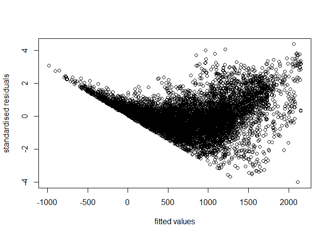<!-- -->
</br>

The AIC and BIC has increased, and the Q-Q plot and residual plot remain
unchanged. Therefore, we will stick to the previous model.

</br>

We noted variations in the number of rented bikes according to different
periods of time. Therefore, we will attempt to simplify the model by
categorizing the hours into five distinct periods. we will merge the
DAWN category with the baseline dummy variable (HOUR_0).

``` r
df5 <- df_final %>%
  mutate(DAWN = HOUR_1 + HOUR_2 +HOUR_3 + HOUR_4 + HOUR_5,
         MORNING = HOUR_6 + HOUR_7 + HOUR_8, 
         MIDDLE =  HOUR_9 + HOUR_10 + HOUR_11+ HOUR_12 + HOUR_13 + HOUR_14 + HOUR_15,
         EVENING = HOUR_16 + HOUR_17 + HOUR_18 + HOUR_19 + HOUR_20,
         NIGHT = HOUR_21 + HOUR_22 + HOUR_23) %>%
  select(-WIND_SPEED, -VISIBILITY, -DEW_POINT_TEMPERATURE, -SOLAR_RADIATION, -DAWN, -starts_with("HOUR"), )
df5$NO_RAINING<-ifelse(df5$RAINFALL==0, 1, 0)
df5$NO_SNOWFALL<-ifelse(df5$SNOWFALL==0, 1, 0)
df5 <- df5%>%
  select(-RAINFALL, -SNOWFALL)
head(df5)
```

    ##   RENTED_BIKE_COUNT TEMPERATURE  HUMIDITY IS_WEEKEND SEASONS_SPRING
    ## 1               254   0.2202797 0.3775510          0              0
    ## 2               204   0.2150350 0.3877551          0              0
    ## 3               173   0.2062937 0.3979592          0              0
    ## 4               107   0.2027972 0.4081633          0              0
    ## 5                78   0.2062937 0.3673469          0              0
    ## 6               100   0.1993007 0.3775510          0              0
    ##   SEASONS_SUMMER SEASONS_WINTER HOLIDAY_NO_HOLIDAY MORNING MIDDLE EVENING NIGHT
    ## 1              0              1                  1       0      0       0     0
    ## 2              0              1                  1       0      0       0     0
    ## 3              0              1                  1       0      0       0     0
    ## 4              0              1                  1       0      0       0     0
    ## 5              0              1                  1       0      0       0     0
    ## 6              0              1                  1       0      0       0     0
    ##   NO_RAINING NO_SNOWFALL
    ## 1          1           1
    ## 2          1           1
    ## 3          1           1
    ## 4          1           1
    ## 5          1           1
    ## 6          1           1

``` r
lm_model_all_refined5<-glm(RENTED_BIKE_COUNT ~ poly(TEMPERATURE, 4)+poly(HUMIDITY, 2)+., family=gaussian(link = "identity"), df5)
summary(lm_model_all_refined5)
```

    ## 
    ## Call:
    ## glm(formula = RENTED_BIKE_COUNT ~ poly(TEMPERATURE, 4) + poly(HUMIDITY, 
    ##     2) + ., family = gaussian(link = "identity"), data = df5)
    ## 
    ## Deviance Residuals: 
    ##      Min        1Q    Median        3Q       Max  
    ## -1395.27   -247.22    -23.54    195.48   1878.44  
    ## 
    ## Coefficients: (2 not defined because of singularities)
    ##                         Estimate Std. Error t value Pr(>|t|)    
    ## (Intercept)              202.814     36.524   5.553 2.89e-08 ***
    ## poly(TEMPERATURE, 4)1  28407.490    824.075  34.472  < 2e-16 ***
    ## poly(TEMPERATURE, 4)2  -2604.834    530.347  -4.912 9.20e-07 ***
    ## poly(TEMPERATURE, 4)3 -10054.138    387.891 -25.920  < 2e-16 ***
    ## poly(TEMPERATURE, 4)4  -6430.372    415.603 -15.472  < 2e-16 ***
    ## poly(HUMIDITY, 2)1    -12799.194    501.644 -25.514  < 2e-16 ***
    ## poly(HUMIDITY, 2)2     -7199.450    418.171 -17.217  < 2e-16 ***
    ## TEMPERATURE                   NA         NA      NA       NA    
    ## HUMIDITY                      NA         NA      NA       NA    
    ## IS_WEEKEND               -79.024      8.992  -8.789  < 2e-16 ***
    ## SEASONS_SPRING          -109.514     11.811  -9.272  < 2e-16 ***
    ## SEASONS_SUMMER          -149.645     16.829  -8.892  < 2e-16 ***
    ## SEASONS_WINTER          -331.361     19.047 -17.397  < 2e-16 ***
    ## HOLIDAY_NO_HOLIDAY       105.922     19.236   5.507 3.77e-08 ***
    ## MORNING                  385.753     14.083  27.391  < 2e-16 ***
    ## MIDDLE                   216.408     12.452  17.379  < 2e-16 ***
    ## EVENING                  716.108     13.234  54.112  < 2e-16 ***
    ## NIGHT                    509.082     14.207  35.833  < 2e-16 ***
    ## NO_RAINING               412.368     20.512  20.103  < 2e-16 ***
    ## NO_SNOWFALL             -117.944     20.752  -5.684 1.36e-08 ***
    ## ---
    ## Signif. codes:  0 '***' 0.001 '**' 0.01 '*' 0.05 '.' 0.1 ' ' 1
    ## 
    ## (Dispersion parameter for gaussian family taken to be 139426.8)
    ## 
    ##     Null deviance: 3492373534  on 8464  degrees of freedom
    ## Residual deviance: 1177738348  on 8447  degrees of freedom
    ## AIC: 124313
    ## 
    ## Number of Fisher Scoring iterations: 2

``` r
AIC(lm_model_all_refined5)
```

    ## [1] 124313

``` r
BIC(lm_model_all_refined5)
```

    ## [1] 124446.9

``` r
phi=summary(lm_model_all_refined5)$dispersion
qqnorm(residuals(lm_model_all_refined5, type="deviance")/sqrt(phi))
qqline(residuals(lm_model_all_refined5, type="deviance")/sqrt(phi))
```

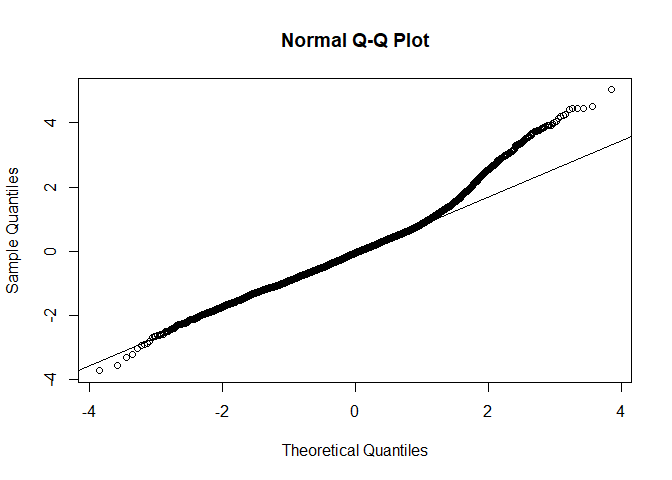<!-- -->

``` r
plot(fitted(lm_model_all_refined5), residuals(lm_model_all_refined5, type="deviance")/sqrt(phi),
xlab="fitted values",
ylab="standardised residuals")
```

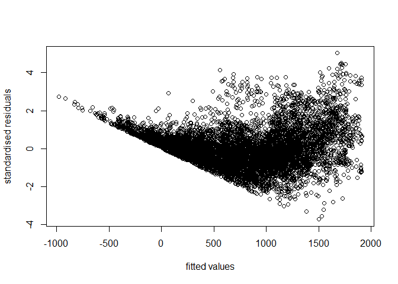<!-- -->

</br>

While the lower tail of the Q-Q plot has shown improvement comparing
with lm_model_refined3, there is a slight increase in the AIC and BIC,
and the residuals still do not exhibit a randomly scattered pattern. To
maintain the simplicity of the model, We can try to improve this model
by using link functions and a different distribution

</br>

Earlier, we observed a positive skewness in the response variable
(RENTED_BIKE_COUNT). To address this skewness, we introduced a log link
to explore potential improvements.

``` r
lm_model_all_refined6<-glm(RENTED_BIKE_COUNT ~ poly(TEMPERATURE, 4)+poly(HUMIDITY, 2)+., family=gaussian(link = "log"), df5)
summary(lm_model_all_refined6)
```

    ## 
    ## Call:
    ## glm(formula = RENTED_BIKE_COUNT ~ poly(TEMPERATURE, 4) + poly(HUMIDITY, 
    ##     2) + ., family = gaussian(link = "log"), data = df5)
    ## 
    ## Deviance Residuals: 
    ##      Min        1Q    Median        3Q       Max  
    ## -1553.22   -152.59    -26.97    120.78   2050.37  
    ## 
    ## Coefficients: (2 not defined because of singularities)
    ##                         Estimate Std. Error t value Pr(>|t|)    
    ## (Intercept)             4.430074   0.105851  41.852  < 2e-16 ***
    ## poly(TEMPERATURE, 4)1  38.255859   1.598993  23.925  < 2e-16 ***
    ## poly(TEMPERATURE, 4)2 -12.532308   1.401565  -8.942  < 2e-16 ***
    ## poly(TEMPERATURE, 4)3 -12.804351   1.041044 -12.300  < 2e-16 ***
    ## poly(TEMPERATURE, 4)4  -3.055387   0.711851  -4.292 1.79e-05 ***
    ## poly(HUMIDITY, 2)1    -17.282564   0.565978 -30.536  < 2e-16 ***
    ## poly(HUMIDITY, 2)2     -9.214775   0.498040 -18.502  < 2e-16 ***
    ## TEMPERATURE                   NA         NA      NA       NA    
    ## HUMIDITY                      NA         NA      NA       NA    
    ## IS_WEEKEND             -0.128704   0.008721 -14.758  < 2e-16 ***
    ## SEASONS_SPRING         -0.131539   0.010382 -12.670  < 2e-16 ***
    ## SEASONS_SUMMER          0.017241   0.012155   1.418    0.156    
    ## SEASONS_WINTER         -0.685085   0.040071 -17.097  < 2e-16 ***
    ## HOLIDAY_NO_HOLIDAY      0.182513   0.022041   8.281  < 2e-16 ***
    ## MORNING                 0.784783   0.023756  33.036  < 2e-16 ***
    ## MIDDLE                  0.590147   0.022274  26.495  < 2e-16 ***
    ## EVENING                 1.171096   0.021423  54.665  < 2e-16 ***
    ## NIGHT                   1.013970   0.021959  46.176  < 2e-16 ***
    ## NO_RAINING              1.215013   0.069863  17.391  < 2e-16 ***
    ## NO_SNOWFALL             0.088645   0.074831   1.185    0.236    
    ## ---
    ## Signif. codes:  0 '***' 0.001 '**' 0.01 '*' 0.05 '.' 0.1 ' ' 1
    ## 
    ## (Dispersion parameter for gaussian family taken to be 100572.9)
    ## 
    ##     Null deviance: 3492373534  on 8464  degrees of freedom
    ## Residual deviance:  849522228  on 8447  degrees of freedom
    ## AIC: 121548
    ## 
    ## Number of Fisher Scoring iterations: 7

``` r
AIC(lm_model_all_refined6)
```

    ## [1] 121547.7

``` r
BIC(lm_model_all_refined6)
```

    ## [1] 121681.5

``` r
phi=summary(lm_model_all_refined6)$dispersion
qqnorm(residuals(lm_model_all_refined6, type="deviance")/sqrt(phi))
qqline(residuals(lm_model_all_refined6, type="deviance")/sqrt(phi))
```

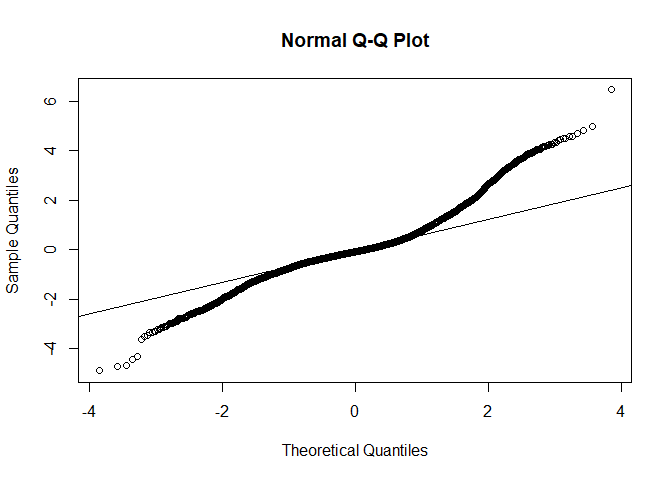<!-- -->

``` r
plot(fitted(lm_model_all_refined6), residuals(lm_model_all_refined6, type="deviance")/sqrt(phi),
xlab="fitted values",
ylab="standardised residuals")
```

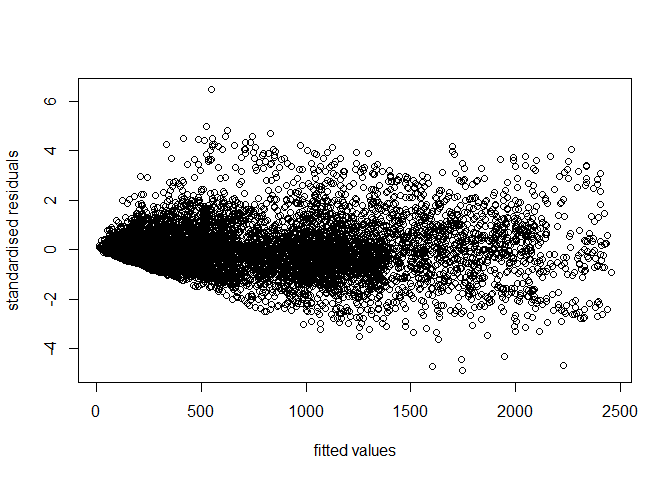<!-- -->
</br>

The AIC and BIC significantly improved after adding a log link. The
residual plot also significantly improved by showing a relatively
randomly scattered pattern. The Q-Q plot on the other hand shows a
greater deviation of the tails and several variables are not
significant.

</br>

Let’s check if the Gaussian distribution is a suitable fit.

``` r
plot(fitted(lm_model_all_refined6), abs(residuals(lm_model_all_refined6, type="deviance")/sqrt(phi)),
xlab="scaled fitted values",
ylab="absolute standardised residuals")
s=fitted(lm_model_all_refined6)
t= abs(residuals(lm_model_all_refined6, type="deviance")/sqrt(phi))
fit<-lm(t~s)
abline(fit,col=2)
```

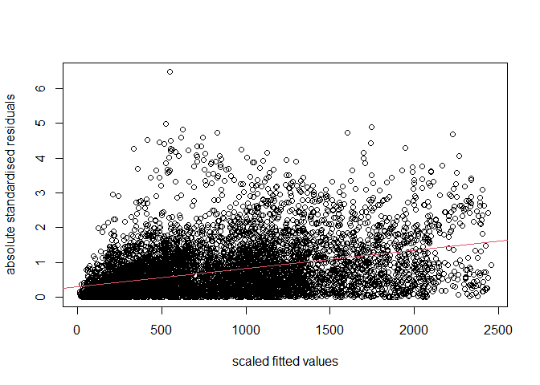<!-- -->
</br>

The observation of a positive trend indicates that the variance function
is assumed to increase too slowly with the mean. Consequently, it
suggests considering distributions with a greater variance function.

</br>

Let’s try using the Poisson distribution.

``` r
lm_model_all_refined7<-glm(RENTED_BIKE_COUNT ~ poly(TEMPERATURE, 4)+poly(HUMIDITY, 2)+., family=poisson(link = "log"), df5)
summary(lm_model_all_refined7)
```

    ## 
    ## Call:
    ## glm(formula = RENTED_BIKE_COUNT ~ poly(TEMPERATURE, 4) + poly(HUMIDITY, 
    ##     2) + ., family = poisson(link = "log"), data = df5)
    ## 
    ## Deviance Residuals: 
    ##     Min       1Q   Median       3Q      Max  
    ## -48.246   -7.833   -1.647    5.251   64.045  
    ## 
    ## Coefficients: (2 not defined because of singularities)
    ##                         Estimate Std. Error  z value Pr(>|z|)    
    ## (Intercept)            4.497e+00  5.923e-03  759.177   <2e-16 ***
    ## poly(TEMPERATURE, 4)1  4.024e+01  1.004e-01  400.765   <2e-16 ***
    ## poly(TEMPERATURE, 4)2 -1.419e+01  7.347e-02 -193.172   <2e-16 ***
    ## poly(TEMPERATURE, 4)3 -1.125e+01  5.776e-02 -194.752   <2e-16 ***
    ## poly(TEMPERATURE, 4)4 -3.763e+00  5.378e-02  -69.959   <2e-16 ***
    ## poly(HUMIDITY, 2)1    -1.902e+01  5.463e-02 -348.211   <2e-16 ***
    ## poly(HUMIDITY, 2)2    -1.019e+01  4.679e-02 -217.844   <2e-16 ***
    ## TEMPERATURE                   NA         NA       NA       NA    
    ## HUMIDITY                      NA         NA       NA       NA    
    ## IS_WEEKEND            -1.336e-01  9.123e-04 -146.479   <2e-16 ***
    ## SEASONS_SPRING        -1.730e-01  1.102e-03 -156.919   <2e-16 ***
    ## SEASONS_SUMMER        -2.851e-02  1.412e-03  -20.197   <2e-16 ***
    ## SEASONS_WINTER        -6.538e-01  2.558e-03 -255.571   <2e-16 ***
    ## HOLIDAY_NO_HOLIDAY     2.169e-01  2.214e-03   97.996   <2e-16 ***
    ## MORNING                8.146e-01  1.735e-03  469.597   <2e-16 ***
    ## MIDDLE                 5.777e-01  1.590e-03  363.393   <2e-16 ***
    ## EVENING                1.116e+00  1.550e-03  720.177   <2e-16 ***
    ## NIGHT                  9.577e-01  1.635e-03  585.937   <2e-16 ***
    ## NO_RAINING             1.214e+00  3.690e-03  328.877   <2e-16 ***
    ## NO_SNOWFALL            3.316e-02  3.859e-03    8.594   <2e-16 ***
    ## ---
    ## Signif. codes:  0 '***' 0.001 '**' 0.01 '*' 0.05 '.' 0.1 ' ' 1
    ## 
    ## (Dispersion parameter for poisson family taken to be 1)
    ## 
    ##     Null deviance: 4556385  on 8464  degrees of freedom
    ## Residual deviance: 1053186  on 8447  degrees of freedom
    ## AIC: 1120316
    ## 
    ## Number of Fisher Scoring iterations: 5

``` r
phi=summary(lm_model_all_refined7)$dispersion
qqnorm(residuals(lm_model_all_refined7, type="deviance")/sqrt(phi))
qqline(residuals(lm_model_all_refined7, type="deviance")/sqrt(phi))
```

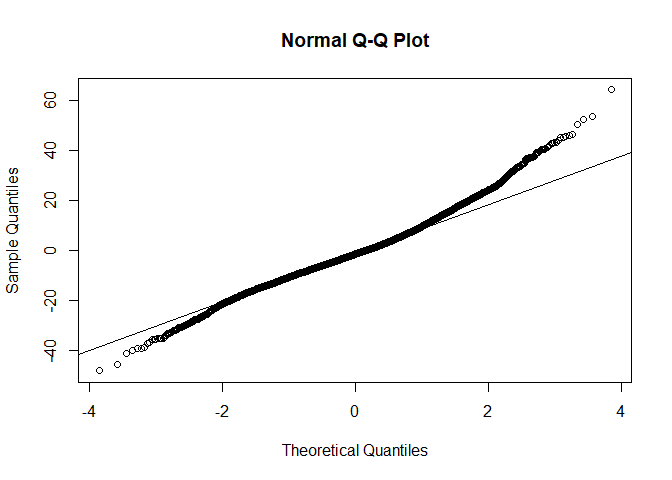<!-- -->

``` r
plot(fitted(lm_model_all_refined7), residuals(lm_model_all_refined7, type="deviance")/sqrt(phi),
xlab="fitted values",
ylab="standardised residuals")
```

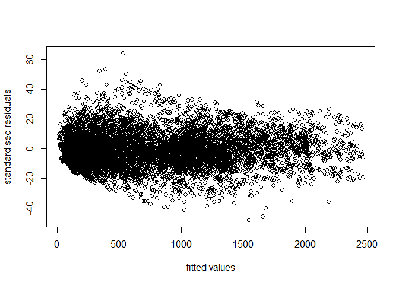<!-- -->
</br>

All variables are significant and the residuals are relatively randomly
scattered.There is slight deviation in the Q-Q plot.

</br>

Let’s check if the Poisson distribution is a suitable fit.

``` r
plot(2*sqrt(fitted(lm_model_all_refined7)), abs(residuals(lm_model_all_refined7, type="deviance")/sqrt(phi)),
xlab="scaled fitted values",
ylab="absolute standardised residuals")
s=2*sqrt(fitted(lm_model_all_refined7))
t= abs(residuals(lm_model_all_refined7, type="deviance")/sqrt(phi))
fit<-lm(t~s)
abline(fit,col=2)
```

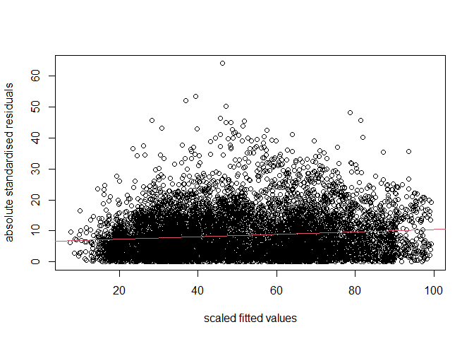<!-- -->
</br>

No significant trend can be seen. This indicates that the Poisson
distribution is a suitable choice.

Therefore, we will employ this model as our final model for predicting
bike renting demand in South Korea.

``` r
save(lm_model_all_refined7, file="bike_pred_model_final.rda")
```

## Prediction

Now, we’ll employ the regression model built earlier to forecast bike
rental demand for the upcoming five days. Subsequently, the following
script will be utilized as a data source to construct a Power BI
dashboard.

First, we’ll integrate the Public Holiday API provided by Abstract API
to gather information on holidays, which is one of the predictors in our
model.

``` r
readRenviron(".env")
holiday_url<- 'https://holidays.abstractapi.com/v1/'
holidays<-c()
dates <- as.character(seq(Sys.Date() + 1, Sys.Date() + 5, by = "days"))
  
  for (datex in dates) {
    holiday_query <- list(api_key = Sys.getenv("holidays_api_key"), 
    country = "KR", year = year(datex), month = month(datex), day= mday(datex))
    response <- GET(holiday_url, query= holiday_query)
    json_result <- content(response, as="parsed")
    
    if (length(json_result) != 0) {
      holidays<-append(holidays,json_result[[1]]$date)
    }
    
    Sys.sleep(1) #limitation of API
  }
  
holidays
```

    ## NULL

Next, we create a function designed to assemble the prediction dataset
and apply it to our model, resulting in forecasted bike rentals.

``` r
prediction<-function(city){
#get weather forecast
temp<-weather_forecast( city,
                        Sys.Date()+1,
                        Sys.Date()+5,
                        hourly = c("temperature_2m", "relative_humidity_2m", "rain",  "snowfall"),
                        response_units = list(temperature_unit = "celsius"),
                        timezone = "UTC")

#format collected data
temp<-as.data.frame(temp)
colnames(temp)<-c("DATE", "TEMPERATURE", "HUMIDITY", "RAINFALL", "SNOWFALL")

temp$HOUR <- as.character(as.numeric(format(as.POSIXct(temp$DATE), format = "%H"))) 
temp$DATE <- as.Date(temp$DATE, tz = "UTC")
temp$CITY <- city
temp$WEEKEND<-ifelse(is.weekend(temp$DATE), "Weekend" , "Weekday")
temp$SEASONS<-ifelse(month(temp$DATE) %in% c(4,5,6), "Spring",
                ifelse(month(temp$DATE) %in% c(7,8), "Summer",
                ifelse(month(temp$DATE) %in% c(9,10,11), "Autumn",
                "Winter")))
#Use API to determine holidays  
temp$HOLIDAY<-ifelse(temp$DATE %in% holidays, "Holiday", "No Holiday")


#Format data set to match the train data to fit the model
temp_final <- dummy_cols(temp, 
        select_columns = c("HOUR"),
        remove_first_dummy = TRUE)

temp_final$SEASONS_SUMMER<-ifelse(temp$SEASONS=='Summer', 1, 0)
temp_final$SEASONS_SPRING<-ifelse(temp$SEASONS=='Spring', 1, 0)
temp_final$SEASONS_WINTER<-ifelse(temp$SEASONS=='Winter', 1, 0)
temp_final$HOLIDAY_NO_HOLIDAY<-ifelse(temp$HOLIDAY=='No Holiday', 1, 0)
temp_final$IS_WEEKEND<-ifelse(temp$WEEKEND=='Weekend', 1, 0)

temp_final$NO_RAINING<-ifelse(temp$RAINFALL==0, 1, 0)
temp_final$NO_SNOWFALL<-ifelse(temp$SNOWFALL==0, 1, 0)

temp_final_pred <- temp_final %>%
  mutate(DAWN = HOUR_1 + HOUR_2 +HOUR_3 + HOUR_4 + HOUR_5,
         MORNING = HOUR_6 + HOUR_7 + HOUR_8, 
         MIDDLE =  HOUR_9 + HOUR_10 + HOUR_11+ HOUR_12 + HOUR_13 + HOUR_14 + HOUR_15,
         EVENING = HOUR_16 + HOUR_17 + HOUR_18 + HOUR_19 + HOUR_20,
         NIGHT = HOUR_21 + HOUR_22 + HOUR_23) %>%
  mutate(TEMPERATURE = (TEMPERATURE - (-17.8)) / (39.4 - (-17.8)),#min max of training data
         HUMIDITY = (HUMIDITY - 0) / (98-0))%>% #min max of training data
  select(-DAWN, -starts_with("HOUR"), -DATE, -RAINFALL, -SNOWFALL, -SEASONS, -WEEKEND, -CITY)

pred<-predict(lm_model_all_refined7, temp_final_pred)
pred<-pmin(round(exp(pred)), 50000) 
#As per information online, Seoul have the maximum number of bikes for sharing which is      around 45,000. Hence, to prevent unrealistic prediction, the number predicted will be        capped at 50,000
    
final<-cbind(temp, pred)

    return(final)
}
```

``` r
KR_BIKE_PRED<-prediction("Seoul")
```

    ## `geocode()` has matched "Seoul" to:
    ## Seoul in Seoul, South Korea
    ## Population: 10349312
    ## Co-ordinates: c(37.566, 126.9784)

    ## Warning in predict.lm(object, newdata, se.fit, scale = 1, type = if (type == :
    ## prediction from a rank-deficient fit may be misleading

``` r
head(KR_BIKE_PRED)
```

    ##         DATE TEMPERATURE HUMIDITY RAINFALL SNOWFALL HOUR  CITY WEEKEND SEASONS
    ## 1 2024-02-02        -1.1       76        0        0    0 Seoul Weekday  Winter
    ## 2 2024-02-02         0.1       72        0        0    1 Seoul Weekday  Winter
    ## 3 2024-02-02         1.5       67        0        0    2 Seoul Weekday  Winter
    ## 4 2024-02-02         2.9       63        0        0    3 Seoul Weekday  Winter
    ## 5 2024-02-02         4.1       60        0        0    4 Seoul Weekday  Winter
    ## 6 2024-02-02         4.9       58        0        0    5 Seoul Weekday  Winter
    ##      HOLIDAY pred
    ## 1 No Holiday   96
    ## 2 No Holiday  109
    ## 3 No Holiday  126
    ## 4 No Holiday  142
    ## 5 No Holiday  156
    ## 6 No Holiday  166

Apart from Seoul, there are several other cities in South Korea with
bike-sharing systems. We also try to provide insights into four other
major cities with bike-sharing systems using our model. We begin by
acquiring the population size of these cities which will be used to
normalize our predictions, enhancing the accuracy of our forecasts.

``` r
other_cities<-left_join(bike_sharing_systems, kr_cities, by=c("REGION"="CITY"))%>%
  arrange(desc(`2024_POPULATION`))%>%
  head(5) #select top 4 biggest cities other than Seoul

cities<-as.vector(other_cities$REGION)
populations<-as.vector(other_cities$`2024_POPULATION`)

cities
```

    ## [1] "Seoul"   "Daejeon" "Suwon"   "Goyang"  "Ansan"

``` r
populations
```

    ## [1] 10349312  1475221  1242724  1073069   650728

We utilize the model to forecast bike rental demands for the next five
days in the four additional cities, adjusting the predictions based on
their respective population sizes.

It’s crucial to acknowledge that these predictions only serve as
preliminary insights into the demands, as various additional factors may
differ between cities, impacting the accuracy of the forecasts.

``` r
for (i in c(2:length(cities))) {
  x<-prediction(cities[i])
  x$pred<-pmin(round((x$pred/populations[1])*populations[i],0), 50000)
  KR_BIKE_PRED<-rbind(KR_BIKE_PRED,x)
}
```

    ## `geocode()` has matched "Daejeon" to:
    ## Daejeon in Daejeon, South Korea
    ## Population: 1475221
    ## Co-ordinates: c(36.34913, 127.38493)

    ## Warning in predict.lm(object, newdata, se.fit, scale = 1, type = if (type == :
    ## prediction from a rank-deficient fit may be misleading

    ## `geocode()` has matched "Suwon" to:
    ## Suwon in Gyeonggi-do, South Korea
    ## Population: 1242724
    ## Co-ordinates: c(37.29111, 127.00889)

    ## Warning in predict.lm(object, newdata, se.fit, scale = 1, type = if (type == :
    ## prediction from a rank-deficient fit may be misleading

    ## Warning: Unknown or uninitialised column: `admin1`.

    ## Warning: Unknown or uninitialised column: `population`.

    ## `geocode()` has matched "Goyang" to:
    ## Goyang in , Indonesia
    ## Population: 
    ## Co-ordinates: c(-6.935, 107.73722)

    ## Warning in predict.lm(object, newdata, se.fit, scale = 1, type = if (type == :
    ## prediction from a rank-deficient fit may be misleading

    ## `geocode()` has matched "Ansan" to:
    ## Ansan in Occitanie, France
    ## Population: 87
    ## Co-ordinates: c(43.69033, 0.77392)

    ## Warning in predict.lm(object, newdata, se.fit, scale = 1, type = if (type == :
    ## prediction from a rank-deficient fit may be misleading

``` r
head(KR_BIKE_PRED)
```

    ##         DATE TEMPERATURE HUMIDITY RAINFALL SNOWFALL HOUR  CITY WEEKEND SEASONS
    ## 1 2024-02-02        -1.1       76        0        0    0 Seoul Weekday  Winter
    ## 2 2024-02-02         0.1       72        0        0    1 Seoul Weekday  Winter
    ## 3 2024-02-02         1.5       67        0        0    2 Seoul Weekday  Winter
    ## 4 2024-02-02         2.9       63        0        0    3 Seoul Weekday  Winter
    ## 5 2024-02-02         4.1       60        0        0    4 Seoul Weekday  Winter
    ## 6 2024-02-02         4.9       58        0        0    5 Seoul Weekday  Winter
    ##      HOLIDAY pred
    ## 1 No Holiday   96
    ## 2 No Holiday  109
    ## 3 No Holiday  126
    ## 4 No Holiday  142
    ## 5 No Holiday  156
    ## 6 No Holiday  166

The resulting dataset will be used to build a dashboard using Power BI
for presenting purposes.
