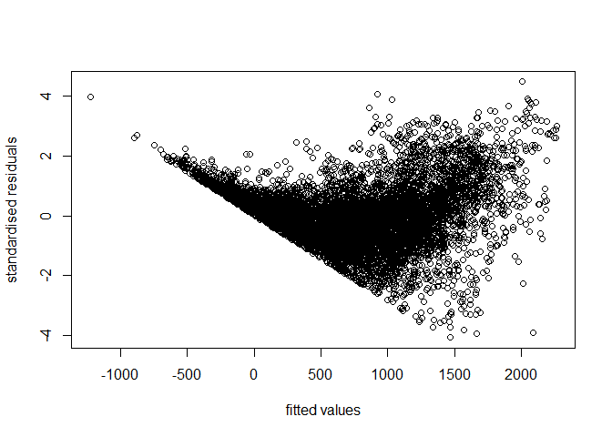
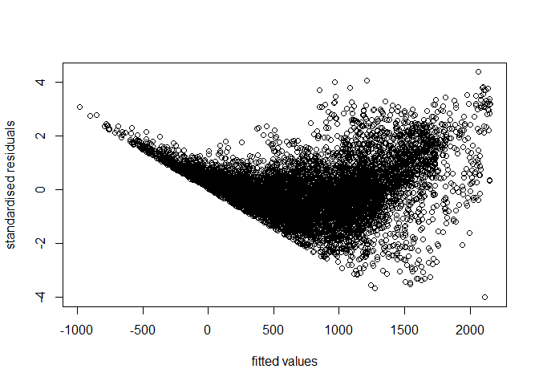
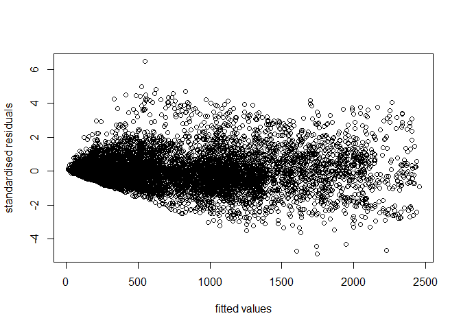

Bike Sharing System Analysis in South Korea
================
Tan Kar Min
2023-11-26

Import Essential Libraries

``` r
library(rvest)
```

    ## Warning: package 'rvest' was built under R version 4.2.3

``` r
library(httr)
library(tidyverse)
```

    ## ── Attaching packages ─────────────────────────────────────── tidyverse 1.3.2 ──
    ## ✔ ggplot2 3.4.4     ✔ purrr   1.0.2
    ## ✔ tibble  3.2.1     ✔ dplyr   1.1.3
    ## ✔ tidyr   1.3.0     ✔ stringr 1.5.0
    ## ✔ readr   2.1.2     ✔ forcats 0.5.1

    ## Warning: package 'ggplot2' was built under R version 4.2.3

    ## Warning: package 'tibble' was built under R version 4.2.3

    ## Warning: package 'tidyr' was built under R version 4.2.3

    ## Warning: package 'purrr' was built under R version 4.2.3

    ## Warning: package 'dplyr' was built under R version 4.2.3

    ## Warning: package 'stringr' was built under R version 4.2.3

    ## ── Conflicts ────────────────────────────────────────── tidyverse_conflicts() ──
    ## ✖ dplyr::filter()         masks stats::filter()
    ## ✖ readr::guess_encoding() masks rvest::guess_encoding()
    ## ✖ dplyr::lag()            masks stats::lag()

``` r
library(ggplot2)
library(ggpubr)
library(chron)
```

    ## Warning: package 'chron' was built under R version 4.2.3

``` r
library(fastDummies)
```

    ## Warning: package 'fastDummies' was built under R version 4.2.3

``` r
library(BBmisc)
```

    ## Warning: package 'BBmisc' was built under R version 4.2.3

    ## 
    ## Attaching package: 'BBmisc'
    ## 
    ## The following objects are masked from 'package:dplyr':
    ## 
    ##     coalesce, collapse, symdiff
    ## 
    ## The following object is masked from 'package:base':
    ## 
    ##     isFALSE

``` r
library(car)
```

    ## Loading required package: carData
    ## 
    ## Attaching package: 'car'
    ## 
    ## The following object is masked from 'package:dplyr':
    ## 
    ##     recode
    ## 
    ## The following object is masked from 'package:purrr':
    ## 
    ##     some

``` r
library(openmeteo)
```

    ## Warning: package 'openmeteo' was built under R version 4.2.3

``` r
library(lubridate)
```

    ## 
    ## Attaching package: 'lubridate'
    ## 
    ## The following objects are masked from 'package:chron':
    ## 
    ##     days, hours, minutes, seconds, years
    ## 
    ## The following objects are masked from 'package:base':
    ## 
    ##     date, intersect, setdiff, union

``` r
library(knitr)
library(Metrics)
```

    ## Warning: package 'Metrics' was built under R version 4.2.3

``` r
library(caTools)
```

    ## Warning: package 'caTools' was built under R version 4.2.3

``` r
opts_chunk$set(dev='png')
```

## Data Collection

Retrieve the population information for South Korean cities from an HTML
table and transform it into a data frame.

``` r
url <- "https://worldpopulationreview.com/countries/cities/south-korea"
root_node <- read_html(url)
table_nodes2 <- html_nodes(root_node, "table")
kr_cities <- html_table(table_nodes2[[1]], fill=TRUE)
head(kr_cities)
```

    ## # A tibble: 6 × 2
    ##   City    `2024 Population`
    ##   <chr>   <chr>            
    ## 1 Seoul   10,349,312       
    ## 2 Busan   3,678,555        
    ## 3 Incheon 2,628,000        
    ## 4 Daegu   2,566,540        
    ## 5 Daejeon 1,475,221        
    ## 6 Gwangju 1,416,938

Download a specific hourly Seoul bike sharing demand dataset which will
be used to train our model.

``` r
seoul_bike_sharing<-read.csv("https://cf-courses-data.s3.us.cloud-object-storage.appdomain.cloud/IBMDeveloperSkillsNetwork-RP0321EN-SkillsNetwork/labs/datasets/raw_seoul_bike_sharing.csv")
head(seoul_bike_sharing)
```

    ##         Date RENTED_BIKE_COUNT Hour TEMPERATURE HUMIDITY WIND_SPEED Visibility
    ## 1 01/12/2017               254    0        -5.2       37        2.2       2000
    ## 2 01/12/2017               204    1        -5.5       38        0.8       2000
    ## 3 01/12/2017               173    2        -6.0       39        1.0       2000
    ## 4 01/12/2017               107    3        -6.2       40        0.9       2000
    ## 5 01/12/2017                78    4        -6.0       36        2.3       2000
    ## 6 01/12/2017               100    5        -6.4       37        1.5       2000
    ##   DEW_POINT_TEMPERATURE SOLAR_RADIATION RAINFALL Snowfall SEASONS    HOLIDAY
    ## 1                 -17.6               0        0        0  Winter No Holiday
    ## 2                 -17.6               0        0        0  Winter No Holiday
    ## 3                 -17.7               0        0        0  Winter No Holiday
    ## 4                 -17.6               0        0        0  Winter No Holiday
    ## 5                 -18.6               0        0        0  Winter No Holiday
    ## 6                 -18.7               0        0        0  Winter No Holiday
    ##   FUNCTIONING_DAY
    ## 1             Yes
    ## 2             Yes
    ## 3             Yes
    ## 4             Yes
    ## 5             Yes
    ## 6             Yes

The data set consist of the following features: - `TEMPERATURE` -
Temperature in Celsius - `HUMIDITY` - Unit is `%` - `WIND_SPEED` - Unit
is `m/s` - `VISIBILITY` - Multiplied by 10m - `DEW_POINT_TEMPERATURE` -
The temperature to which the air would have to cool down in order to
reach saturation, unit is Celsius - `SOLAR_RADIATION` - MJ/m2 -
`RAINFALL` - mm - `SNOWFALL` - cm - `DATE` - Year-month-day - `HOUR`-
Hour of he day - `FUNCTIONAL DAY` - NoFunc(Non Functional Hours),
Fun(Functional hours) - `HOLIDAY` - Holiday/No holiday - `SEASONS` -
Winter, Spring, Summer, Autumn </br>

## Date Cleaning

Standardize all column names

``` r
 names(kr_cities)<-str_replace_all(toupper(names(kr_cities)), " ", "_")
 names(seoul_bike_sharing)<-str_replace_all(toupper(names(seoul_bike_sharing)), " ", "_")
```

Clean kr_cities dataset by removing extra information.

``` r
kr_cities$CITY <- sub("-[a-z]+", "", kr_cities$CITY)
kr_cities$`2024_POPULATION`<-as.numeric(gsub(",", "", kr_cities$`2024_POPULATION`))
head(kr_cities)
```

    ## # A tibble: 6 × 2
    ##   CITY    `2024_POPULATION`
    ##   <chr>               <dbl>
    ## 1 Seoul            10349312
    ## 2 Busan             3678555
    ## 3 Incheon           2628000
    ## 4 Daegu             2566540
    ## 5 Daejeon           1475221
    ## 6 Gwangju           1416938

Clean Seoul bike sharing dataset

``` r
summary(seoul_bike_sharing)
```

    ##      DATE           RENTED_BIKE_COUNT      HOUR        TEMPERATURE    
    ##  Length:8760        Min.   :   2.0    Min.   : 0.00   Min.   :-17.80  
    ##  Class :character   1st Qu.: 214.0    1st Qu.: 5.75   1st Qu.:  3.40  
    ##  Mode  :character   Median : 542.0    Median :11.50   Median : 13.70  
    ##                     Mean   : 729.2    Mean   :11.50   Mean   : 12.87  
    ##                     3rd Qu.:1084.0    3rd Qu.:17.25   3rd Qu.: 22.50  
    ##                     Max.   :3556.0    Max.   :23.00   Max.   : 39.40  
    ##                     NA's   :295                       NA's   :11      
    ##     HUMIDITY       WIND_SPEED      VISIBILITY   DEW_POINT_TEMPERATURE
    ##  Min.   : 0.00   Min.   :0.000   Min.   :  27   Min.   :-30.600      
    ##  1st Qu.:42.00   1st Qu.:0.900   1st Qu.: 940   1st Qu.: -4.700      
    ##  Median :57.00   Median :1.500   Median :1698   Median :  5.100      
    ##  Mean   :58.23   Mean   :1.725   Mean   :1437   Mean   :  4.074      
    ##  3rd Qu.:74.00   3rd Qu.:2.300   3rd Qu.:2000   3rd Qu.: 14.800      
    ##  Max.   :98.00   Max.   :7.400   Max.   :2000   Max.   : 27.200      
    ##                                                                      
    ##  SOLAR_RADIATION     RAINFALL          SNOWFALL         SEASONS         
    ##  Min.   :0.0000   Min.   : 0.0000   Min.   :0.00000   Length:8760       
    ##  1st Qu.:0.0000   1st Qu.: 0.0000   1st Qu.:0.00000   Class :character  
    ##  Median :0.0100   Median : 0.0000   Median :0.00000   Mode  :character  
    ##  Mean   :0.5691   Mean   : 0.1487   Mean   :0.07507                     
    ##  3rd Qu.:0.9300   3rd Qu.: 0.0000   3rd Qu.:0.00000                     
    ##  Max.   :3.5200   Max.   :35.0000   Max.   :8.80000                     
    ##                                                                         
    ##    HOLIDAY          FUNCTIONING_DAY   
    ##  Length:8760        Length:8760       
    ##  Class :character   Class :character  
    ##  Mode  :character   Mode  :character  
    ##                                       
    ##                                       
    ##                                       
    ## 

``` r
dim(seoul_bike_sharing)
```

    ## [1] 8760   14

The data set have 14 features and 8760 records. “RENTED_BIKE_COUNT” and
“TEMPERATURE” have missing values.

</br>

Handling missing values in RENTED_BIKE_COUNT by dropping them

``` r
seoul_bike_sharing <-seoul_bike_sharing[!is.na(seoul_bike_sharing$RENTED_BIKE_COUNT),]
dim(seoul_bike_sharing)
```

    ## [1] 8465   14

Handling missing values in TEMPERATURE by replacing them with average
temperature

``` r
seoul_bike_sharing %>% 
  filter(is.na(TEMPERATURE)) 
```

    ##          DATE RENTED_BIKE_COUNT HOUR TEMPERATURE HUMIDITY WIND_SPEED VISIBILITY
    ## 1  07/06/2018              3221   18          NA       57        2.7       1217
    ## 2  12/06/2018              1246   14          NA       45        2.2       1961
    ## 3  13/06/2018              2664   17          NA       57        3.3        919
    ## 4  17/06/2018              2330   17          NA       58        3.3        865
    ## 5  20/06/2018              2741   19          NA       61        2.7       1236
    ## 6  30/06/2018              1144   13          NA       87        1.7        390
    ## 7  05/07/2018               827   10          NA       75        1.1       1028
    ## 8  11/07/2018               634    9          NA       96        0.6        450
    ## 9  12/07/2018               593    6          NA       93        1.1        852
    ## 10 21/07/2018               347    4          NA       77        1.2       1203
    ## 11 21/08/2018              1277   23          NA       75        0.1       1892
    ##    DEW_POINT_TEMPERATURE SOLAR_RADIATION RAINFALL SNOWFALL SEASONS    HOLIDAY
    ## 1                   16.4            0.96      0.0        0  Summer No Holiday
    ## 2                   12.7            1.39      0.0        0  Summer No Holiday
    ## 3                   16.4            0.87      0.0        0  Summer No Holiday
    ## 4                   16.7            0.66      0.0        0  Summer No Holiday
    ## 5                   17.5            0.60      0.0        0  Summer No Holiday
    ## 6                   23.2            0.71      3.5        0  Summer No Holiday
    ## 7                   20.8            1.22      0.0        0  Summer No Holiday
    ## 8                   24.9            0.41      0.0        0  Summer No Holiday
    ## 9                   24.3            0.01      0.0        0  Summer No Holiday
    ## 10                  21.2            0.00      0.0        0  Summer No Holiday
    ## 11                  20.8            0.00      0.0        0  Summer No Holiday
    ##    FUNCTIONING_DAY
    ## 1              Yes
    ## 2              Yes
    ## 3              Yes
    ## 4              Yes
    ## 5              Yes
    ## 6              Yes
    ## 7              Yes
    ## 8              Yes
    ## 9              Yes
    ## 10             Yes
    ## 11             Yes

All missing temperature are found to be in Summer.

</br>

Replace NA values with average temperature of summer

``` r
Avg_temp<-aggregate(TEMPERATURE~SEASONS, seoul_bike_sharing, mean, na.action=na.omit)
round(Avg_temp[Avg_temp$SEASONS=="Summer", "TEMPERATURE"], 1)
```

    ## [1] 26.6

``` r
seoul_bike_sharing <- seoul_bike_sharing %>%
  mutate(TEMPERATURE = ifelse(is.na(TEMPERATURE), 26.6, TEMPERATURE))

summary(seoul_bike_sharing)
```

    ##      DATE           RENTED_BIKE_COUNT      HOUR        TEMPERATURE    
    ##  Length:8465        Min.   :   2.0    Min.   : 0.00   Min.   :-17.80  
    ##  Class :character   1st Qu.: 214.0    1st Qu.: 6.00   1st Qu.:  3.00  
    ##  Mode  :character   Median : 542.0    Median :12.00   Median : 13.50  
    ##                     Mean   : 729.2    Mean   :11.51   Mean   : 12.77  
    ##                     3rd Qu.:1084.0    3rd Qu.:18.00   3rd Qu.: 22.70  
    ##                     Max.   :3556.0    Max.   :23.00   Max.   : 39.40  
    ##     HUMIDITY       WIND_SPEED      VISIBILITY   DEW_POINT_TEMPERATURE
    ##  Min.   : 0.00   Min.   :0.000   Min.   :  27   Min.   :-30.600      
    ##  1st Qu.:42.00   1st Qu.:0.900   1st Qu.: 935   1st Qu.: -5.100      
    ##  Median :57.00   Median :1.500   Median :1690   Median :  4.700      
    ##  Mean   :58.15   Mean   :1.726   Mean   :1434   Mean   :  3.945      
    ##  3rd Qu.:74.00   3rd Qu.:2.300   3rd Qu.:2000   3rd Qu.: 15.200      
    ##  Max.   :98.00   Max.   :7.400   Max.   :2000   Max.   : 27.200      
    ##  SOLAR_RADIATION     RAINFALL          SNOWFALL         SEASONS         
    ##  Min.   :0.0000   Min.   : 0.0000   Min.   :0.00000   Length:8465       
    ##  1st Qu.:0.0000   1st Qu.: 0.0000   1st Qu.:0.00000   Class :character  
    ##  Median :0.0100   Median : 0.0000   Median :0.00000   Mode  :character  
    ##  Mean   :0.5679   Mean   : 0.1491   Mean   :0.07769                     
    ##  3rd Qu.:0.9300   3rd Qu.: 0.0000   3rd Qu.:0.00000                     
    ##  Max.   :3.5200   Max.   :35.0000   Max.   :8.80000                     
    ##    HOLIDAY          FUNCTIONING_DAY   
    ##  Length:8465        Length:8465       
    ##  Class :character   Class :character  
    ##  Mode  :character   Mode  :character  
    ##                                       
    ##                                       
    ## 

Check datatypes

``` r
str(seoul_bike_sharing)
```

    ## 'data.frame':    8465 obs. of  14 variables:
    ##  $ DATE                 : chr  "01/12/2017" "01/12/2017" "01/12/2017" "01/12/2017" ...
    ##  $ RENTED_BIKE_COUNT    : int  254 204 173 107 78 100 181 460 930 490 ...
    ##  $ HOUR                 : int  0 1 2 3 4 5 6 7 8 9 ...
    ##  $ TEMPERATURE          : num  -5.2 -5.5 -6 -6.2 -6 -6.4 -6.6 -7.4 -7.6 -6.5 ...
    ##  $ HUMIDITY             : int  37 38 39 40 36 37 35 38 37 27 ...
    ##  $ WIND_SPEED           : num  2.2 0.8 1 0.9 2.3 1.5 1.3 0.9 1.1 0.5 ...
    ##  $ VISIBILITY           : int  2000 2000 2000 2000 2000 2000 2000 2000 2000 1928 ...
    ##  $ DEW_POINT_TEMPERATURE: num  -17.6 -17.6 -17.7 -17.6 -18.6 -18.7 -19.5 -19.3 -19.8 -22.4 ...
    ##  $ SOLAR_RADIATION      : num  0 0 0 0 0 0 0 0 0.01 0.23 ...
    ##  $ RAINFALL             : num  0 0 0 0 0 0 0 0 0 0 ...
    ##  $ SNOWFALL             : num  0 0 0 0 0 0 0 0 0 0 ...
    ##  $ SEASONS              : chr  "Winter" "Winter" "Winter" "Winter" ...
    ##  $ HOLIDAY              : chr  "No Holiday" "No Holiday" "No Holiday" "No Holiday" ...
    ##  $ FUNCTIONING_DAY      : chr  "Yes" "Yes" "Yes" "Yes" ...

Several datatypes needs to be coerce. Change “DATE” and “HOUR” to date
and ordinal datatype respectively.

``` r
seoul_bike_sharing$DATE<-as.Date(seoul_bike_sharing$DATE, format = "%d/%m/%Y")
class(seoul_bike_sharing$DATE)
```

    ## [1] "Date"

``` r
seoul_bike_sharing$HOUR<-as.factor(seoul_bike_sharing$HOUR)
class(seoul_bike_sharing$HOUR)
```

    ## [1] "factor"

## Explanatory Data Analysis

### Descriptive Analysis

Basic Observations:

``` r
summary(seoul_bike_sharing)
```

    ##       DATE            RENTED_BIKE_COUNT      HOUR       TEMPERATURE    
    ##  Min.   :2017-12-01   Min.   :   2.0    7      : 353   Min.   :-17.80  
    ##  1st Qu.:2018-02-27   1st Qu.: 214.0    8      : 353   1st Qu.:  3.00  
    ##  Median :2018-05-28   Median : 542.0    9      : 353   Median : 13.50  
    ##  Mean   :2018-05-28   Mean   : 729.2    10     : 353   Mean   : 12.77  
    ##  3rd Qu.:2018-08-24   3rd Qu.:1084.0    11     : 353   3rd Qu.: 22.70  
    ##  Max.   :2018-11-30   Max.   :3556.0    12     : 353   Max.   : 39.40  
    ##                                         (Other):6347                   
    ##     HUMIDITY       WIND_SPEED      VISIBILITY   DEW_POINT_TEMPERATURE
    ##  Min.   : 0.00   Min.   :0.000   Min.   :  27   Min.   :-30.600      
    ##  1st Qu.:42.00   1st Qu.:0.900   1st Qu.: 935   1st Qu.: -5.100      
    ##  Median :57.00   Median :1.500   Median :1690   Median :  4.700      
    ##  Mean   :58.15   Mean   :1.726   Mean   :1434   Mean   :  3.945      
    ##  3rd Qu.:74.00   3rd Qu.:2.300   3rd Qu.:2000   3rd Qu.: 15.200      
    ##  Max.   :98.00   Max.   :7.400   Max.   :2000   Max.   : 27.200      
    ##                                                                      
    ##  SOLAR_RADIATION     RAINFALL          SNOWFALL         SEASONS         
    ##  Min.   :0.0000   Min.   : 0.0000   Min.   :0.00000   Length:8465       
    ##  1st Qu.:0.0000   1st Qu.: 0.0000   1st Qu.:0.00000   Class :character  
    ##  Median :0.0100   Median : 0.0000   Median :0.00000   Mode  :character  
    ##  Mean   :0.5679   Mean   : 0.1491   Mean   :0.07769                     
    ##  3rd Qu.:0.9300   3rd Qu.: 0.0000   3rd Qu.:0.00000                     
    ##  Max.   :3.5200   Max.   :35.0000   Max.   :8.80000                     
    ##                                                                         
    ##    HOLIDAY          FUNCTIONING_DAY   
    ##  Length:8465        Length:8465       
    ##  Class :character   Class :character  
    ##  Mode  :character   Mode  :character  
    ##                                       
    ##                                       
    ##                                       
    ## 

``` r
table(seoul_bike_sharing$SEASONS)
```

    ## 
    ## Autumn Spring Summer Winter 
    ##   1937   2160   2208   2160

``` r
table(seoul_bike_sharing$HOLIDAY)
```

    ## 
    ##    Holiday No Holiday 
    ##        408       8057

``` r
table(seoul_bike_sharing$FUNCTIONING_DAY)
```

    ## 
    ##  Yes 
    ## 8465

1)  We can see from `DATE` that we have exactly a full year of data
2)  Temperature has a large range, so we might expect it to explain at
    least some of the variation in bike rentals
3)  Precipitation seems to be quite rare
4)  Wind speed has a small range. The average `WINDSPEED` is very light
    at only 1.7 m/s
5)  Spring and Winter have the same count of records, while autumn has
    the least and Summer has the most
6)  Majorities of the records are not holidays.
7)  All records are functioning day, thus, we can remove this feature
    from our analysis

</br>

Check correlation

``` r
cor_matrix<-cor(seoul_bike_sharing[c(2,4,5,6,7,8,9,10,11)])
cor_matrix
```

    ##                       RENTED_BIKE_COUNT TEMPERATURE   HUMIDITY   WIND_SPEED
    ## RENTED_BIKE_COUNT             1.0000000  0.56281052 -0.2019727  0.125021946
    ## TEMPERATURE                   0.5628105  1.00000000  0.1664719 -0.038466217
    ## HUMIDITY                     -0.2019727  0.16647193  1.0000000 -0.337352380
    ## WIND_SPEED                    0.1250219 -0.03846622 -0.3373524  1.000000000
    ## VISIBILITY                    0.2123228  0.02819900 -0.5485418  0.180427649
    ## DEW_POINT_TEMPERATURE         0.4002628  0.91448482  0.5394024 -0.177170126
    ## SOLAR_RADIATION               0.2738616  0.35480990 -0.4572727  0.326221868
    ## RAINFALL                     -0.1286261  0.05215776  0.2369169 -0.024931327
    ## SNOWFALL                     -0.1516108 -0.21773825  0.1101265 -0.003789344
    ##                       VISIBILITY DEW_POINT_TEMPERATURE SOLAR_RADIATION
    ## RENTED_BIKE_COUNT      0.2123228            0.40026283      0.27386155
    ## TEMPERATURE            0.0281990            0.91448482      0.35480990
    ## HUMIDITY              -0.5485418            0.53940245     -0.45727269
    ## WIND_SPEED             0.1804276           -0.17717013      0.32622187
    ## VISIBILITY             1.0000000           -0.18258645      0.15304614
    ## DEW_POINT_TEMPERATURE -0.1825864            1.00000000      0.09852498
    ## SOLAR_RADIATION        0.1530461            0.09852498      1.00000000
    ## RAINFALL              -0.1703518            0.12681245     -0.07415727
    ## SNOWFALL              -0.1228597           -0.14975979     -0.07337987
    ##                           RAINFALL     SNOWFALL
    ## RENTED_BIKE_COUNT     -0.128626093 -0.151610753
    ## TEMPERATURE            0.052157758 -0.217738246
    ## HUMIDITY               0.236916912  0.110126502
    ## WIND_SPEED            -0.024931327 -0.003789344
    ## VISIBILITY            -0.170351798 -0.122859731
    ## DEW_POINT_TEMPERATURE  0.126812453 -0.149759793
    ## SOLAR_RADIATION       -0.074157271 -0.073379874
    ## RAINFALL               1.000000000  0.008604092
    ## SNOWFALL               0.008604092  1.000000000

A multicollinearity issue has surfaced in the data, marked by a notable
correlation between TEMPERATURE and DEW_POINT_TEMPERATURE. Additionally,
Solar Radiation exhibits a noteworthy correlation with both HUMIDITY and
WIND_SPEED.

Among all the features, the variables ‘TEMPERATURE’ and
‘DEW_POINT_TEMPERATURE’ exhibit the highest correlation with
‘RENTED_BIKE_COUNT’, followed by ‘SOLAR_RADIATION’, ‘VISIBILITY’, and
‘HUMIDITY’. However, it is necessary to validate these correlations
through visual aids for a more comprehensive understanding.

</br>

### Data Visualisation

Distribution of `RENTED_BIKE_COUNT`

``` r
ggplot(seoul_bike_sharing,aes(x=RENTED_BIKE_COUNT))+geom_histogram(fill="lightgray",color="black")
```

    ## `stat_bin()` using `bins = 30`. Pick better value with `binwidth`.

<!-- -->
</br>

The mode of bikes rented is about 250. The distribution is right skewed.

</br>

Association between `RENTED_BIKE_COUNT` and `TEMPERATURE`.

``` r
ggplot(seoul_bike_sharing, aes(TEMPERATURE,RENTED_BIKE_COUNT)) + 
  geom_point()+
  geom_smooth(method="lm", formula = y ~ poly(x, 4), se = FALSE)
```

<!-- -->

</br>

It seems that there is a non-linear positive relationship, possibly a
fourth-degree polynomial, between the two variables. `RENTED_BIKE_COUNT`
peaks at around 25 degrees Celsius.

</br>

Association between `RENTED_BIKE_COUNT` and `HUMIDITY`

``` r
ggplot(seoul_bike_sharing, aes(HUMIDITY,RENTED_BIKE_COUNT)) + 
  geom_point()+
  geom_smooth(method="lm", formula = y ~ poly(x, 2), se = FALSE)
```

<!-- -->

</br>

It appears that there is a weak non-linear relationship between
`HUMIDITY` and `RENTED_BIKE_COUNT`. Moderate humidity levels tend to be
associated with a greater number of rented bikes.

</br>

Association between `RENTED_BIKE_COUNT` and `WIND_SPEED`

``` r
ggplot(seoul_bike_sharing, aes(WIND_SPEED,RENTED_BIKE_COUNT)) + 
  geom_point()
```

<!-- -->

</br>

Not much association can be observed between `WIND_SPEED` and
`RENTED_BIKE_COUNT`.

</br>

Association between `RENTED_BIKE_COUNT` and `VISIBILITY`

``` r
ggplot(seoul_bike_sharing, aes(VISIBILITY,RENTED_BIKE_COUNT)) + 
  geom_point()
```

<!-- -->

</br>

Not much association can be observed between `VISIBILITY` and
`RENTED_BIKE_COUNT`.

</br>

Association between `RENTED_BIKE_COUNT` and `DEW_POINT_TEMPERATURE`

``` r
ggplot(seoul_bike_sharing, aes(DEW_POINT_TEMPERATURE,RENTED_BIKE_COUNT)) + 
  geom_point()
```

<!-- -->

</br>

The relationship between `RENTED_BIKE_COUNT` and `DEW_POINT_TEMPERATURE`
is similar to that between `RENTED_BIKE_COUNT` and `TEMPERATURE`.This is
expected as `TEMPERATURE` and `DEW_POINT_TEMPERATURE` have very high
correlation. Thus, we can exclude one of the features in our model
later.

</br>

Association between `RENTED_BIKE_COUNT` and `SOLAR_RADIATION`

``` r
ggplot(seoul_bike_sharing, aes(SOLAR_RADIATION,RENTED_BIKE_COUNT)) + 
  geom_point()
```

<!-- -->

</br>

There is a very weak negative relationship between the two variables.

</br>

Association between `RENTED_BIKE_COUNT` and `RAINFALL`

``` r
ggplot(seoul_bike_sharing, aes(RAINFALL,RENTED_BIKE_COUNT)) + 
  geom_point()
```

<!-- -->

``` r
df_rain<-seoul_bike_sharing%>%
  group_by(RAINFALL)%>%
  summarise(AVG_BIKE=mean(RENTED_BIKE_COUNT))

ggplot(df_rain, aes(RAINFALL, AVG_BIKE))+
  geom_point()+
  labs(title = "Average Rented Bikes by Rainfall")
```

<!-- -->

</br>

The average number of rented bikes is significantly larger when there
are no rainfall or very minimal rainfall.

</br>

Association between `RENTED_BIKE_COUNT` and `SNOWFALL`

``` r
ggplot(seoul_bike_sharing, aes(SNOWFALL,RENTED_BIKE_COUNT)) + 
  geom_point()
```

<!-- -->

``` r
df_rain<-seoul_bike_sharing%>%
  group_by(SNOWFALL)%>%
  summarise(AVG_BIKE=mean(RENTED_BIKE_COUNT))

ggplot(df_rain, aes(SNOWFALL, AVG_BIKE))+
  geom_point()+
  labs(title = "Average Rented Bikes by Snowfall")
```

<!-- -->

</br>

Similar to `RAINFALL`, the average number of rented bikes significantly
increases in the absence of snowfall. The average number of rented bikes
remains relatively similar(low) during snowfall.

</br>

Association between rented bike count with day and time

``` r
ggplot(seoul_bike_sharing, aes(DATE, RENTED_BIKE_COUNT, color=HOUR))+
  geom_point(alpha=0.8)
```

<!-- -->
</br>

1)  The number of rented bikes reaches its peak around mid-year and
    October, while it tends to be lower before April. This pattern
    suggests an association with the seasons, where mid-year and October
    align with spring/summer and autumn, respectively, while the period
    before April corresponds to winter.

2)  The number of rented bikes appears to be associated with time. There
    is a notable peak during the evening around 6 pm, followed by
    another peak in the morning around 8 am.

</br>

Let’s delve into a more comprehensive analysis of the relationship
between the number of rented bikes and the factors of seasons and time

``` r
ggplot(seoul_bike_sharing, aes(HOUR, RENTED_BIKE_COUNT))+
  geom_boxplot()+
  facet_wrap(~seoul_bike_sharing$SEASONS)
```

<!-- -->
</br>

The overall scale of bike rental counts does indeed vary with the
seasons. Summer tends to have slightly higher average number of rented
bike than spring and autumn, which exhibit a very similar scale. In
contrast, winter has a substantially lower scale compared to the other
three seasons. Despite these differences in scale, key patterns remain
remarkably consistent. For instance, peak demand times persist at 8 am
and 6 pm across all seasons

</br>

Let’s explore whether holidays have an impact on the number of rented
bikes.

``` r
t.test(RENTED_BIKE_COUNT ~ HOLIDAY, data = seoul_bike_sharing)
```

    ## 
    ##  Welch Two Sample t-test
    ## 
    ## data:  RENTED_BIKE_COUNT by HOLIDAY
    ## t = -7.1703, df = 460.46, p-value = 3.002e-12
    ## alternative hypothesis: true difference in means between group Holiday and group No Holiday is not equal to 0
    ## 95 percent confidence interval:
    ##  -267.7201 -152.5410
    ## sample estimates:
    ##    mean in group Holiday mean in group No Holiday 
    ##                 529.1544                 739.2850

On average, the number of rented bikes is significantly higher on
non-holidays compared to holidays.

</br>

## Baseline Predictive Modelling

We will first remove unused columns. We won’t be using the `DATE`
column, because ‘as is’, it basically acts like an data entry index. We
also do not need the `FUNCTIONAL DAY` column because it only has one
distinct value remaining.

``` r
df_removed <- seoul_bike_sharing %>% 
  select(-DATE, -FUNCTIONING_DAY) 
```

Convert categorical/ordinal attributes to dummy variables.

``` r
df_converted <- dummy_cols(df_removed, 
                           select_columns = c("SEASONS", "HOLIDAY", "HOUR"),
                           remove_first_dummy = TRUE)%>%
                select(-SEASONS, -HOLIDAY,-HOUR)

####Standardized column names again
names(df_converted)<-toupper(names(df_converted))
names(df_converted)<-str_replace_all(names(df_converted), " ", "_")
head(df_converted)
```

    ##   RENTED_BIKE_COUNT TEMPERATURE HUMIDITY WIND_SPEED VISIBILITY
    ## 1               254        -5.2       37        2.2       2000
    ## 2               204        -5.5       38        0.8       2000
    ## 3               173        -6.0       39        1.0       2000
    ## 4               107        -6.2       40        0.9       2000
    ## 5                78        -6.0       36        2.3       2000
    ## 6               100        -6.4       37        1.5       2000
    ##   DEW_POINT_TEMPERATURE SOLAR_RADIATION RAINFALL SNOWFALL SEASONS_SPRING
    ## 1                 -17.6               0        0        0              0
    ## 2                 -17.6               0        0        0              0
    ## 3                 -17.7               0        0        0              0
    ## 4                 -17.6               0        0        0              0
    ## 5                 -18.6               0        0        0              0
    ## 6                 -18.7               0        0        0              0
    ##   SEASONS_SUMMER SEASONS_WINTER HOLIDAY_NO_HOLIDAY HOUR_1 HOUR_2 HOUR_3 HOUR_4
    ## 1              0              1                  1      0      0      0      0
    ## 2              0              1                  1      1      0      0      0
    ## 3              0              1                  1      0      1      0      0
    ## 4              0              1                  1      0      0      1      0
    ## 5              0              1                  1      0      0      0      1
    ## 6              0              1                  1      0      0      0      0
    ##   HOUR_5 HOUR_6 HOUR_7 HOUR_8 HOUR_9 HOUR_10 HOUR_11 HOUR_12 HOUR_13 HOUR_14
    ## 1      0      0      0      0      0       0       0       0       0       0
    ## 2      0      0      0      0      0       0       0       0       0       0
    ## 3      0      0      0      0      0       0       0       0       0       0
    ## 4      0      0      0      0      0       0       0       0       0       0
    ## 5      0      0      0      0      0       0       0       0       0       0
    ## 6      1      0      0      0      0       0       0       0       0       0
    ##   HOUR_15 HOUR_16 HOUR_17 HOUR_18 HOUR_19 HOUR_20 HOUR_21 HOUR_22 HOUR_23
    ## 1       0       0       0       0       0       0       0       0       0
    ## 2       0       0       0       0       0       0       0       0       0
    ## 3       0       0       0       0       0       0       0       0       0
    ## 4       0       0       0       0       0       0       0       0       0
    ## 5       0       0       0       0       0       0       0       0       0
    ## 6       0       0       0       0       0       0       0       0       0

Scale and Normalize numerical data

``` r
df_final<- df_converted %>% 
 mutate_at(c('TEMPERATURE', 'HUMIDITY', 'WIND_SPEED', 'VISIBILITY', 'DEW_POINT_TEMPERATURE', 'SOLAR_RADIATION', 'RAINFALL', 'SNOWFALL'), ~(normalize(.,method = "range", range = c(0, 1)) %>% as.vector))
summary(df_final)
```

    ##  RENTED_BIKE_COUNT  TEMPERATURE        HUMIDITY        WIND_SPEED    
    ##  Min.   :   2.0    Min.   :0.0000   Min.   :0.0000   Min.   :0.0000  
    ##  1st Qu.: 214.0    1st Qu.:0.3636   1st Qu.:0.4286   1st Qu.:0.1216  
    ##  Median : 542.0    Median :0.5472   Median :0.5816   Median :0.2027  
    ##  Mean   : 729.2    Mean   :0.5345   Mean   :0.5933   Mean   :0.2332  
    ##  3rd Qu.:1084.0    3rd Qu.:0.7080   3rd Qu.:0.7551   3rd Qu.:0.3108  
    ##  Max.   :3556.0    Max.   :1.0000   Max.   :1.0000   Max.   :1.0000  
    ##    VISIBILITY     DEW_POINT_TEMPERATURE SOLAR_RADIATION       RAINFALL       
    ##  Min.   :0.0000   Min.   :0.0000        Min.   :0.000000   Min.   :0.000000  
    ##  1st Qu.:0.4602   1st Qu.:0.4412        1st Qu.:0.000000   1st Qu.:0.000000  
    ##  Median :0.8429   Median :0.6107        Median :0.002841   Median :0.000000  
    ##  Mean   :0.7131   Mean   :0.5977        Mean   :0.161326   Mean   :0.004261  
    ##  3rd Qu.:1.0000   3rd Qu.:0.7924        3rd Qu.:0.264205   3rd Qu.:0.000000  
    ##  Max.   :1.0000   Max.   :1.0000        Max.   :1.000000   Max.   :1.000000  
    ##     SNOWFALL        SEASONS_SPRING   SEASONS_SUMMER   SEASONS_WINTER  
    ##  Min.   :0.000000   Min.   :0.0000   Min.   :0.0000   Min.   :0.0000  
    ##  1st Qu.:0.000000   1st Qu.:0.0000   1st Qu.:0.0000   1st Qu.:0.0000  
    ##  Median :0.000000   Median :0.0000   Median :0.0000   Median :0.0000  
    ##  Mean   :0.008828   Mean   :0.2552   Mean   :0.2608   Mean   :0.2552  
    ##  3rd Qu.:0.000000   3rd Qu.:1.0000   3rd Qu.:1.0000   3rd Qu.:1.0000  
    ##  Max.   :1.000000   Max.   :1.0000   Max.   :1.0000   Max.   :1.0000  
    ##  HOLIDAY_NO_HOLIDAY     HOUR_1            HOUR_2            HOUR_3       
    ##  Min.   :0.0000     Min.   :0.00000   Min.   :0.00000   Min.   :0.00000  
    ##  1st Qu.:1.0000     1st Qu.:0.00000   1st Qu.:0.00000   1st Qu.:0.00000  
    ##  Median :1.0000     Median :0.00000   Median :0.00000   Median :0.00000  
    ##  Mean   :0.9518     Mean   :0.04158   Mean   :0.04158   Mean   :0.04158  
    ##  3rd Qu.:1.0000     3rd Qu.:0.00000   3rd Qu.:0.00000   3rd Qu.:0.00000  
    ##  Max.   :1.0000     Max.   :1.00000   Max.   :1.00000   Max.   :1.00000  
    ##      HOUR_4            HOUR_5            HOUR_6            HOUR_7      
    ##  Min.   :0.00000   Min.   :0.00000   Min.   :0.00000   Min.   :0.0000  
    ##  1st Qu.:0.00000   1st Qu.:0.00000   1st Qu.:0.00000   1st Qu.:0.0000  
    ##  Median :0.00000   Median :0.00000   Median :0.00000   Median :0.0000  
    ##  Mean   :0.04158   Mean   :0.04158   Mean   :0.04158   Mean   :0.0417  
    ##  3rd Qu.:0.00000   3rd Qu.:0.00000   3rd Qu.:0.00000   3rd Qu.:0.0000  
    ##  Max.   :1.00000   Max.   :1.00000   Max.   :1.00000   Max.   :1.0000  
    ##      HOUR_8           HOUR_9          HOUR_10          HOUR_11      
    ##  Min.   :0.0000   Min.   :0.0000   Min.   :0.0000   Min.   :0.0000  
    ##  1st Qu.:0.0000   1st Qu.:0.0000   1st Qu.:0.0000   1st Qu.:0.0000  
    ##  Median :0.0000   Median :0.0000   Median :0.0000   Median :0.0000  
    ##  Mean   :0.0417   Mean   :0.0417   Mean   :0.0417   Mean   :0.0417  
    ##  3rd Qu.:0.0000   3rd Qu.:0.0000   3rd Qu.:0.0000   3rd Qu.:0.0000  
    ##  Max.   :1.0000   Max.   :1.0000   Max.   :1.0000   Max.   :1.0000  
    ##     HOUR_12          HOUR_13          HOUR_14          HOUR_15      
    ##  Min.   :0.0000   Min.   :0.0000   Min.   :0.0000   Min.   :0.0000  
    ##  1st Qu.:0.0000   1st Qu.:0.0000   1st Qu.:0.0000   1st Qu.:0.0000  
    ##  Median :0.0000   Median :0.0000   Median :0.0000   Median :0.0000  
    ##  Mean   :0.0417   Mean   :0.0417   Mean   :0.0417   Mean   :0.0417  
    ##  3rd Qu.:0.0000   3rd Qu.:0.0000   3rd Qu.:0.0000   3rd Qu.:0.0000  
    ##  Max.   :1.0000   Max.   :1.0000   Max.   :1.0000   Max.   :1.0000  
    ##     HOUR_16          HOUR_17          HOUR_18          HOUR_19      
    ##  Min.   :0.0000   Min.   :0.0000   Min.   :0.0000   Min.   :0.0000  
    ##  1st Qu.:0.0000   1st Qu.:0.0000   1st Qu.:0.0000   1st Qu.:0.0000  
    ##  Median :0.0000   Median :0.0000   Median :0.0000   Median :0.0000  
    ##  Mean   :0.0417   Mean   :0.0417   Mean   :0.0417   Mean   :0.0417  
    ##  3rd Qu.:0.0000   3rd Qu.:0.0000   3rd Qu.:0.0000   3rd Qu.:0.0000  
    ##  Max.   :1.0000   Max.   :1.0000   Max.   :1.0000   Max.   :1.0000  
    ##     HOUR_20          HOUR_21          HOUR_22          HOUR_23      
    ##  Min.   :0.0000   Min.   :0.0000   Min.   :0.0000   Min.   :0.0000  
    ##  1st Qu.:0.0000   1st Qu.:0.0000   1st Qu.:0.0000   1st Qu.:0.0000  
    ##  Median :0.0000   Median :0.0000   Median :0.0000   Median :0.0000  
    ##  Mean   :0.0417   Mean   :0.0417   Mean   :0.0417   Mean   :0.0417  
    ##  3rd Qu.:0.0000   3rd Qu.:0.0000   3rd Qu.:0.0000   3rd Qu.:0.0000  
    ##  Max.   :1.0000   Max.   :1.0000   Max.   :1.0000   Max.   :1.0000

``` r
set.seed(1)

ind = sample.split(Y = df_final$RENTED_BIKE_COUNT, SplitRatio = 0.8)

#subsetting into Train data
train = df_final[ind,]

#subsetting into Test data
test = df_final[!ind,]

dim(train)
```

    ## [1] 6933   36

``` r
dim(test)
```

    ## [1] 1532   36

Based on EDA and prior knowledge, weather conditions may affect people’s
bike renting. Thus, we will build a model to explain the city’s
bike-sharing demand based on its local weather information.

``` r
df1<-train%>%
  select(RENTED_BIKE_COUNT,TEMPERATURE, HUMIDITY, WIND_SPEED, VISIBILITY, DEW_POINT_TEMPERATURE, SOLAR_RADIATION, RAINFALL, SNOWFALL)

lm_model_weather<-lm(RENTED_BIKE_COUNT~.,df1)
summary(lm_model_weather)
```

    ## 
    ## Call:
    ## lm(formula = RENTED_BIKE_COUNT ~ ., data = df1)
    ## 
    ## Residuals:
    ##      Min       1Q   Median       3Q      Max 
    ## -1397.38  -305.78   -58.94   217.54  2296.74 
    ## 
    ## Coefficients:
    ##                        Estimate Std. Error t value Pr(>|t|)    
    ## (Intercept)             200.245     57.878   3.460 0.000544 ***
    ## TEMPERATURE            2396.008    262.290   9.135  < 2e-16 ***
    ## HUMIDITY              -1016.690    127.171  -7.995 1.51e-15 ***
    ## WIND_SPEED              392.729     47.142   8.331  < 2e-16 ***
    ## VISIBILITY                2.797     24.315   0.115 0.908435    
    ## DEW_POINT_TEMPERATURE  -232.432    279.585  -0.831 0.405806    
    ## SOLAR_RADIATION        -484.674     33.949 -14.277  < 2e-16 ***
    ## RAINFALL              -1817.130    189.046  -9.612  < 2e-16 ***
    ## SNOWFALL                333.213    125.716   2.651 0.008055 ** 
    ## ---
    ## Signif. codes:  0 '***' 0.001 '**' 0.01 '*' 0.05 '.' 0.1 ' ' 1
    ## 
    ## Residual standard error: 500.7 on 6924 degrees of freedom
    ## Multiple R-squared:  0.4365, Adjusted R-squared:  0.4358 
    ## F-statistic: 670.4 on 8 and 6924 DF,  p-value: < 2.2e-16

The adjusted R-squared suggests that the weather model explains 43% of
the data variability. `VISIBILITY` and `DEW_POINT_TEMPERATURE` are not
significant.

</br>

Based on EDA, it appears that additional features such as seasons or
time could also be influential predictors of bike rental demand.
Consequently, we will construct another model incorporating all features
and compare its performance with the weather-based model.

``` r
df2<-train%>%
 select(everything()) 

lm_model_all<-lm(RENTED_BIKE_COUNT ~ ., df2)
summary(lm_model_all)
```

    ## 
    ## Call:
    ## lm(formula = RENTED_BIKE_COUNT ~ ., data = df2)
    ## 
    ## Residuals:
    ##      Min       1Q   Median       3Q      Max 
    ## -1421.92  -223.41    -8.12   210.12  1830.67 
    ## 
    ## Coefficients:
    ##                         Estimate Std. Error t value Pr(>|t|)    
    ## (Intercept)             503.0604    62.5734   8.040 1.05e-15 ***
    ## TEMPERATURE             699.0889   210.0629   3.328 0.000879 ***
    ## HUMIDITY               -990.0136    98.6482 -10.036  < 2e-16 ***
    ## WIND_SPEED              -32.7978    39.0728  -0.839 0.401272    
    ## VISIBILITY                0.8452    19.6000   0.043 0.965605    
    ## DEW_POINT_TEMPERATURE   740.6791   219.4309   3.375 0.000741 ***
    ## SOLAR_RADIATION         277.4240    39.9571   6.943 4.19e-12 ***
    ## RAINFALL              -2106.0481   146.5436 -14.371  < 2e-16 ***
    ## SNOWFALL                316.3592    97.5354   3.244 0.001186 ** 
    ## SEASONS_SPRING         -160.6744    13.9920 -11.483  < 2e-16 ***
    ## SEASONS_SUMMER         -164.1757    17.1428  -9.577  < 2e-16 ***
    ## SEASONS_WINTER         -360.5549    19.7382 -18.267  < 2e-16 ***
    ## HOLIDAY_NO_HOLIDAY      107.9327    21.5937   4.998 5.92e-07 ***
    ## HOUR_1                 -114.0171    32.4665  -3.512 0.000448 ***
    ## HOUR_2                 -223.3941    32.2422  -6.929 4.63e-12 ***
    ## HOUR_3                 -311.3403    32.5139  -9.576  < 2e-16 ***
    ## HOUR_4                 -376.6665    32.4945 -11.592  < 2e-16 ***
    ## HOUR_5                 -353.8815    32.6665 -10.833  < 2e-16 ***
    ## HOUR_6                 -193.8181    32.7357  -5.921 3.36e-09 ***
    ## HOUR_7                  132.6807    32.1351   4.129 3.69e-05 ***
    ## HOUR_8                  536.8315    32.1139  16.716  < 2e-16 ***
    ## HOUR_9                   15.5526    33.7122   0.461 0.644573    
    ## HOUR_10                -214.7516    34.7924  -6.172 7.11e-10 ***
    ## HOUR_11                -226.6829    35.6012  -6.367 2.05e-10 ***
    ## HOUR_12                -199.0579    37.4491  -5.315 1.10e-07 ***
    ## HOUR_13                -186.1814    36.9880  -5.034 4.94e-07 ***
    ## HOUR_14                -173.7154    36.7470  -4.727 2.32e-06 ***
    ## HOUR_15                 -90.8436    35.7932  -2.538 0.011170 *  
    ## HOUR_16                  50.3099    35.0127   1.437 0.150790    
    ## HOUR_17                 350.8670    33.9549  10.333  < 2e-16 ***
    ## HOUR_18                 848.7311    32.3850  26.208  < 2e-16 ***
    ## HOUR_19                 566.4994    32.2489  17.566  < 2e-16 ***
    ## HOUR_20                 477.3807    31.8684  14.980  < 2e-16 ***
    ## HOUR_21                 452.7467    32.2373  14.044  < 2e-16 ***
    ## HOUR_22                 356.1419    31.8924  11.167  < 2e-16 ***
    ## HOUR_23                 103.2593    32.0376   3.223 0.001274 ** 
    ## ---
    ## Signif. codes:  0 '***' 0.001 '**' 0.01 '*' 0.05 '.' 0.1 ' ' 1
    ## 
    ## Residual standard error: 383.6 on 6897 degrees of freedom
    ## Multiple R-squared:  0.6706, Adjusted R-squared:  0.6689 
    ## F-statistic: 401.1 on 35 and 6897 DF,  p-value: < 2.2e-16

The current model outperforms the previous one based on the adjusted
R-squared, suggesting that both weather conditions and time are
significant predictors. As anticipated, `WIND_SPEED` and `VISIBILITY`
are not deemed significant, as their association with
`RENTED_BIKE_COUNT` lacks statistical significance, as observed in the
exploratory data analysis (EDA).

</br>

## Refine the Regression Model

To enhance the lm_model_all model, which exhibits a higher adjusted
R-squared, we will address the issue of multicollinearity observed in
the Exploratory Data Analysis (EDA). We will exclude one of the highly
correlated variables.

``` r
#we exclude DEW_POINT_TEMPERATURE that is highly correlated with TEMPERATURE and SOLAR_RADIATION that exhibits a noteworthy correlation with both HUMIDITY and WIND_SPEED. 
vif(lm_model_all)
```

    ##           TEMPERATURE              HUMIDITY            WIND_SPEED 
    ##             93.977099             19.758636              1.399243 
    ##            VISIBILITY DEW_POINT_TEMPERATURE       SOLAR_RADIATION 
    ##              1.709718            118.476500              4.629267 
    ##              RAINFALL              SNOWFALL        SEASONS_SPRING 
    ##              1.102714              1.118616              1.740982 
    ##        SEASONS_SUMMER        SEASONS_WINTER    HOLIDAY_NO_HOLIDAY 
    ##              2.696299              3.459301              1.024777 
    ##                HOUR_1                HOUR_2                HOUR_3 
    ##              1.918548              1.950522              1.924153 
    ##                HOUR_4                HOUR_5                HOUR_6 
    ##              1.928455              1.922244              1.923683 
    ##                HOUR_7                HOUR_8                HOUR_9 
    ##              1.995432              2.044017              2.025942 
    ##               HOUR_10               HOUR_11               HOUR_12 
    ##              2.188145              2.425457              2.526297 
    ##               HOUR_13               HOUR_14               HOUR_15 
    ##              2.635123              2.525232              2.467631 
    ##               HOUR_16               HOUR_17               HOUR_18 
    ##              2.231272              2.105693              2.124126 
    ##               HOUR_19               HOUR_20               HOUR_21 
    ##              2.054788              2.063179              1.975822 
    ##               HOUR_22               HOUR_23 
    ##              1.990671              1.964197

``` r
vif(lm(RENTED_BIKE_COUNT ~ .-DEW_POINT_TEMPERATURE-SOLAR_RADIATION, df2))
```

    ##        TEMPERATURE           HUMIDITY         WIND_SPEED         VISIBILITY 
    ##           5.082394           2.288034           1.366108           1.696793 
    ##           RAINFALL           SNOWFALL     SEASONS_SPRING     SEASONS_SUMMER 
    ##           1.085886           1.111706           1.720003           2.683132 
    ##     SEASONS_WINTER HOLIDAY_NO_HOLIDAY             HOUR_1             HOUR_2 
    ##           3.459301           1.024479           1.918275           1.949537 
    ##             HOUR_3             HOUR_4             HOUR_5             HOUR_6 
    ##           1.922842           1.926385           1.918793           1.919202 
    ##             HOUR_7             HOUR_8             HOUR_9            HOUR_10 
    ##           1.984635           2.003262           1.910184           1.942410 
    ##            HOUR_11            HOUR_12            HOUR_13            HOUR_14 
    ##           2.041545           2.020193           2.131313           2.113272 
    ##            HOUR_15            HOUR_16            HOUR_17            HOUR_18 
    ##           2.169395           2.091905           2.063888           2.120689 
    ##            HOUR_19            HOUR_20            HOUR_21            HOUR_22 
    ##           2.050917           2.055048           1.972271           1.989202 
    ##            HOUR_23 
    ##           1.963859

Upon removing correlated variables, the VIF values have substantially
decreased, and the remaining variables now exhibit acceptable VIF
values, all equal to or below 5.

</br>

In the lm_model_all, it is evident that several HOUR dummy variables are
insignificant. Consequently, we merge some of them based on their
coefficient sizes. We also remove correlated and insignificant
variables.

``` r
df3 <- train %>%
  mutate(HOUR_9_16 = HOUR_9 + HOUR_16,
         HOUR_15_1_12_13_14 =  HOUR_15 + HOUR_1 + HOUR_12+ HOUR_13 + HOUR_14) %>%
  select(-HOUR_1, -HOUR_15, -HOUR_9, -HOUR_16, -HOUR_12, -HOUR_13 , -HOUR_14, -WIND_SPEED, -VISIBILITY, -DEW_POINT_TEMPERATURE, -SOLAR_RADIATION)
```

We will utilize the ‘glm’ function, which provides the AIC measurement
for more robust comparisons. The chosen distribution is Gaussian, and
the identity link is employed, equivalent to linear regression.

``` r
lm_model_all_refined1<-glm(RENTED_BIKE_COUNT ~ ., family=gaussian(link = "identity"),df3)
summary(lm_model_all_refined1)
```

    ## 
    ## Call:
    ## glm(formula = RENTED_BIKE_COUNT ~ ., family = gaussian(link = "identity"), 
    ##     data = df3)
    ## 
    ## Deviance Residuals: 
    ##      Min        1Q    Median        3Q       Max  
    ## -1414.24   -229.94     -6.36    213.21   1801.10  
    ## 
    ## Coefficients:
    ##                    Estimate Std. Error t value Pr(>|t|)    
    ## (Intercept)          395.70      44.89   8.816  < 2e-16 ***
    ## TEMPERATURE         1510.11      47.32  31.910  < 2e-16 ***
    ## HUMIDITY            -784.14      26.58 -29.498  < 2e-16 ***
    ## RAINFALL           -2192.38     145.36 -15.083  < 2e-16 ***
    ## SNOWFALL             329.19      97.31   3.383 0.000722 ***
    ## SEASONS_SPRING      -151.43      13.37 -11.329  < 2e-16 ***
    ## SEASONS_SUMMER      -163.65      16.90  -9.682  < 2e-16 ***
    ## SEASONS_WINTER      -353.76      19.30 -18.333  < 2e-16 ***
    ## HOLIDAY_NO_HOLIDAY   106.61      21.66   4.922 8.78e-07 ***
    ## HOUR_2              -218.45      32.33  -6.757 1.53e-11 ***
    ## HOUR_3              -304.61      32.60  -9.345  < 2e-16 ***
    ## HOUR_4              -367.88      32.58 -11.293  < 2e-16 ***
    ## HOUR_5              -342.60      32.71 -10.474  < 2e-16 ***
    ## HOUR_6              -181.41      32.75  -5.539 3.16e-08 ***
    ## HOUR_7               150.72      32.13   4.691 2.78e-06 ***
    ## HOUR_8               568.95      31.89  17.841  < 2e-16 ***
    ## HOUR_10             -135.58      32.79  -4.135 3.58e-05 ***
    ## HOUR_11             -133.82      32.54  -4.112 3.97e-05 ***
    ## HOUR_17              370.87      33.20  11.172  < 2e-16 ***
    ## HOUR_18              846.81      32.16  26.331  < 2e-16 ***
    ## HOUR_19              553.76      32.15  17.226  < 2e-16 ***
    ## HOUR_20              462.24      31.82  14.528  < 2e-16 ***
    ## HOUR_21              442.49      32.29  13.702  < 2e-16 ***
    ## HOUR_22              350.35      32.00  10.950  < 2e-16 ***
    ## HOUR_23              101.94      32.16   3.170 0.001531 ** 
    ## HOUR_9_16             83.18      28.59   2.909 0.003637 ** 
    ## HOUR_15_1_12_13_14   -77.92      25.77  -3.023 0.002509 ** 
    ## ---
    ## Signif. codes:  0 '***' 0.001 '**' 0.01 '*' 0.05 '.' 0.1 ' ' 1
    ## 
    ## (Dispersion parameter for gaussian family taken to be 148277.5)
    ## 
    ##     Null deviance: 3.080e+09  on 6932  degrees of freedom
    ## Residual deviance: 1.024e+09  on 6906  degrees of freedom
    ## AIC: 102254
    ## 
    ## Number of Fisher Scoring iterations: 2

``` r
AIC(lm_model_all_refined1)
```

    ## [1] 102254.1

``` r
BIC(lm_model_all_refined1)
```

    ## [1] 102445.7

``` r
phi=summary(lm_model_all_refined1)$dispersion
qqnorm(residuals(lm_model_all_refined1, type="deviance")/sqrt(phi))
qqline(residuals(lm_model_all_refined1, type="deviance")/sqrt(phi))
```

<!-- -->

``` r
plot(fitted(lm_model_all_refined1), residuals(lm_model_all_refined1, type="deviance")/sqrt(phi),
xlab="fitted values",
ylab="standardised residuals")
```

<!-- -->

</br>

All variables are statistically significant. However, the Q-Q plot
reveals slight deviations at both ends, and the residual plot displays
noticeable patterns. These observations suggest that modifications to
the model are necessary.

</br>

In the EDA, we observed that the relationships between TEMPERATURE and
RENTED_BIKE_COUNT and between HUMIDITY and RENTED_BIKE_COUNT are not
linear. Thus, we will introduce polynomial forms to assess whether it
improves the model.

``` r
lm_model_all_refined2<-glm(RENTED_BIKE_COUNT ~ poly(TEMPERATURE, 4)+poly(HUMIDITY, 2)+., family=gaussian(link = "identity"), df3)
summary(lm_model_all_refined2)
```

    ## 
    ## Call:
    ## glm(formula = RENTED_BIKE_COUNT ~ poly(TEMPERATURE, 4) + poly(HUMIDITY, 
    ##     2) + ., family = gaussian(link = "identity"), data = df3)
    ## 
    ## Deviance Residuals: 
    ##      Min        1Q    Median        3Q       Max  
    ## -1518.59   -217.51      4.48    188.18   1503.57  
    ## 
    ## Coefficients: (2 not defined because of singularities)
    ##                        Estimate Std. Error t value Pr(>|t|)    
    ## (Intercept)              705.61      29.87  23.623  < 2e-16 ***
    ## poly(TEMPERATURE, 4)1  26773.36     780.20  34.316  < 2e-16 ***
    ## poly(TEMPERATURE, 4)2  -2280.39     498.01  -4.579 4.75e-06 ***
    ## poly(TEMPERATURE, 4)3  -9361.07     366.51 -25.541  < 2e-16 ***
    ## poly(TEMPERATURE, 4)4  -5649.25     393.12 -14.370  < 2e-16 ***
    ## poly(HUMIDITY, 2)1    -14467.21     440.39 -32.851  < 2e-16 ***
    ## poly(HUMIDITY, 2)2     -7206.16     383.17 -18.807  < 2e-16 ***
    ## TEMPERATURE                  NA         NA      NA       NA    
    ## HUMIDITY                     NA         NA      NA       NA    
    ## RAINFALL               -1692.64     138.89 -12.187  < 2e-16 ***
    ## SNOWFALL                 537.54      90.40   5.946 2.88e-09 ***
    ## SEASONS_SPRING          -116.36      12.42  -9.368  < 2e-16 ***
    ## SEASONS_SUMMER          -151.53      17.60  -8.608  < 2e-16 ***
    ## SEASONS_WINTER          -319.67      20.07 -15.925  < 2e-16 ***
    ## HOLIDAY_NO_HOLIDAY        90.78      20.01   4.537 5.81e-06 ***
    ## HOUR_2                  -211.55      29.78  -7.104 1.34e-12 ***
    ## HOUR_3                  -290.42      30.03  -9.671  < 2e-16 ***
    ## HOUR_4                  -345.65      30.02 -11.515  < 2e-16 ***
    ## HOUR_5                  -315.59      30.16 -10.465  < 2e-16 ***
    ## HOUR_6                  -151.27      30.20  -5.009 5.62e-07 ***
    ## HOUR_7                   172.61      29.62   5.827 5.90e-09 ***
    ## HOUR_8                   569.23      29.38  19.375  < 2e-16 ***
    ## HOUR_10                 -128.39      30.19  -4.252 2.14e-05 ***
    ## HOUR_11                 -108.93      29.99  -3.633 0.000283 ***
    ## HOUR_17                  441.70      30.65  14.410  < 2e-16 ***
    ## HOUR_18                  885.09      29.64  29.863  < 2e-16 ***
    ## HOUR_19                  571.84      29.61  19.313  < 2e-16 ***
    ## HOUR_20                  462.07      29.30  15.770  < 2e-16 ***
    ## HOUR_21                  441.60      29.74  14.848  < 2e-16 ***
    ## HOUR_22                  343.47      29.47  11.657  < 2e-16 ***
    ## HOUR_23                  103.04      29.61   3.479 0.000506 ***
    ## HOUR_9_16                132.64      26.38   5.028 5.08e-07 ***
    ## HOUR_15_1_12_13_14       -14.56      23.83  -0.611 0.541337    
    ## ---
    ## Signif. codes:  0 '***' 0.001 '**' 0.01 '*' 0.05 '.' 0.1 ' ' 1
    ## 
    ## (Dispersion parameter for gaussian family taken to be 125737.9)
    ## 
    ##     Null deviance: 3079971430  on 6932  degrees of freedom
    ## Residual deviance:  867843097  on 6902  degrees of freedom
    ## AIC: 101115
    ## 
    ## Number of Fisher Scoring iterations: 2

``` r
AIC(lm_model_all_refined2)
```

    ## [1] 101114.9

``` r
BIC(lm_model_all_refined2)
```

    ## [1] 101333.9

``` r
phi=summary(lm_model_all_refined2)$dispersion
qqnorm(residuals(lm_model_all_refined2, type="deviance")/sqrt(phi))
qqline(residuals(lm_model_all_refined2, type="deviance")/sqrt(phi))
```

<!-- -->

``` r
plot(fitted(lm_model_all_refined2), residuals(lm_model_all_refined2, type="deviance")/sqrt(phi),
xlab="fitted values",
ylab="standardised residuals")
```

<!-- -->

</br>

The introduction of polynomial forms led to an improvement in the AIC
and BIC despite having one variable becoming insignificant. The Q-Q plot
and residual plot show similar patterns, indicating that further
adjustments to the model may be needed.

</br>

Based on EDA, we noted a significant increase in the number of rented
bikes when it is not raining or snowing. Consequently, we have
transformed the two variables into categorical variables, distinguishing
between raining or not raining and snowing or not snowing.

``` r
df4<-df3
df4$NO_RAINING<-ifelse(df3$RAINFALL==0, 1, 0)
df4$NO_SNOWFALL<-ifelse(df3$SNOWFALL==0, 1, 0)
df4 <- df4%>%
  select(-RAINFALL, -SNOWFALL)
```

``` r
lm_model_all_refined3<-glm(RENTED_BIKE_COUNT ~ poly(TEMPERATURE, 4)+poly(HUMIDITY, 2)+., family=gaussian(link = "identity"), df4)
summary(lm_model_all_refined3)
```

    ## 
    ## Call:
    ## glm(formula = RENTED_BIKE_COUNT ~ poly(TEMPERATURE, 4) + poly(HUMIDITY, 
    ##     2) + ., family = gaussian(link = "identity"), data = df4)
    ## 
    ## Deviance Residuals: 
    ##      Min        1Q    Median        3Q       Max  
    ## -1390.31   -217.52      1.03    189.10   1500.99  
    ## 
    ## Coefficients: (2 not defined because of singularities)
    ##                        Estimate Std. Error t value Pr(>|t|)    
    ## (Intercept)              407.48      41.92   9.719  < 2e-16 ***
    ## poly(TEMPERATURE, 4)1  27019.48     767.81  35.190  < 2e-16 ***
    ## poly(TEMPERATURE, 4)2  -2227.90     495.61  -4.495 7.06e-06 ***
    ## poly(TEMPERATURE, 4)3  -9196.94     361.17 -25.464  < 2e-16 ***
    ## poly(TEMPERATURE, 4)4  -5900.94     386.01 -15.287  < 2e-16 ***
    ## poly(HUMIDITY, 2)1    -11692.24     462.78 -25.265  < 2e-16 ***
    ## poly(HUMIDITY, 2)2     -5088.87     394.04 -12.915  < 2e-16 ***
    ## TEMPERATURE                  NA         NA      NA       NA    
    ## HUMIDITY                     NA         NA      NA       NA    
    ## SEASONS_SPRING          -107.67      12.15  -8.860  < 2e-16 ***
    ## SEASONS_SUMMER          -154.47      17.21  -8.976  < 2e-16 ***
    ## SEASONS_WINTER          -327.00      19.67 -16.624  < 2e-16 ***
    ## HOLIDAY_NO_HOLIDAY        89.11      19.58   4.551 5.43e-06 ***
    ## HOUR_2                  -218.91      29.15  -7.510 6.68e-14 ***
    ## HOUR_3                  -283.22      29.39  -9.635  < 2e-16 ***
    ## HOUR_4                  -363.97      29.40 -12.381  < 2e-16 ***
    ## HOUR_5                  -337.48      29.54 -11.423  < 2e-16 ***
    ## HOUR_6                  -153.94      29.56  -5.208 1.97e-07 ***
    ## HOUR_7                   149.54      29.02   5.153 2.64e-07 ***
    ## HOUR_8                   553.98      28.76  19.262  < 2e-16 ***
    ## HOUR_10                 -124.30      29.54  -4.208 2.61e-05 ***
    ## HOUR_11                 -105.00      29.33  -3.580 0.000346 ***
    ## HOUR_17                  451.29      30.01  15.038  < 2e-16 ***
    ## HOUR_18                  892.86      29.00  30.787  < 2e-16 ***
    ## HOUR_19                  583.09      28.98  20.117  < 2e-16 ***
    ## HOUR_20                  459.91      28.66  16.049  < 2e-16 ***
    ## HOUR_21                  445.91      29.10  15.325  < 2e-16 ***
    ## HOUR_22                  337.84      28.84  11.716  < 2e-16 ***
    ## HOUR_23                   98.01      28.99   3.381 0.000725 ***
    ## HOUR_9_16                138.19      25.81   5.353 8.93e-08 ***
    ## HOUR_15_1_12_13_14       -10.84      23.32  -0.465 0.641974    
    ## NO_RAINING               452.29      21.45  21.086  < 2e-16 ***
    ## NO_SNOWFALL             -133.47      21.79  -6.124 9.62e-10 ***
    ## ---
    ## Signif. codes:  0 '***' 0.001 '**' 0.01 '*' 0.05 '.' 0.1 ' ' 1
    ## 
    ## (Dispersion parameter for gaussian family taken to be 120442.9)
    ## 
    ##     Null deviance: 3.080e+09  on 6932  degrees of freedom
    ## Residual deviance: 8.313e+08  on 6902  degrees of freedom
    ## AIC: 100817
    ## 
    ## Number of Fisher Scoring iterations: 2

``` r
AIC(lm_model_all_refined3)
```

    ## [1] 100816.6

``` r
BIC(lm_model_all_refined3)
```

    ## [1] 101035.6

``` r
phi=summary(lm_model_all_refined3)$dispersion
qqnorm(residuals(lm_model_all_refined3, type="deviance")/sqrt(phi))
qqline(residuals(lm_model_all_refined3, type="deviance")/sqrt(phi))
```

<!-- -->

``` r
plot(fitted(lm_model_all_refined3), residuals(lm_model_all_refined3, type="deviance")/sqrt(phi),
xlab="fitted values",
ylab="standardised residuals")
```

<!-- -->
</br>

The model performance is very similar to the previous version with an
improved AIC and BIC.

</br>

Based on EDA, we observed that summer, spring, and autumn exhibit a
similar scale in rented bike counts. To simplify the model, we will
attempt to merge these three categories into one.

``` r
lm_model_all_refined4<-glm(RENTED_BIKE_COUNT ~ poly(TEMPERATURE, 4)+poly(HUMIDITY, 2)+.-SEASONS_SUMMER-SEASONS_SPRING, family=gaussian(link = "identity"), df4)

summary(lm_model_all_refined4)
```

    ## 
    ## Call:
    ## glm(formula = RENTED_BIKE_COUNT ~ poly(TEMPERATURE, 4) + poly(HUMIDITY, 
    ##     2) + . - SEASONS_SUMMER - SEASONS_SPRING, family = gaussian(link = "identity"), 
    ##     data = df4)
    ## 
    ## Deviance Residuals: 
    ##      Min        1Q    Median        3Q       Max  
    ## -1412.10   -222.42      0.71    193.77   1447.52  
    ## 
    ## Coefficients: (2 not defined because of singularities)
    ##                         Estimate Std. Error t value Pr(>|t|)    
    ## (Intercept)              341.098     41.837   8.153 4.18e-16 ***
    ## poly(TEMPERATURE, 4)1  24595.753    644.184  38.181  < 2e-16 ***
    ## poly(TEMPERATURE, 4)2  -3699.266    436.535  -8.474  < 2e-16 ***
    ## poly(TEMPERATURE, 4)3  -9316.803    363.826 -25.608  < 2e-16 ***
    ## poly(TEMPERATURE, 4)4  -5487.506    379.730 -14.451  < 2e-16 ***
    ## poly(HUMIDITY, 2)1    -12164.443    458.406 -26.536  < 2e-16 ***
    ## poly(HUMIDITY, 2)2     -5529.064    395.068 -13.995  < 2e-16 ***
    ## TEMPERATURE                   NA         NA      NA       NA    
    ## HUMIDITY                      NA         NA      NA       NA    
    ## SEASONS_WINTER          -274.982     18.702 -14.703  < 2e-16 ***
    ## HOLIDAY_NO_HOLIDAY        76.566     19.702   3.886 0.000103 ***
    ## HOUR_2                  -217.950     29.398  -7.414 1.37e-13 ***
    ## HOUR_3                  -285.350     29.643  -9.626  < 2e-16 ***
    ## HOUR_4                  -364.487     29.646 -12.295  < 2e-16 ***
    ## HOUR_5                  -338.311     29.795 -11.355  < 2e-16 ***
    ## HOUR_6                  -154.821     29.811  -5.193 2.12e-07 ***
    ## HOUR_7                   149.913     29.269   5.122 3.11e-07 ***
    ## HOUR_8                   553.878     29.006  19.095  < 2e-16 ***
    ## HOUR_10                 -119.692     29.782  -4.019 5.91e-05 ***
    ## HOUR_11                  -99.468     29.566  -3.364 0.000772 ***
    ## HOUR_17                  464.852     30.199  15.393  < 2e-16 ***
    ## HOUR_18                  903.087     29.203  30.925  < 2e-16 ***
    ## HOUR_19                  588.647     29.211  20.152  < 2e-16 ***
    ## HOUR_20                  462.279     28.893  16.000  < 2e-16 ***
    ## HOUR_21                  449.945     29.341  15.335  < 2e-16 ***
    ## HOUR_22                  340.556     29.082  11.710  < 2e-16 ***
    ## HOUR_23                   97.789     29.233   3.345 0.000827 ***
    ## HOUR_9_16                146.066     26.009   5.616 2.03e-08 ***
    ## HOUR_15_1_12_13_14        -1.705     23.477  -0.073 0.942120    
    ## NO_RAINING               457.051     21.627  21.133  < 2e-16 ***
    ## NO_SNOWFALL             -145.901     21.950  -6.647 3.22e-11 ***
    ## ---
    ## Signif. codes:  0 '***' 0.001 '**' 0.01 '*' 0.05 '.' 0.1 ' ' 1
    ## 
    ## (Dispersion parameter for gaussian family taken to be 122511)
    ## 
    ##     Null deviance: 3079971430  on 6932  degrees of freedom
    ## Residual deviance:  845816016  on 6904  degrees of freedom
    ## AIC: 100933
    ## 
    ## Number of Fisher Scoring iterations: 2

``` r
AIC(lm_model_all_refined4)
```

    ## [1] 100932.7

``` r
BIC(lm_model_all_refined4)
```

    ## [1] 101138

``` r
phi=summary(lm_model_all_refined4)$dispersion
qqnorm(residuals(lm_model_all_refined4, type="deviance")/sqrt(phi))
qqline(residuals(lm_model_all_refined4, type="deviance")/sqrt(phi))
```

<!-- -->

``` r
plot(fitted(lm_model_all_refined4), residuals(lm_model_all_refined4, type="deviance")/sqrt(phi),
xlab="fitted values",
ylab="standardised residuals")
```

<!-- -->
</br>

The AIC and BIC has increased, and the Q-Q plot and residual plot remain
unchanged. Therefore, we will stick to the previous model.

</br>

We noted variations in the number of rented bikes according to different
periods of time. Therefore, we will attempt to simplify the model by
categorizing the hours into five distinct periods. we will merge the
DAWN category with the baseline dummy variable (HOUR_0).

``` r
df5 <- train %>%
  mutate(DAWN = HOUR_1 + HOUR_2 +HOUR_3 + HOUR_4 + HOUR_5,
         MORNING = HOUR_6 + HOUR_7 + HOUR_8, 
         MIDDLE =  HOUR_9 + HOUR_10 + HOUR_11+ HOUR_12 + HOUR_13 + HOUR_14 + HOUR_15,
         EVENING = HOUR_16 + HOUR_17 + HOUR_18 + HOUR_19 + HOUR_20,
         NIGHT = HOUR_21 + HOUR_22 + HOUR_23) %>%
  select(-WIND_SPEED, -VISIBILITY, -DEW_POINT_TEMPERATURE, -SOLAR_RADIATION, -DAWN, -starts_with("HOUR"), )
df5$NO_RAINING<-ifelse(df5$RAINFALL==0, 1, 0)
df5$NO_SNOWFALL<-ifelse(df5$SNOWFALL==0, 1, 0)
df5 <- df5%>%
  select(-RAINFALL, -SNOWFALL)
head(df5)
```

    ##   RENTED_BIKE_COUNT TEMPERATURE  HUMIDITY SEASONS_SPRING SEASONS_SUMMER
    ## 1               254   0.2202797 0.3775510              0              0
    ## 2               204   0.2150350 0.3877551              0              0
    ## 4               107   0.2027972 0.4081633              0              0
    ## 5                78   0.2062937 0.3673469              0              0
    ## 6               100   0.1993007 0.3775510              0              0
    ## 7               181   0.1958042 0.3571429              0              0
    ##   SEASONS_WINTER HOLIDAY_NO_HOLIDAY MORNING MIDDLE EVENING NIGHT NO_RAINING
    ## 1              1                  1       0      0       0     0          1
    ## 2              1                  1       0      0       0     0          1
    ## 4              1                  1       0      0       0     0          1
    ## 5              1                  1       0      0       0     0          1
    ## 6              1                  1       0      0       0     0          1
    ## 7              1                  1       1      0       0     0          1
    ##   NO_SNOWFALL
    ## 1           1
    ## 2           1
    ## 4           1
    ## 5           1
    ## 6           1
    ## 7           1

``` r
lm_model_all_refined5<-glm(RENTED_BIKE_COUNT ~ poly(TEMPERATURE, 4)+poly(HUMIDITY, 2)+., family=gaussian(link = "identity"), df5)
summary(lm_model_all_refined5)
```

    ## 
    ## Call:
    ## glm(formula = RENTED_BIKE_COUNT ~ poly(TEMPERATURE, 4) + poly(HUMIDITY, 
    ##     2) + ., family = gaussian(link = "identity"), data = df5)
    ## 
    ## Deviance Residuals: 
    ##     Min       1Q   Median       3Q      Max  
    ## -1365.3   -256.5    -18.4    202.8   1844.5  
    ## 
    ## Coefficients: (2 not defined because of singularities)
    ##                        Estimate Std. Error t value Pr(>|t|)    
    ## (Intercept)              212.32      42.02   5.053 4.45e-07 ***
    ## poly(TEMPERATURE, 4)1  26252.65     854.45  30.725  < 2e-16 ***
    ## poly(TEMPERATURE, 4)2  -2401.57     549.46  -4.371 1.26e-05 ***
    ## poly(TEMPERATURE, 4)3  -9669.51     400.62 -24.136  < 2e-16 ***
    ## poly(TEMPERATURE, 4)4  -6172.38     428.24 -14.413  < 2e-16 ***
    ## poly(HUMIDITY, 2)1    -11688.26     517.89 -22.569  < 2e-16 ***
    ## poly(HUMIDITY, 2)2     -6556.64     433.47 -15.126  < 2e-16 ***
    ## TEMPERATURE                  NA         NA      NA       NA    
    ## HUMIDITY                     NA         NA      NA       NA    
    ## SEASONS_SPRING          -105.15      13.48  -7.798 7.20e-15 ***
    ## SEASONS_SUMMER          -147.48      19.10  -7.721 1.32e-14 ***
    ## SEASONS_WINTER          -338.40      21.83 -15.499  < 2e-16 ***
    ## HOLIDAY_NO_HOLIDAY        90.78      21.73   4.178 2.97e-05 ***
    ## MORNING                  415.58      16.07  25.863  < 2e-16 ***
    ## MIDDLE                   215.37      14.35  15.008  < 2e-16 ***
    ## EVENING                  753.61      15.10  49.921  < 2e-16 ***
    ## NIGHT                    513.05      16.17  31.737  < 2e-16 ***
    ## NO_RAINING               425.11      23.76  17.890  < 2e-16 ***
    ## NO_SNOWFALL             -138.54      24.21  -5.723 1.09e-08 ***
    ## ---
    ## Signif. codes:  0 '***' 0.001 '**' 0.01 '*' 0.05 '.' 0.1 ' ' 1
    ## 
    ## (Dispersion parameter for gaussian family taken to be 148349.2)
    ## 
    ##     Null deviance: 3.080e+09  on 6932  degrees of freedom
    ## Residual deviance: 1.026e+09  on 6916  degrees of freedom
    ## AIC: 102247
    ## 
    ## Number of Fisher Scoring iterations: 2

``` r
AIC(lm_model_all_refined5)
```

    ## [1] 102247.5

``` r
BIC(lm_model_all_refined5)
```

    ## [1] 102370.7

``` r
phi=summary(lm_model_all_refined5)$dispersion
qqnorm(residuals(lm_model_all_refined5, type="deviance")/sqrt(phi))
qqline(residuals(lm_model_all_refined5, type="deviance")/sqrt(phi))
```

<!-- -->

``` r
plot(fitted(lm_model_all_refined5), residuals(lm_model_all_refined5, type="deviance")/sqrt(phi),
xlab="fitted values",
ylab="standardised residuals")
```

<!-- -->

</br>

While the lower tail of the Q-Q plot has shown improvement comparing
with lm_model_refined3, there is an increase in the AIC and BIC, and the
residuals still do not exhibit a randomly scattered pattern. Hence, I
decided to continue with the previous model.

</br>

Earlier, we observed a positive skewness in the response variable
(RENTED_BIKE_COUNT). To address this skewness, we introduced a log link
to explore potential improvements.

``` r
lm_model_all_refined6<-glm(RENTED_BIKE_COUNT ~ poly(TEMPERATURE, 4)+poly(HUMIDITY, 2)+., family=gaussian(link = "log"), df4)
summary(lm_model_all_refined6)
```

    ## 
    ## Call:
    ## glm(formula = RENTED_BIKE_COUNT ~ poly(TEMPERATURE, 4) + poly(HUMIDITY, 
    ##     2) + ., family = gaussian(link = "log"), data = df4)
    ## 
    ## Deviance Residuals: 
    ##      Min        1Q    Median        3Q       Max  
    ## -2008.79   -115.69     -1.43    105.91   2068.08  
    ## 
    ## Coefficients: (2 not defined because of singularities)
    ##                         Estimate Std. Error t value Pr(>|t|)    
    ## (Intercept)             4.932617   0.102217  48.256  < 2e-16 ***
    ## poly(TEMPERATURE, 4)1  34.189489   1.327405  25.757  < 2e-16 ***
    ## poly(TEMPERATURE, 4)2 -10.103182   1.151564  -8.773  < 2e-16 ***
    ## poly(TEMPERATURE, 4)3 -11.327151   0.846408 -13.383  < 2e-16 ***
    ## poly(TEMPERATURE, 4)4  -2.397239   0.585279  -4.096 4.25e-05 ***
    ## poly(HUMIDITY, 2)1    -14.244550   0.453856 -31.386  < 2e-16 ***
    ## poly(HUMIDITY, 2)2     -5.788652   0.413067 -14.014  < 2e-16 ***
    ## TEMPERATURE                   NA         NA      NA       NA    
    ## HUMIDITY                      NA         NA      NA       NA    
    ## SEASONS_SPRING         -0.121276   0.009482 -12.790  < 2e-16 ***
    ## SEASONS_SUMMER          0.003029   0.010986   0.276  0.78278    
    ## SEASONS_WINTER         -0.700550   0.037924 -18.472  < 2e-16 ***
    ## HOLIDAY_NO_HOLIDAY      0.159970   0.019801   8.079 7.65e-16 ***
    ## HOUR_2                 -0.554059   0.051856 -10.685  < 2e-16 ***
    ## HOUR_3                 -0.914210   0.072291 -12.646  < 2e-16 ***
    ## HOUR_4                 -1.349470   0.109832 -12.287  < 2e-16 ***
    ## HOUR_5                 -1.238329   0.101582 -12.190  < 2e-16 ***
    ## HOUR_6                 -0.513830   0.055744  -9.218  < 2e-16 ***
    ## HOUR_7                  0.181149   0.033997   5.328 1.02e-07 ***
    ## HOUR_8                  0.605988   0.028406  21.333  < 2e-16 ***
    ## HOUR_10                -0.179426   0.037113  -4.835 1.36e-06 ***
    ## HOUR_11                -0.104740   0.034239  -3.059  0.00223 ** 
    ## HOUR_17                 0.560448   0.028246  19.841  < 2e-16 ***
    ## HOUR_18                 0.852958   0.026847  31.771  < 2e-16 ***
    ## HOUR_19                 0.686598   0.027411  25.048  < 2e-16 ***
    ## HOUR_20                 0.606003   0.027627  21.935  < 2e-16 ***
    ## HOUR_21                 0.599015   0.028011  21.385  < 2e-16 ***
    ## HOUR_22                 0.497627   0.028606  17.396  < 2e-16 ***
    ## HOUR_23                 0.211447   0.031836   6.642 3.34e-11 ***
    ## HOUR_9_16               0.224758   0.028249   7.956 2.06e-15 ***
    ## HOUR_15_1_12_13_14      0.065443   0.027062   2.418  0.01562 *  
    ## NO_RAINING              1.283756   0.066042  19.438  < 2e-16 ***
    ## NO_SNOWFALL             0.093454   0.072474   1.289  0.19727    
    ## ---
    ## Signif. codes:  0 '***' 0.001 '**' 0.01 '*' 0.05 '.' 0.1 ' ' 1
    ## 
    ## (Dispersion parameter for gaussian family taken to be 75292.73)
    ## 
    ##     Null deviance: 3079971430  on 6932  degrees of freedom
    ## Residual deviance:  519666626  on 6902  degrees of freedom
    ## AIC: 97560
    ## 
    ## Number of Fisher Scoring iterations: 7

``` r
AIC(lm_model_all_refined6)
```

    ## [1] 97559.5

``` r
BIC(lm_model_all_refined6)
```

    ## [1] 97778.51

``` r
phi=summary(lm_model_all_refined6)$dispersion
qqnorm(residuals(lm_model_all_refined6, type="deviance")/sqrt(phi))
qqline(residuals(lm_model_all_refined6, type="deviance")/sqrt(phi))
```

<!-- -->

``` r
plot(fitted(lm_model_all_refined6), residuals(lm_model_all_refined6, type="deviance")/sqrt(phi),
xlab="fitted values",
ylab="standardised residuals")
```

<!-- -->

</br>

The AIC and BIC significantly improved after adding a log link. The
residual plot also significantly improved by showing a relatively
randomly scattered pattern. The Q-Q plot on the other hand shows a
greater deviation of the tails and several variables are not
significant.

</br>

Let’s check if the Gaussian distribution is a suitable fit.

``` r
plot(fitted(lm_model_all_refined6), abs(residuals(lm_model_all_refined6, type="deviance")/sqrt(phi)),
xlab="scaled fitted values",
ylab="absolute standardised residuals")
s=fitted(lm_model_all_refined6)
t= abs(residuals(lm_model_all_refined6, type="deviance")/sqrt(phi))
fit<-lm(t~s)
abline(fit,col=2)
```

<!-- -->
</br>

The observation of a positive trend indicates that the variance function
is assumed to increase too slowly with the mean. Consequently, it
suggests considering distributions with a greater variance function.

</br>

Let’s try using the Poisson distribution.

``` r
lm_model_all_refined7<-glm(RENTED_BIKE_COUNT ~ poly(TEMPERATURE, 4)+poly(HUMIDITY, 2)+., family=poisson(link = "log"), df4)
summary(lm_model_all_refined7)
```

    ## 
    ## Call:
    ## glm(formula = RENTED_BIKE_COUNT ~ poly(TEMPERATURE, 4) + poly(HUMIDITY, 
    ##     2) + ., family = poisson(link = "log"), data = df4)
    ## 
    ## Deviance Residuals: 
    ##     Min       1Q   Median       3Q      Max  
    ## -48.401   -5.314   -0.234    4.415   64.185  
    ## 
    ## Coefficients: (2 not defined because of singularities)
    ##                         Estimate Std. Error  z value Pr(>|z|)    
    ## (Intercept)             5.037482   0.006897  730.381  < 2e-16 ***
    ## poly(TEMPERATURE, 4)1  36.462252   0.100388  363.215  < 2e-16 ***
    ## poly(TEMPERATURE, 4)2 -12.246044   0.073561 -166.474  < 2e-16 ***
    ## poly(TEMPERATURE, 4)3 -10.008794   0.057343 -174.542  < 2e-16 ***
    ## poly(TEMPERATURE, 4)4  -3.176942   0.053458  -59.429  < 2e-16 ***
    ## poly(HUMIDITY, 2)1    -16.092716   0.052959 -303.873  < 2e-16 ***
    ## poly(HUMIDITY, 2)2     -6.629975   0.047216 -140.417  < 2e-16 ***
    ## TEMPERATURE                   NA         NA       NA       NA    
    ## HUMIDITY                      NA         NA       NA       NA    
    ## SEASONS_SPRING         -0.164556   0.001201 -136.991  < 2e-16 ***
    ## SEASONS_SUMMER         -0.030134   0.001524  -19.767  < 2e-16 ***
    ## SEASONS_WINTER         -0.662744   0.002848 -232.727  < 2e-16 ***
    ## HOLIDAY_NO_HOLIDAY      0.169218   0.002352   71.946  < 2e-16 ***
    ## HOUR_2                 -0.519788   0.004156 -125.080  < 2e-16 ***
    ## HOUR_3                 -0.879474   0.004817 -182.581  < 2e-16 ***
    ## HOUR_4                 -1.311469   0.005699 -230.132  < 2e-16 ***
    ## HOUR_5                 -1.219324   0.005583 -218.402  < 2e-16 ***
    ## HOUR_6                 -0.476061   0.004347 -109.526  < 2e-16 ***
    ## HOUR_7                  0.237074   0.003432   69.077  < 2e-16 ***
    ## HOUR_8                  0.693318   0.003047  227.571  < 2e-16 ***
    ## HOUR_10                -0.165714   0.003618  -45.808  < 2e-16 ***
    ## HOUR_11                -0.109954   0.003470  -31.683  < 2e-16 ***
    ## HOUR_17                 0.515485   0.003117  165.361  < 2e-16 ***
    ## HOUR_18                 0.826191   0.002926  282.377  < 2e-16 ***
    ## HOUR_19                 0.648408   0.003002  216.004  < 2e-16 ***
    ## HOUR_20                 0.550576   0.003021  182.234  < 2e-16 ***
    ## HOUR_21                 0.553108   0.003076  179.789  < 2e-16 ***
    ## HOUR_22                 0.460622   0.003112  148.006  < 2e-16 ***
    ## HOUR_23                 0.174829   0.003354   52.131  < 2e-16 ***
    ## HOUR_9_16               0.213219   0.002954   72.170  < 2e-16 ***
    ## HOUR_15_1_12_13_14      0.038234   0.002766   13.822  < 2e-16 ***
    ## NO_RAINING              1.254840   0.004090  306.805  < 2e-16 ***
    ## NO_SNOWFALL             0.027476   0.004394    6.253 4.03e-10 ***
    ## ---
    ## Signif. codes:  0 '***' 0.001 '**' 0.01 '*' 0.05 '.' 0.1 ' ' 1
    ## 
    ## (Dispersion parameter for poisson family taken to be 1)
    ## 
    ##     Null deviance: 3894674  on 6932  degrees of freedom
    ## Residual deviance:  603279  on 6902  degrees of freedom
    ## AIC: 658523
    ## 
    ## Number of Fisher Scoring iterations: 5

``` r
phi=summary(lm_model_all_refined7)$dispersion
qqnorm(residuals(lm_model_all_refined7, type="deviance")/sqrt(phi))
qqline(residuals(lm_model_all_refined7, type="deviance")/sqrt(phi))
```

<!-- -->

``` r
plot(fitted(lm_model_all_refined7), residuals(lm_model_all_refined7, type="deviance")/sqrt(phi),
xlab="fitted values",
ylab="standardised residuals")
```

<!-- -->
</br>

All variables are significant and the residuals are relatively randomly
scattered.There is deviation in the Q-Q plot.

</br>

Let’s check if the Poisson distribution is a suitable fit.

``` r
plot(2*sqrt(fitted(lm_model_all_refined7)), abs(residuals(lm_model_all_refined7, type="deviance")/sqrt(phi)),
xlab="scaled fitted values",
ylab="absolute standardised residuals")
s=2*sqrt(fitted(lm_model_all_refined7))
t= abs(residuals(lm_model_all_refined7, type="deviance")/sqrt(phi))
fit<-lm(t~s)
abline(fit,col=2)
```

<!-- -->
</br>

No significant trend can be seen. This indicates that the Poisson
distribution is a suitable choice.

Therefore, we will employ this model as our final model for predicting
bike renting demand in South Korea.

``` r
save(lm_model_all_refined7, file="bike_pred_model_final.rda")
```

Let’s check the performance of this model.

``` r
y_test <- test$RENTED_BIKE_COUNT
x_test <- test %>%
          mutate(HOUR_9_16 = HOUR_9 + HOUR_16,
                 HOUR_15_1_12_13_14 =  HOUR_15 + HOUR_1 + HOUR_12+ HOUR_13 + HOUR_14,
                 NO_RAINING = ifelse(test$RAINFALL==0, 1, 0),
                 NO_SNOWFALL = ifelse(test$SNOWFALL==0, 1, 0)) %>%
          select(-RENTED_BIKE_COUNT, -HOUR_1, -HOUR_15, -HOUR_9, -HOUR_16, -HOUR_12, -HOUR_13 , -HOUR_14, -WIND_SPEED, -VISIBILITY, -DEW_POINT_TEMPERATURE, -SOLAR_RADIATION, -RAINFALL, -SNOWFALL)

test_pred<-predict(lm_model_all_refined7, x_test)
```

    ## Warning in predict.lm(object, newdata, se.fit, scale = 1, type = if (type == :
    ## prediction from a rank-deficient fit may be misleading

``` r
rmse(y_test, round(exp(test_pred)))
```

    ## [1] 240.2587

on average, the model’s predictions are off by approximately 240 units
from the actual values. This indicates further improvement can be done
on the model.

</br>

## Prediction

Now, we’ll employ the regression model built earlier to forecast bike
rental demand for the upcoming five days. Subsequently, the following
script will be utilized as a data source to construct a Power BI
dashboard.

First, we’ll integrate the Public Holiday API provided by Abstract API
to gather information on holidays, which is one of the predictors in our
model.

``` r
readRenviron(".env")
holiday_url<- 'https://holidays.abstractapi.com/v1/'
holidays<-c()
dates <- as.character(seq(Sys.Date() + 1, Sys.Date() + 5, by = "days"))
  
  for (datex in dates) {
    holiday_query <- list(api_key = Sys.getenv("holidays_api_key"), 
    country = "KR", year = year(datex), month = month(datex), day= mday(datex))
    response <- GET(holiday_url, query= holiday_query)
    json_result <- content(response, as="parsed")
    
    if (length(json_result) != 0) {
      holidays<-append(holidays,json_result[[1]]$date)
    }
    
    Sys.sleep(1) #limitation of API
  }
  
holidays
```

    ## NULL

Next, we create a function designed to assemble the prediction dataset
and apply it to our model, resulting in forecasted bike rentals.

``` r
prediction<-function(city){
#get weather forecast
temp<-weather_forecast( city,
                        Sys.Date()+1,
                        Sys.Date()+5,
                        hourly = c("temperature_2m", "relative_humidity_2m", "rain",  "snowfall"),
                        response_units = list(temperature_unit = "celsius"),
                        timezone = "UTC")

#format collected data
temp<-as.data.frame(temp)
colnames(temp)<-c("DATE", "TEMPERATURE", "HUMIDITY", "RAINFALL", "SNOWFALL")

temp$HOUR <- as.character(as.numeric(format(as.POSIXct(temp$DATE), format = "%H"))) 
temp$DATE <- as.Date(temp$DATE, tz = "UTC")
temp$CITY <- city
temp$SEASONS<-ifelse(month(temp$DATE) %in% c(4,5,6), "Spring",
                ifelse(month(temp$DATE) %in% c(7,8), "Summer",
                ifelse(month(temp$DATE) %in% c(9,10,11), "Autumn",
                "Winter")))
#Use API to determine holidays  
temp$HOLIDAY<-ifelse(temp$DATE %in% holidays, "Holiday", "No Holiday")


#Format data set to match the train data to fit the model
temp_final <- dummy_cols(temp, 
        select_columns = c("HOUR"),
        remove_first_dummy = TRUE)

temp_final$SEASONS_SUMMER<-ifelse(temp$SEASONS=='Summer', 1, 0)
temp_final$SEASONS_SPRING<-ifelse(temp$SEASONS=='Spring', 1, 0)
temp_final$SEASONS_WINTER<-ifelse(temp$SEASONS=='Winter', 1, 0)
temp_final$HOLIDAY_NO_HOLIDAY<-ifelse(temp$HOLIDAY=='No Holiday', 1, 0)

temp_final$NO_RAINING<-ifelse(temp$RAINFALL==0, 1, 0)
temp_final$NO_SNOWFALL<-ifelse(temp$SNOWFALL==0, 1, 0)

temp_final_pred <- temp_final %>%
  mutate(HOUR_9_16 = HOUR_9 + HOUR_16,
         HOUR_15_1_12_13_14 =  HOUR_15 + HOUR_1 + HOUR_12+ HOUR_13 + HOUR_14,
         TEMPERATURE = (TEMPERATURE - (-17.8)) / (39.4 - (-17.8)),#min max of training data
         HUMIDITY = (HUMIDITY - 0) / (98-0))%>% #min max of training data
  select(-HOUR_1, -HOUR_15, -HOUR_9, -HOUR_16, -HOUR_12, -HOUR_13 , -HOUR_14, -DATE, -RAINFALL, -SNOWFALL, -SEASONS, -CITY)

#Make prediction
pred<-predict(lm_model_all_refined7, temp_final_pred)
pred<-pmin(round(exp(pred)), 50000) 
#As per information online, Seoul have the maximum number of bikes for sharing which is      around 45,000. Hence, to prevent unrealistic prediction, the number predicted will be        capped at 50,000
    
final<-cbind(temp, pred)

    return(final)
}
```

``` r
KR_BIKE_PRED<-prediction("Seoul")
```

    ## `geocode()` has matched "Seoul" to:
    ## Seoul in Seoul, South Korea
    ## Population: 10349312
    ## Co-ordinates: c(37.566, 126.9784)

    ## Warning in predict.lm(object, newdata, se.fit, scale = 1, type = if (type == :
    ## prediction from a rank-deficient fit may be misleading

``` r
head(KR_BIKE_PRED)
```

    ##         DATE TEMPERATURE HUMIDITY RAINFALL SNOWFALL HOUR  CITY SEASONS
    ## 1 2024-02-19         9.5       99        0        0    0 Seoul  Winter
    ## 2 2024-02-19         9.6       99        0        0    1 Seoul  Winter
    ## 3 2024-02-19         9.2       99        0        0    2 Seoul  Winter
    ## 4 2024-02-19         8.4       99        0        0    3 Seoul  Winter
    ## 5 2024-02-19         7.8       99        0        0    4 Seoul  Winter
    ## 6 2024-02-19         7.6       99        0        0    5 Seoul  Winter
    ##      HOLIDAY pred
    ## 1 No Holiday  176
    ## 2 No Holiday  184
    ## 3 No Holiday  103
    ## 4 No Holiday   69
    ## 5 No Holiday   43
    ## 6 No Holiday   47

Apart from Seoul, there are several other cities in South Korea with
bike-sharing systems. We also try to provide insights into four other
major cities with bike-sharing systems using our model. We begin by
acquiring the population size of these cities which will be used to
normalize our predictions, enhancing the accuracy of our forecasts.

``` r
other_cities <- kr_cities %>%
  filter(CITY %in% c("Daejeon","Suwon","Goyang","Ansan"))

cities<-other_cities$CITY
populations<-other_cities$`2024_POPULATION`
```

We utilize the model to forecast bike rental demands for the next five
days in the four additional cities, adjusting the predictions based on
their respective population sizes.

It’s crucial to acknowledge that these predictions only serve as
preliminary insights into the demands, as various additional factors may
differ between cities, impacting the accuracy of the forecasts.

``` r
for (i in c(1:length(cities))) {
  x<-prediction(cities[i])
  x$pred<-pmin(round((x$pred/populations[1])*populations[i],0), 50000)
  KR_BIKE_PRED<-rbind(KR_BIKE_PRED,x)
}
```

    ## `geocode()` has matched "Suwon" to:
    ## Suwon in Gyeonggi-do, South Korea
    ## Population: 1242724
    ## Co-ordinates: c(37.29111, 127.00889)

    ## Warning in predict.lm(object, newdata, se.fit, scale = 1, type = if (type == :
    ## prediction from a rank-deficient fit may be misleading

    ## Warning: Unknown or uninitialised column: `admin1`.

    ## Warning: Unknown or uninitialised column: `population`.

    ## `geocode()` has matched "Goyang" to:
    ## Goyang in , Indonesia
    ## Population: 
    ## Co-ordinates: c(-6.935, 107.73722)

    ## Warning in predict.lm(object, newdata, se.fit, scale = 1, type = if (type == :
    ## prediction from a rank-deficient fit may be misleading

    ## `geocode()` has matched "Ansan" to:
    ## Ansan in Occitanie, France
    ## Population: 87
    ## Co-ordinates: c(43.69033, 0.77392)

    ## Warning in predict.lm(object, newdata, se.fit, scale = 1, type = if (type == :
    ## prediction from a rank-deficient fit may be misleading

``` r
head(KR_BIKE_PRED)
```

    ##         DATE TEMPERATURE HUMIDITY RAINFALL SNOWFALL HOUR  CITY SEASONS
    ## 1 2024-02-19         9.5       99        0        0    0 Seoul  Winter
    ## 2 2024-02-19         9.6       99        0        0    1 Seoul  Winter
    ## 3 2024-02-19         9.2       99        0        0    2 Seoul  Winter
    ## 4 2024-02-19         8.4       99        0        0    3 Seoul  Winter
    ## 5 2024-02-19         7.8       99        0        0    4 Seoul  Winter
    ## 6 2024-02-19         7.6       99        0        0    5 Seoul  Winter
    ##      HOLIDAY pred
    ## 1 No Holiday  176
    ## 2 No Holiday  184
    ## 3 No Holiday  103
    ## 4 No Holiday   69
    ## 5 No Holiday   43
    ## 6 No Holiday   47

The resulting dataset will be used to build a dashboard using Power BI
for presenting purposes.
